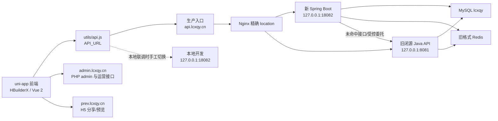

# lcwxq / StarFree 后端重建技术手册

> 文档版本：2026-08-02  
> 适用目录：`D:\Users\陈家博\Documents\HBuilderProjects\lcwxq`  
> 主要读者：项目维护者、二次开发人员、后续接手的 AI  
> 当前原则：本地开发和验证优先，生产采用新旧 Java 后端并行、Nginx 精确路由灰度

本文档是当前项目的主技术手册。它描述前端、已重建的 Spring Boot 后端、旧闭源 Java API、
PHP admin、MySQL、Redis 和生产 Nginx 之间的真实关系，并给出接口、测试、部署、回滚和排障规则。

本文档故意不保存 SSH 密码、MySQL 密码、Redis 密码、支付密钥、短信密钥、广告回调密钥或其他
凭据。凭据只能放在本地忽略目录、服务器既有配置或受控的密钥系统中，不能写入源码和文档。

---

## 1. 先看结论

1. 前端是 HBuilderX / uni-app / Vue 2 工程，根目录没有标准 Node `package.json`，主要由
   HBuilderX 运行和发行。
2. 新后端已经在本仓库中，源码位于 `backend/starfree-replacement`，不是旧文档所说的“后端不在
   仓库”。它使用 Spring Boot 2.7.18，编译目标为 Java 8。
3. 前端发行配置当前在 `utils/api.js` 中使用 `https://api.lcxqy.cn/`；需要本地联调时可临时改为
   `http://localhost:18082/`，但不能把 localhost 配置发布给用户。
4. 生产仍保留旧闭源 Java API：`127.0.0.1:8081`；新后端运行在 `127.0.0.1:18082`。
5. 公网 `https://api.lcxqy.cn/` 由 Nginx 按精确路径决定访问 18082 还是 8081。没有精确切流的
   接口继续走旧后端。
6. 新后端本身还有一个最低优先级兜底代理。直接访问新后端时，未重建路径会转发到旧 API。
7. `admin.lcxqy.cn` 的 PHP admin 不重建、不替换；插件功能也不重建。
8. 官方支付下单、卡密充值、支付通知、短信/邮件验证码发送、上传、聊天和社会化登录/绑定继续使用旧后端。
9. 发帖、普通编辑、动态、核心积分经济、商城商品管理/消费、VIP、签到、广告、用户管理、分类管理、
   订单读取和内容扩展等逻辑已有新实现；其中一部分仍未切生产路由。
10. `assets`、`points`、`experience` 是三个完全不同的数值，任何二开都不得混用。

---

## 2. 项目范围与边界

### 2.1 本次重建包括

- 用户注册、用户名/邮箱密码登录、退出和 token 校验的本地实现。
- 注册配置、找回密码、资料修改、推送 clientId。
- 用户资料/统计、通知、关注关系。
- 普通文章和视频的列表、详情、发布、修改、删除、审核。
- 评论列表、发布、删除、审核。
- 分类读取、分类内容查询，以及分类/标签新增、编辑、删除和推荐管理。
- 收藏、文章点赞、打赏、每日打卡。
- 动态发布、编辑、审核、锁定、详情、列表、删除、点赞、关注动态流和动态话题。
- 钱包人工调整、提现申请/审核、流水和汇总。
- 商城商品列表/详情/发布/编辑/删除/审核/挂载、商城购买、VIP 按天和套餐购买、VIP 套餐读取、七日签到。
- 广告配置/列表/详情/购买/编辑/删除/审核/管理员续期。
- 激励视频客户端回调和带签名的服务端回调。
- 用户列表、手机验证码登录消费、账号管理、邀请码、系统消息、封禁、数据清理、限制和 VIP 赠送。
- 内容推荐/置顶/轮播/自定义字段/后台统计/删除配置，以及受固定主机限制的 Pexels/ForeverBlog 读取。
- 买家订单、卖家订单和管理员批量数据清理。
- 与旧 Redis Java 序列化登录态、防刷键、缓存键的兼容。
- 未迁移接口透明代理，以及官方支付路径持有全局经济锁后的旧后端转发。

### 2.2 明确不重建

- PHP admin 站点。
- 插件目录和插件业务；动态 type=6 明确拒绝。
- 官方支付宝/微信/Epay 等支付内部实现和支付通知业务。
- 卡密生成、卡密兑换和原支付渠道配置。
- 邮件/短信验证码发送供应商及模板。
- 文件上传和对象存储。
- 私聊、群聊和聊天室。
- 第三方社会化登录/绑定及绑定状态等尚未迁移功能。

这些功能继续使用旧 API 并非遗漏，而是当前风险边界。除非先完成接口取证、可重复测试、数据补偿
和独立回滚，否则不要直接改成新实现。

---

## 3. 总体架构



关键理解：

- “源码中有控制器”表示新后端具备实现，不自动表示生产公网已经切到它。
- “生产切流”由 Nginx 精确 location 决定，必须通过 `X-Starfree-Backend` 响应头核实。
- 新后端的兜底代理主要服务于本地完整运行和受控委托；生产公网大部分旧接口直接由 Nginx 发往 8081。
- 两个 Java 后端共享同一 MySQL 和 Redis，所以数据格式、幂等、并发锁和缓存键必须兼容。

---

## 4. 目录说明

```text
lcwxq/
├─ App.vue, main.js, pages.json, manifest.json
│  └─ uni-app / Vue 2 前端入口与页面配置
├─ utils/
│  ├─ api.js
│  │  └─ API_URL、STAR_URL、WEB_URL、前端接口函数、requestId 生成
│  └─ net.js
│     └─ uni.request 薄封装，默认表单编码
├─ pages/, components/, static/, uni_modules/, js_sdk/
│  └─ 前端页面、组件、资源和随项目分发的模块
├─ backend/
│  ├─ starfree-replacement/
│  │  ├─ pom.xml
│  │  └─ src/main/java/cn/lcxqy/starfree/
│  │     ├─ api/       请求解析、响应包络、业务异常
│  │     ├─ user/      账号、注册、通知、关注
│  │     ├─ content/   文章及新旧写路由
│  │     ├─ comment/   评论
│  │     ├─ meta/      分类
│  │     ├─ log/       收藏、点赞、打赏、打卡
│  │     ├─ space/     动态
│  │     ├─ economy/   钱包、提现、商城、VIP、签到、journal
│  │     ├─ ads/       广告购买与奖励
│  │     ├─ security/  token 与旧 Redis session 桥接
│  │     ├─ proxy/     旧 API 兜底代理
│  │     └─ system/    健康检查
│  ├─ database/
│  │  ├─ snapshots/lcxqy_2026-07-23_11-17-42.sql
│  │  └─ migrations/001_economy_operation_journal.sql
│  ├─ scripts/
│  │  ├─ start-local.ps1
│  │  └─ test-local-*.ps1
│  ├─ deploy/production/
│  │  ├─ deploy-jar.sh, start.sh, starfree-replacement.service
│  │  ├─ nginx-public-read.conf
│  │  ├─ cutover-*.sh, promote-*.sh
│  │  └─ verify-*.sh
│  ├─ docs/REBUILD_STATUS.md
│  └─ reference/
│     ├─ legacy-java/  旧 JAR 取证产物和 MyBatis mapper
│     └─ legacy-admin/ PHP admin 参考副本，不是新的部署源
└─ AI_PROJECT_BRIEF.md
   └─ 本手册
```

`backend/.local` 是本地运行、下载和临时检查目录，包含可能敏感或容易过时的运行文件，必须保持忽略，
不能打包部署、不能当作唯一生产事实来源。

---

## 5. 本地运行

### 5.1 已知本机环境

- Windows 11。
- Java 22.0.2；项目仍编译为 Java 8 字节码。
- IntelliJ IDEA 2021.2.4 自带 Maven 3.6.3。
- Windows 服务 `MySQL80` 已安装并运行。
- 本地开发 schema：`lcxqy_dev`。
- 前端通常由 HBuilderX 运行，H5 地址为 `http://localhost:8080/#/`。
- 新后端本地端口为 18082，因为 8082 曾被其他本机程序占用。

### 5.2 数据库快照

快照文件：

```text
backend/database/snapshots/lcxqy_2026-07-23_11-17-42.sql
```

它是生产库的历史快照，只能导入独立的本地开发 schema。绝对不要把该文件导回生产，因为文件包含
DROP/CREATE 和历史数据。后续结构变更写入 `backend/database/migrations`，不要修改原始快照伪造历史。

经济功能还需要执行：

```text
backend/database/migrations/001_economy_operation_journal.sql
```

该迁移创建 InnoDB 表 `starfree_economy_operations`。没有此表时，涉及资产的接口应拒绝运行，不能降级为
无 journal 的直接余额写入。

### 5.3 配置

主配置：`backend/starfree-replacement/src/main/resources/application.yml`。

常用环境变量：

| 变量 | 默认值 | 说明 |
|---|---|---|
| `APP_PORT` | 8082；local profile 为 18082 | 服务端口 |
| `DB_HOST` | 127.0.0.1 | MySQL 地址 |
| `DB_PORT` | 3306 | MySQL 端口 |
| `DB_NAME` | lcxqy_dev | schema |
| `DB_USERNAME` | lcxqy_dev | 用户名 |
| `DB_PASSWORD` | 无默认 | 必须提供 |
| `REDIS_HOST` | 127.0.0.1 | Redis 地址 |
| `REDIS_PORT` | 6379 | Redis 端口 |
| `REDIS_PASSWORD` | 空 | Redis 密码 |
| `LEGACY_API_BASE_URL` | https://api.lcxqy.cn | 本地兜底旧 API；生产必须是 127.0.0.1:8081 |
| `LEGACY_REDIS_ENABLED` | false | 是否启用旧登录态桥接；生产为 true |
| `LEGACY_REDIS_PREFIX` | starfree | 必须与旧配置 `web.prefix` 一致 |
| `LEGACY_REDIS_SESSION_TTL` | 86400 | 登录态 TTL，生产读取旧配置 |

本地启动脚本会把数据库密码放到：

```text
backend/.local/run/application-secrets.yml
```

该文件已属于忽略目录。不要把密码写进 `application.yml`。

### 5.4 编译、测试和启动

从项目根目录运行：

```powershell
& 'C:\Program Files\JetBrains\IntelliJ IDEA 2021.2.4\plugins\maven\lib\maven3\bin\mvn.cmd' `
  -f backend/starfree-replacement/pom.xml -q test
```

打包：

```powershell
& 'C:\Program Files\JetBrains\IntelliJ IDEA 2021.2.4\plugins\maven\lib\maven3\bin\mvn.cmd' `
  -f backend/starfree-replacement/pom.xml -q clean package
```

如果本地 JAR 正在运行，Windows 可能锁住 target JAR。先读取
`backend/.local/run/starfree-replacement.pid` 并停止对应进程，确认 PID 确实是本项目后再 clean package。

启动：

```powershell
powershell.exe -NoProfile -ExecutionPolicy Bypass `
  -File backend/scripts/start-local.ps1
```

首次可显式提供本地数据库密码；之后脚本会从忽略的 secrets 文件读取。启动成功后检查：

```powershell
Invoke-RestMethod http://127.0.0.1:18082/health
Invoke-RestMethod http://127.0.0.1:18082/health/live
```

### 5.5 前端 API 地址

当前 `utils/api.js`：

```js
var API_URL = 'https://api.lcxqy.cn/';
var STAR_URL = 'https://admin.lcxqy.cn/';
var WEB_URL = 'https://prev.lcxqy.cn/';
```

- 当前值是可发行的生产入口，Nginx 会继续让未切换接口走旧 8081，让已切换接口走新 18082。
- 本地联调时，Chrome/H5 与后端在同一台电脑运行，才可以临时使用 `localhost:18082`。
- 真机 App 中的 localhost 指手机自己，不是电脑。真机调试要改成电脑局域网 IP，并放行 Windows 防火墙，
  或改用生产 HTTPS。
- 每次正式发行前都必须再次确认 `API_URL` 是 `https://api.lcxqy.cn/`，否则安装包会访问用户自己的设备。
- `STAR_URL` 继续指 PHP admin；新后端不替代其中的 `Api/api.php?act=...`。

---

## 6. 请求协议

> 调用示例、每个前端接口的参数与路由状态请同时阅读同目录的 [API_USAGE_GUIDE.md](API_USAGE_GUIDE.md)。本手册保留架构与接口总表，调用手册面向前端、脚本和集成开发。

### 6.1 默认编码

`utils/net.js` 默认发送：

```http
Content-Type: application/x-www-form-urlencoded
```

后端控制器主要通过 `@RequestParam Map<String,String>` 接收表单和查询参数。很多复杂表单使用名为
`params` 的字段承载 JSON 字符串，例如：

```text
token=<token>
params={"title":"标题","type":"post","category":"1"}
text=正文
requestId=shop-...
```

token 目前放在 query/form 字段，不使用 Authorization Bearer。新增接口若改变传输方式，必须同时更新前端
封装和兼容测试，不能单方面改成 JSON body。

### 6.2 参数解析的兼容特点

- 空字符串通常归一化为 `""`。
- 非法整数通常回退到接口指定默认值，再由服务层校验。
- 非法 `params` JSON 当前会被解析为空对象，不会直接抛 JSON 400；服务随后通常返回“参数错误”。
- 历史 id 参数不统一，例如内容详情接受 `key/cid`，评论删除接受 `key/coid`，提现审核使用 `key`。
- 不要为了“统一命名”删除旧别名，现有 HBuilderX 页面可能仍依赖它。

### 6.3 标准响应

普通成功：

```json
{"code":1,"msg":"请求成功","data":{}}
```

业务失败：

```json
{"code":0,"msg":"具体原因"}
```

分页：

```json
{"code":1,"msg":"","data":[],"count":0,"total":0}
```

- `count` 通常是当前页行数。
- `total` 通常是数据库匹配总数。
- 少数旧兼容列表只有 count，没有 total，接口表会单独说明。
- `IllegalArgumentException` 被转换为 HTTP 200 + `code=0`。前端不能只判断 HTTP 200。
- 未捕获的数据库/编程错误仍可能返回 HTTP 5xx，不能把所有失败都理解为业务 code=0。

### 6.4 非标准成功响应

以下结构不能擅自统一，否则旧前端会直接读错字段：

| 接口 | 成功结构 |
|---|---|
| `/SFreeContents/contentsInfo` | 裸文章对象 |
| `/SFreeAds/adsInfo` | 裸广告对象 |
| `/SFreeShop/shopInfo` | 裸商品对象；无权/不存在为 `{}` |
| `/SFreeContents/ImagePexels` | Pexels 原生 JSON，顶层含 `photos` |
| `/SFreeContents/foreverblog` | Forever Blog 提供方原生响应 |
| `/StarFreeSystem/vipTypeList` | 顶层 `vip/count`，没有 `data` |
| `/SFreeEconomy/signinConfig` | 裸签到配置对象 |
| `/SFreeEconomy/signinStreak` | 裸 `{leiji:n}` |
| `/pay/payorderList` | 顶层 `paydata/count/total` |
| `/SFreeUserlog/addLog` 的 clock | 顶层 `clockData` |
| `/SFreeUserlog/adsServerNotify` | 裸 `{isValid:true/false}` |

### 6.5 requestId

所有会改变资产、积分、库存、VIP、广告期限或产生经济流水的客户端动作都应传 `requestId`。前端
`utils/api.js` 提供 `createRequestId(prefix)`。

规则：

1. 一次用户动作生成一个 requestId。
2. 网络超时后重试同一动作，必须复用原 requestId。
3. 用户明确修改金额、商品、天数等参数后，生成新的 requestId。
4. 不传 requestId 时后端只能用 5 秒时间桶兼容旧客户端，无法提供长期可靠幂等。
5. journal 中 committed 会重放原结果；started/needs_review 不会自动重复扣款，而是要求人工核对。

---

## 7. 登录态与 Redis 兼容

### 7.1 token 查找顺序

`LegacyTokenService.userId(token)`：

1. 先查 `starfree_users.authCode`。
2. MySQL 找不到时，如果启用了桥接，再查旧 Redis session hash。

这很重要：生产旧 `userLogin` 可能只写 Redis、不更新 MySQL authCode，所以“authCode 为空”不能证明用户
未登录。

### 7.2 旧 Redis key

逻辑 key 主要包括：

| 逻辑 key | 用途 |
|---|---|
| `<prefix>_userkey<账号>` | 用户名/邮箱/手机号到 token 的映射 |
| `<prefix>_userInfo<token>` | session hash |
| `<prefix>_contentsInfo_<cid>_<mode>` | 内容详情缓存 |
| `<prefix>_isRead_<ip>_<agent>_<cid>` | 文章 900 秒浏览去重 |
| `<prefix>_<uid>_silence` | 禁言/防刷 |
| `<prefix>_<uid>_isAddSpace` | 动态发布防刷 |
| `<prefix>_<uid>_isIntercept` | 拦截时间窗 |
| `<prefix>_<uid>_spaceNum` | 动态发布计数 |
| `<prefix>_ImagePexels_rate_<sha256>` | Pexels 客户端指纹 3 秒共享限流 |
| `<prefix>_external_pexels_<sha256>` | Pexels 响应缓存，TTL 6 小时 |
| `<prefix>_external_foreverblog_<sha256>` | Forever Blog 响应缓存，TTL 2 分钟 |

旧 Java 使用 JDK 序列化器，Redis 中的实际 key/value 不是可直接按普通 UTF-8 字符串操作的数据。不要用
`redis-cli GET starfree_userInfo...` 推断“不存在”。生产验证脚本已经包含二进制 Java 序列化 key 的构造和
清理方法，优先复用脚本或通过 Spring RedisTemplate 访问。

### 7.3 登录、退出和敏感修改

- 新登录生成 token，更新 MySQL authCode，并在生产启用桥接时写旧 Redis。
- Redis 写失败时会清回 authCode，避免半边有效。
- signOut 删除当前 session，并只清空匹配 token 的 authCode。
- 找回密码按用户名、邮箱、手机号清理 Redis 别名，并撤销 MySQL token。
- userEdit 修改密码或邮箱会撤销会话；普通资料修改刷新 Redis session 快照。
- 验证码由旧后端发送，新后端消费同一套 Redis 验证码。
- 商品、分类、用户管理等写接口使用游标 `SCAN` 清理旧 Java 序列化缓存，不允许在生产执行 `KEYS *`。
- Pexels 凭据只从 `starfree_apiconfig.pexelsKey` 读取；缓存键只保存搜索/客户端材料的 SHA-256，不保存密钥。

---

## 8. 数据库与经济一致性

### 8.1 表引擎现状

历史核心表大多是 MyISAM，包括：users、contents、comments、space、userlog、paylog、shop、ads、fan、
inbox、metas 和 relationships。部分 PHP admin 表和签到表是 InnoDB。新建的
`starfree_economy_operations` 必须是 InnoDB。

因此：

- `@Transactional` 不能让 MyISAM 多表写入自动回滚。
- 任何多步写入都要明确“权威主记录”、执行顺序和反向补偿。
- 进程或数据库在两条语句中间停止，补偿代码可能没有机会执行。
- 长期正确方案是先在快照上排练 MyISAM 到 InnoDB 的迁移，再安排独立生产迁移；不能在线直接 ALTER。

### 8.2 三种数值的严格边界

| 字段 | 含义 | 典型增加 | 典型减少 |
|---|---|---|---|
| `assets` | 钱包资产，可由官方充值获得 | 充值、签到资产、广告奖励、售卖、打赏收入 | 商城购买、VIP、广告购买、打赏、提现通过 |
| `points` | 任务/商城抵扣积分 | 任务或配置化积分奖励 | 选择积分抵扣的商城购买 |
| `experience` | 等级经验，不是钱 | 发帖、审核、签到经验 | 配置化删除扣经验 |

禁止事项：

- 不要因为前端显示名都叫“积分”就把 assets 与 points 合并。
- 不要用 experience 结算商品。
- 不要把官方充值写入 points。
- 不要直接 UPDATE 余额而不写 journal/paylog。
- 不要删除 paylog 冒充退款。

### 8.3 全局经济锁

所有新后端余额写入使用 MySQL advisory lock：

```text
starfree:economy:global
```

官方支付创建和回调虽然业务仍在旧后端，生产精确路由会先进入新后端兜底代理，在持锁期间转发旧 API，
避免旧支付回调与新商城/广告/提现同时覆盖 MyISAM 余额。

同一回调内的所有 SQL 必须使用 `EconomyLockExecutor` 提供的同一物理连接。不要在外层再套一个等待锁的
Spring 事务，否则小连接池可能被占满。

### 8.4 journal 状态

| state | 含义 | 处理方式 |
|---|---|---|
| `started` | 已登记，投影是否完成不确定 | 不自动重试，人工查余额/流水/业务行 |
| `committed` | 投影完成并保存结果 | 相同 requestId 重放保存的结果 |
| `failed` | 失败且补偿完成 | 同 key 可重新开始 |
| `needs_review` | 补偿失败或提交状态不明确 | 必须人工对账，禁止直接改 committed |

生产巡检至少应检查：

```sql
SELECT id,operation_type,state,actor_uid,target_uid,reference_id,last_error,updated
FROM starfree_economy_operations
WHERE state IN ('started','needs_review')
ORDER BY updated;
```

---

## 9. 新后端接口总表

说明：

- “GET/POST”表示控制器当前未限定方法，现有前端主要使用 GET 或 POST 表单。
- “公网新”表示生产已有精确新后端路由。
- “公网旧”表示源码虽已实现，但生产公开请求当前仍由旧 API 处理。
- “条件”表示根据 token 或请求形态分流。
- 更细的异常、返回和副作用说明也已写在每个 Controller 方法上方的 Javadoc 中。

覆盖统计以 `utils/api.js` 的 133 个唯一前端路径为口径：当前 **106 个有独立新实现，27 个仍依赖旧后端**。
`SFreeSpace/myFollowSpace` 是注解别名，简单按方法数统计时会少算一个。这里的“有实现”不等于生产已切流；
本地新增的用户管理、内容扩展、分类管理、订单清理和商城管理接口目前都仍是“公网旧”。

### 9.1 系统和代理

| 路径 | 方法 | 鉴权 | 参数 | 返回与注意点 |
|---|---|---|---|---|
| `/health/live` | GET | 无 | 无 | 只证明 JVM/MVC 存活，不访问 DB |
| `/health` | GET | 无 | 无 | 查询 `SELECT 1` 和当前 schema，适合就绪检查；生产应限制公网 |
| `/` | GET | 无 | 无 | 返回 `service=starfree-replacement`，不代表 DB 可用 |
| `/**` | 任意 | 由旧 API 决定 | 原样 | 最低优先级兜底；OPTIONS=204；部分支付路径持经济锁后转发 8081 |

### 9.2 用户和账号 `/SFreeUsers`

| 路径 | 方法 | 鉴权 | 关键参数 | 公网 | 返回/副作用/注意点 |
|---|---|---|---|---|---|
| `/SFreeUsers/regConfig` | GET/POST | 无 | 无 | 新 | data 为 isEmail/isInvite/isPhone |
| `/SFreeUsers/userFoget` | GET/POST | 邮箱验证码 | `params.name/code/password` | 新 | 消费旧 Redis 验证码，更新 phpass 密码，撤销所有账号别名会话 |
| `/SFreeUsers/userEdit` | GET/POST | token | `params.uid` 与资料字段 | 新 | 只能改自己的白名单资料；钱包/积分/经验/VIP/角色不可改 |
| `/SFreeUsers/setClientId` | GET/POST | token | `clientId` | 新 | 更新推送 ID 并刷新 Redis session；空值表示清除 |
| `/SFreeUsers/userRegister` | GET/POST | 注册策略 | `params.name/password/mail/phone/code/inviteCode` | 新 | 服务端控制角色和初始数值；邀请码返利进入 assets；不自动登录 |
| `/SFreeUsers/userLogin` | POST | 账号密码 | `params.name/password` | 旧 | 新实现可本地使用；生产旧登录仍可能产生 Redis-only session |
| `/SFreeUsers/signOut` | GET/POST | token | token | 旧 | 退出当前 session，不是所有设备退出 |
| `/SFreeUsers/userStatus` | GET/POST | token | token | 旧 | 成功返回用户和原 token；无效为 code=0 |
| `/SFreeUsers/userInfo` | GET/POST | uid 查询可匿名 | `uid` 或 token | 旧 | 脱敏用户资料；uid 优先 |
| `/SFreeUsers/userData` | GET/POST | uid 查询可匿名 | `uid` 或 token | 旧 | 内容/评论/粉丝/关注实时计数；兼容字段为 `contentsNum/commentsNum/fanNum/followNum`，新端同时提供 `contents/comments/fans/follow` |
| `/SFreeUsers/inbox` | GET/POST | token | `type/page/limit` | 旧 | 通知分页；读取不自动已读 |
| `/SFreeUsers/unreadNum` | GET/POST | token | token | 旧 | 站内通知未读总数，不含旧聊天未读 |
| `/SFreeUsers/setRead` | GET/POST | token | `type` | 旧 | all/comment/finance/system/fan；chat 返回 0；可重复调用 |
| `/SFreeUsers/follow` | GET/POST | token | `touid,type` | 旧 | type=1 关注、0 取消；首次关注写 fan 通知 |
| `/SFreeUsers/isFollow` | GET/POST | token | `touid` | 旧 | 已关注 code=1，未关注 code=0，不是布尔 data |
| `/SFreeUsers/followList` | GET/POST | 无 | `uid/page/limit` | 旧 | 关注列表，附脱敏 userJson |
| `/SFreeUsers/fanList` | GET/POST | 无 | `touid/page/limit` | 旧 | 粉丝列表；历史参数名必须保留 touid |
| `/SFreeUsers/userList` | GET/POST | 可选 staff token | `searchParams/searchKey/order/page/limit/token` | 旧 | 匿名字段脱敏；staff 才有管理字段；order 白名单、limit 最大 50 |
| `/SFreeUsers/phoneLogin` | GET/POST | 官方短信验证码 | `phone/code` | 旧 | 只消费旧 Redis 短信码；发送仍在旧端；成功写 MySQL+Redis session |
| `/SFreeUsers/manageUserEdit` | GET/POST | staff | `token/params.uid或name` | 旧 | 字段白名单；敏感标识、密码或角色变化会撤销全部会话 |
| `/SFreeUsers/userDelete` | GET/POST | administrator | `token/key` | 旧 | 经济锁内删账号和绑定/session；保留文章、评论、支付等审计数据 |
| `/SFreeUsers/setScan` | GET/POST | token | `codeContent` | 旧 | 只批准 Redis 中已存在的二维码 nonce，90 秒 TTL；不允许凭空创建 |
| `/SFreeUsers/madeInvitation` | GET/POST | administrator | `num=1..100` | 旧 | 密码学随机邀请码；owner/status/created 服务端生成 |
| `/SFreeUsers/invitationList` | GET/POST | administrator | `searchParams.status/page/limit` | 旧 | 邀请码分页，limit 最大 50 |
| `/SFreeUsers/invitationExcel` | GET/POST | administrator | `limit<=10000` | 旧 | 下载 UTF-8 制表文本 `.xls`；只导出未使用邀请码；不是 JSON |
| `/SFreeUsers/sendUser` | GET/POST | administrator | `uid/text` | 旧 | 写持久 system inbox；不调用可选推送厂商 |
| `/SFreeUsers/banUser` | GET/POST | staff | `uid/time/type/text` | 旧 | 追加 violation、延长 bantime、撤销 session；禁止越级封禁 |
| `/SFreeUsers/unblockUser` | GET/POST | administrator | `uid` | 旧 | 解除当前封禁但保留 violation 历史 |
| `/SFreeUsers/violationList` | GET/POST | 无 | `searchParams/page/limit` | 旧 | 公开封禁历史只带脱敏 userJson |
| `/SFreeUsers/userClean` | GET/POST | administrator | `uid/clean=1..5` | 旧 | 分类型删除文章/评论/动态/商品/打卡；MyISAM 不级联，先备份 |
| `/SFreeUsers/restrict` | GET/POST | administrator | `uid/type=0或1` | 旧 | 直接维护新旧端共享的序列化 silence Redis key |
| `/SFreeUsers/giftVIP` | GET/POST | staff | `uid/day` | 旧 | 经济锁内顺延 VIP，写零金额流水，不扣 assets/points |

资料修改白名单以服务代码为准，主要包括 `screenName`、`introduce`、`userBg`、`url`、`avatar`、
`address`、`pay`、`mail`、`phone`、`password` 和验证码字段。不要在 Controller 直接把任意 params 映射成
SQL 列。

### 9.3 内容 `/SFreeContents`

| 路径 | 方法 | 鉴权 | 关键参数 | 公网 | 返回/副作用/注意点 |
|---|---|---|---|---|---|
| `/SFreeContents/contentsList` | GET/POST | 可选 token | `searchParams/searchKey/order/page/limit/random/token` | 条件 | 匿名新、带 token 旧；普通用户只看 publish；random=1 代价高 |
| `/SFreeContents/contentsInfo` | GET/POST | 可选 token | `key` 或 `cid`、`isMd` | 新 | 成功为裸文章对象；IP+UA 900 秒只加一次 views，计数成功时返回自增后的值 |
| `/SFreeContents/contentsAdd` | POST | token | `params/text/isMd` | 新+内部委托 | 仅普通 post/video 新写；付费/草稿/动态/商品/未知类型原样转 8081 |
| `/SFreeContents/contentsUpdate` | POST | token | `params.cid/title`、`text/isMd` | 新+内部委托 | 普通 post/video 新写；保留类型和 Markdown；其他形态转 8081 |
| `/SFreeContents/contentsDelete` | GET/POST | 作者或 staff | `key/cid` | 旧 | 删除内容/关系并按配置扣经验；MyISAM 多步需对账 |
| `/SFreeContents/contentsAudit` | GET/POST | staff | id 与动作 | 旧 | 普通内容审核、经验和通知；非法/重复状态 code=0 |
| `/SFreeContents/rewardList` | GET/POST | 无 | `id/page/limit` | 新 | 打赏日志分页；文章删除后日志仍可能存在 |
| `/SFreeContents/isCommnet` | GET/POST | token | `key=cid` | 旧 | 保留历史拼写；作者或评论过返回 code=1，其他返回 code=0 |
| `/SFreeContents/toRecommend` | GET/POST | staff | `key/recommend=0或1` | 旧 | 只改文章推荐位并刷新 modified/cache |
| `/SFreeContents/addTop` | GET/POST | staff | `key/istop=0或1` | 旧 | 只改置顶标记 |
| `/SFreeContents/addSwiper` | GET/POST | staff | `key/isswiper=0或1` | 旧 | 只改轮播资格，不负责图片存在性 |
| `/SFreeContents/setFields` | GET/POST | 作者或 staff | `cid/name/strvalue` | 旧 | 固定字符串字段 upsert；保留字拒绝；不能写任意 SQL 列 |
| `/SFreeContents/contentConfig` | GET/POST | 无 | 无 | 旧 | 只公开 allowDelete，禁止附带 apiconfig 密钥 |
| `/SFreeContents/allData` | GET/POST | staff | token | 旧 | 后台实时统计；包含待审、自删和待提现数；高频轮询代价高 |
| `/SFreeContents/ImagePexels` | GET/POST | 无 | `page/searchKey` | 旧 | 固定 Pexels 主机；原生响应；3 秒限流、6 小时 Redis 缓存 |
| `/SFreeContents/foreverblog` | GET/POST | 无 | `page` | 旧 | 固定 ForeverBlog 主机；原生响应；2 分钟 Redis 缓存 |

发布细节：

- 标题非空且最长 200 字。
- 正文非空且最长 60000 字。
- type 只允许 post/video 进入新写入。
- Markdown 模式保存 `<!--markdown-->` 标记，并把 `||rn||` 还原为换行。
- 分类/标签关系先校验，失败时尽力补偿 MyISAM 文章和 relationships。
- 文章主行一旦成功，用户 posttime/IP 和经验属于次要投影；次要失败不会返回发布失败，以免客户端重试
  创建重复文章。
- 发布、编辑、删除和审核后清理旧详情、全部内容分页及分类内容分页缓存；缓存删除失败不回滚权威
  文章数据。
- 删除会在移除 relationships 后重新计算受影响分类/标签的 count。分类计数是次要投影，刷新失败会
  记录错误但不会让已经删除的文章重新出现。
- PHP admin 直接写 MySQL 时不会调用 Spring 的 Redis 失效器，因此前端必须把接口成功返回的空数组
  当作权威结果，不能因为 `list.length == 0` 而继续保留浏览器旧列表。

### 9.4 评论 `/SFreeComments`

| 路径 | 方法 | 鉴权 | 关键参数 | 公网 | 返回/副作用/注意点 |
|---|---|---|---|---|---|
| `/SFreeComments/commentsList` | GET/POST | 可选 token | `searchParams/searchKey/order/page/limit/token` | 条件 | 匿名新、带 token 旧；分页返回 count/total |
| `/SFreeComments/commentsAdd` | GET/POST | token | `params`、`text/pic` | 旧 | 校验目标和审核配置；写评论、计数、经验、通知；waiting 表示待审 |
| `/SFreeComments/commentsDelete` | GET/POST | 作者或 staff | `key/coid` | 旧 | 修正评论计数并按配置处理经验 |
| `/SFreeComments/commentsAudit` | GET/POST | staff | `key/type` | 旧 | 审核可见性、计数、经验；重复状态拒绝 |

### 9.5 分类 `/SFreeMetas`

| 路径 | 方法 | 鉴权 | 关键参数 | 公网 | 返回/注意点 |
|---|---|---|---|---|---|
| `/SFreeMetas/metasList` | GET/POST | 无 | `searchParams/searchKey/order/page/limit` | 新 | 只有当前页 count，不是 total |
| `/SFreeMetas/metaInfo` | GET/POST | 无 | `key/mid/slug` | 旧 | id 优先；不存在 code=0 |
| `/SFreeMetas/selectContents` | GET/POST | 可选 token | 内容筛选和分页 | 条件 | 匿名新、带 token 旧；只有当前页 count |
| `/SFreeMetas/addMeta` | GET/POST | administrator | `params.name/slug/type` | 旧 | category/tag；同类型 name/slug 唯一；count 从 0 开始 |
| `/SFreeMetas/editMeta` | GET/POST | administrator | `params.mid` 与白名单字段 | 旧 | type/count 不可改；父级不能形成循环 |
| `/SFreeMetas/deleteMeta` | GET/POST | administrator | `id` | 旧 | 一条多表 DELETE 同时清 meta、文章关系、动态话题关系和话题关注，不删文章/动态主行 |
| `/SFreeMetas/toRecommend` | GET/POST | administrator | `key/recommend=0或1` | 旧 | 只改分类 isrecommend，不是文章推荐 |

### 9.6 互动日志 `/SFreeUserlog`

| 路径 | 方法 | 鉴权 | 关键参数 | 公网 | 返回/副作用/注意点 |
|---|---|---|---|---|---|
| `/SFreeUserlog/markList` | GET/POST | token | `page/limit` | 旧 | 收藏文章列表，附用于删除的 logid；total 可能含已删文章历史 |
| `/SFreeUserlog/isMark` | GET/POST | token | `cid` | 旧 | data 为 isMark/logid，未收藏 logid=-1 |
| `/SFreeUserlog/addLog` | GET/POST | token | JSON `params.type/cid/num/toid`、`requestId` | 新 | type 仅 mark/reward/likes/clock；clock 返回顶层 clockData |
| `/SFreeUserlog/removeLog` | GET/POST | token | `key` 日志 id | 旧 | 普通用户只可删自己的 mark；不能撤销打赏/签到 |
| `/SFreeUserlog/adsGift` | GET/POST | token | `appkey` | 新 | 创建待完成 adsGift 日志，返回 adpid/logid，不立即加资产 |
| `/SFreeUserlog/adsGiftNotify` | GET/POST | token | `logid` | 新 | 仅客户端回调模式；同一已完成 logid 不重复加 assets |
| `/SFreeUserlog/adsServerNotify` | GET/POST | 厂商签名 | `trans_id/user_id/sign` | 新 | 裸 isValid；trans_id 全局幂等；密钥为空必须拒绝 |
| `/SFreeUserlog/orderList` | GET/POST | token | token | 旧 | token 决定买家；最多 60 条；含商家邮箱，不信任请求 uid |
| `/SFreeUserlog/orderSellList` | GET/POST | token | `page/limit` | 旧 | token 决定卖家；买家邮箱/地址只在此卖家鉴权路由返回 |
| `/SFreeUserlog/dataClean` | GET/POST | administrator | `clean=1..8` | 旧 | 经济锁内永久清理；selector 6 每次最多删 500 个严格空闲账号 |

`addLog` 的 type：

- `mark`：收藏，持久去重。
- `likes`：文章点赞，当前实现持久去重并增加内容 likes。
- `reward`：用户用 assets 打赏文章作者；需要正数 num 和 requestId。
- `clock`：旧 Java 每日打卡，assets、experience、points 按各自配置分别发放。

### 9.7 动态 `/SFreeSpace`

| 路径 | 方法 | 鉴权 | 关键参数 | 公网 | 返回/副作用/注意点 |
|---|---|---|---|---|---|
| `/SFreeSpace/addSpace` | GET/POST | token | `text/pic/type/toid/onlyMe/topicIds` | 新 | type 0..5；type 6 插件拒绝；`topicIds` 最多 3 个话题 mid；审核开启时 status=0 |
| `/SFreeSpace/editSpace` | GET/POST | 作者或 staff | `id/text/topicIds` 及可选字段 | 新 | 类型不可改变；staff 编辑保留原作者；`topicIds=0` 清空话题；不重新发经验 |
| `/SFreeSpace/spaceReview` | GET/POST | staff | `id,type` | 新 | type=1 通过，0 拒绝并删主行；写系统通知 |
| `/SFreeSpace/spaceLock` | GET/POST | staff | `id,type` | 新 | type=2 锁定，1 解锁；待审不可锁；锁定后不可回复/转发 |
| `/SFreeSpace/spaceInfo` | GET/POST | 可选 token | `id/token` | 新 | 统一执行私密、待审、锁定可见性；返回 `topics`；成功读取增加浏览量 |
| `/SFreeSpace/spaceList` | GET/POST | 可选 token | `searchParams/searchKey/order/page/limit/isManage` | 新 | isManage 只对 staff 生效；普通列表默认排除回复 type=3；`searchParams.topicId` 可按话题筛选 |
| `/SFreeSpace/spaceDelete` | GET/POST | 作者或 staff | `id` | 新 | 只删主行，不级联回复/转发/spaceLike，不扣经验 |
| `/SFreeSpace/spaceLikes` | GET/POST | token | `id` | 新 | uid+space id+spaceLike 永久去重；named lock；无取消接口 |
| `/SFreeSpace/followSpace` | GET/POST | token | `page/limit` | 新 | 只看已关注用户的公开、非回复记录；修复旧隐私泄露 |
| `/SFreeSpace/myFollowSpace` | GET/POST | token | `page/limit` | 新 | followSpace 的前端别名；只有当前页 count，无 total |
| `/SFreeSpace/topicList` | GET/POST | 可选 token | `token/searchKey` | 新 | 返回官方话题 `official` 和已关注话题 `followed` |
| `/SFreeSpace/topicCreate` | GET/POST | token | `name` | 新 | 用户自建话题；自动关注；名称只允许中英文/数字/下划线/短横线，1-24 字 |
| `/SFreeSpace/topicFollow` | GET/POST | token | `mid/type` | 新 | `type=1` 关注，`type=0` 取消；幂等 |

动态类型由旧数据模型决定。当前新服务只接受 0..5；除 0 和 4 外需要正数 toid。type=3 是回复，普通
列表默认不直接展示。type=6 属于插件功能，明确不支持。

动态删除保持旧主行删除语义，历史回复、转发和点赞日志可能成为孤儿。任何级联清理都必须先做孤儿统计、
备份、可逆迁移和独立验证，不能悄悄塞进删除接口。

动态话题说明：

- 话题目录复用 `starfree_metas.type='tag'`；后台“分类/话题”页面新增的话题就是官方话题。
- 用户发布动态时可以选择官方话题、已关注话题，也可以输入新话题；新话题写入 `starfree_metas`，并在 `starfree_topic_meta` 标记为用户创建。
- 动态和话题关系写入 `starfree_space_topics`，不使用文章关系表 `starfree_relationships`，因为文章 cid 和动态 id 是两套自增序列，数字可能碰撞。
- 用户关注话题写入 `starfree_topic_follows`；取消关注只删除关注关系，不删除话题本身。
- 一条动态最多绑定 3 个话题。编辑动态时不传 `topicIds` 表示不改话题，传 `topicIds=0` 表示清空话题。

### 9.8 广告 `/SFreeAds`

| 路径 | 方法 | 鉴权 | 关键参数 | 公网 | 返回/副作用/注意点 |
|---|---|---|---|---|---|
| `/SFreeAds/adsConfig` | GET/POST | 无 | 无 | 新 | 三类广告价格和容量，msg 为空 |
| `/SFreeAds/adsList` | GET/POST | 可选 token | `searchParams/searchKey/page/limit/token` | 条件 | 匿名新、带 token 旧；匿名只看有效广告 |
| `/SFreeAds/adsInfo` | GET/POST | 可选 token | `id` | 旧 | 成功为裸广告对象；所有者/staff 可看非公开状态 |
| `/SFreeAds/addAds` | GET/POST | token | `params/day/requestId` | 新 | 从 assets 扣费；普通用户待审；容量/价格在锁内重查 |
| `/SFreeAds/editAds` | GET/POST | 所有者或 staff | `params.aid` 与广告字段 | 旧 | 普通用户编辑后重置待审；不续期、不扣款 |
| `/SFreeAds/deleteAds` | GET/POST | 所有者或 staff | `id` | 旧 | 删除不退款 |
| `/SFreeAds/auditAds` | GET/POST | staff | `id` | 旧 | 只设 status=1，不处理退款 |
| `/SFreeAds/renewalAds` | GET/POST | administrator | `id/day/requestId` | 新 | 管理员赠送天数，不从任何用户扣 assets；写流水 |

广告 type 为 0..2，购买天数为 1..3650。广告购买和奖励都属于新经济边界，但官方充值仍是旧支付边界。

### 9.9 钱包和提现 `/SFreeUsers`

| 路径 | 方法 | 鉴权 | 关键参数 | 公网 | 返回/副作用/注意点 |
|---|---|---|---|---|---|
| `/SFreeUsers/userRecharge` | GET/POST | staff | `key/num/type/rechargeType/requestId` | 新 | type 0 加、1 减；rechargeType 0 assets、1 points；不是官方充值 |
| `/SFreeUsers/userWithdraw` | GET/POST | token | `num/requestId` | 新 | 创建 cid=-1 待审记录，申请时不扣 assets |
| `/SFreeUsers/withdrawList` | GET/POST | token | `searchParams/page/limit` | 新 | 普通用户仅自己，administrator 可看全部；含收款 pay |
| `/SFreeUsers/withdrawStatus` | GET/POST | administrator | `key/type` | 新 | type 1 通过并扣 assets，0 拒绝；不负责实际线下转账 |

提现状态：`cid=-1` 待审、`cid=0` 已通过、`cid=-2` 已拒绝。

### 9.10 财务读取 `/pay`

| 路径 | 方法 | 鉴权 | 关键参数 | 公网 | 返回/注意点 |
|---|---|---|---|---|---|
| `/pay/payorderList` | GET/POST | token | token | 新 | 最近 30 条；顶层 paydata/count/total，不是 data |
| `/pay/financeList` | GET/POST | administrator | `searchParams/page/limit` | 新 | 全站 paylog，按 uid/status/paytype 筛选 |
| `/pay/financeTotal` | GET/POST | administrator | token | 新 | recharge/trade/withdraw/income 分类汇总；新增 paytype 要同步规则 |

### 9.11 七日签到 `/SFreeEconomy`

| 路径 | 方法 | 鉴权 | 关键参数 | 公网 | 返回/副作用/注意点 |
|---|---|---|---|---|---|
| `/SFreeEconomy/signinConfig` | GET/POST | 无 | 无 | 新 | 裸 assets_1day..7day 和 experience_1day..7day |
| `/SFreeEconomy/signinStreak` | GET/POST | token | token | 新 | 裸 `{leiji:n}`，只读最近连续天数 |
| `/SFreeEconomy/signin` | GET/POST | token | token | 新 | JVM 默认日期+uid 固定幂等；生产时区应为 Asia/Shanghai；分别发 assets 和 experience |

### 9.12 商城和 VIP `/SFreeShop`

| 路径 | 方法 | 鉴权 | 关键参数 | 公网 | 返回/副作用/注意点 |
|---|---|---|---|---|---|
| `/SFreeShop/buyShop` | GET/POST | token | `sid/isIntegral/fid/requestId` | 新 | assets 购买或 points 抵扣；库存、卖家收入、VIP 折扣、日志统一处理 |
| `/SFreeShop/isBuyShop` | GET/POST | token | `sid` | 新 | 已买 code=1、未买 code=0，不是布尔 data |
| `/SFreeShop/buyVIP` | GET/POST | token | `day/requestId` | 新 | 按 vipPrice 从 assets 扣款并顺延 VIP |
| `/SFreeShop/buyVIPpackage` | GET/POST | token | `id/requestId` | 新 | 服务端读取套餐价格和赠送天数，客户端价格不可信 |
| `/SFreeShop/vipInfo` | GET/POST | 无 | 无 | 新 | vipDiscount/vipPrice/scale/vipDay；不含套餐列表 |
| `/SFreeShop/shopList` | GET/POST | 可选 token | `searchParams/searchKey/order/page/limit` | 旧 | count/total；排序/筛选白名单；value 仅 owner/staff 可见 |
| `/SFreeShop/shopInfo` | GET/POST | 可选 token | `key/id` | 旧 | 裸商品；待审仅 owner/staff；value 仅 owner/staff/持久购买者 |
| `/SFreeShop/addShop` | GET/POST | token | `params/text/isMd/isSpace` | 旧 | uid/status/cid/sellNum 服务端派生；类型 1..4；可选动态为次要投影 |
| `/SFreeShop/editShop` | GET/POST | owner 或 staff | `params.id` 与白名单字段 | 旧 | owner 修改重新审核；不能改 uid/cid/sellNum/created/status |
| `/SFreeShop/deleteShop` | GET/POST | owner 或 staff | `key/id` | 旧 | 只删商品主行；购买日志不级联；已售商品建议归档而非删除 |
| `/SFreeShop/auditShop` | GET/POST | staff | `key/type/reason` | 旧 | type=0 通过、1 拒绝；拒绝理由必填；重复状态幂等 |
| `/SFreeShop/mountShop` | GET/POST | owner 或 staff | `sid/cid` | 旧 | cid=-1 卸载；普通用户只能挂到同一 owner 的 post/video |
| `/StarFreeSystem/vipTypeList` | GET/POST | 无 | 无 | 旧 | 顶层 vip/count；购买时仍由 buyVIPpackage 在经济锁内重读套餐 |

---

## 10. 尚未重建、仍依赖旧 Java API 的接口

本节只列“没有独立新实现”的前端路径，不把“源码已实现但生产尚未切流”混进来。按 `utils/api.js` 的
133 个唯一前端路径统计，目前剩余 **27 个**。支付回调不在这 133 个前端路径中，但同样继续由旧端处理。
直接访问本地 18082 时这些路径可能通过兜底代理得到响应；这不等于新后端已经实现了其业务。

### 10.1 验证码发送和社会化账号

- `SFreeUsers/RegSendCode`
- `SFreeUsers/sendSMS`
- `SFreeUsers/SendCode`
- `SFreeUsers/apiLogin`
- `SFreeUsers/apiBind`
- `SFreeUsers/userBindStatus`

`phoneLogin` 已有新实现，但短信发送供应商仍在旧端。`apiLogin/apiBind` 不能照抄旧端“信任客户端 openId”
做法；重建前必须由服务端向官方提供方校验 code/token、audience、过期时间和回调状态。

### 10.2 上传和聊天

- `upload/full`
- `SFreeChat/getPrivateChat`
- `SFreeChat/sendMsg`
- `SFreeChat/myChat`
- `SFreeChat/msgList`
- `SFreeChat/deleteChat`
- `SFreeChat/deleteMsg`
- `SFreeChat/createGroup`
- `SFreeChat/editGroup`
- `SFreeChat/allChat`
- `SFreeChat/banChat`
- `SFreeChat/groupInfo`

### 10.3 官方支付和卡密

业务仍由旧后端执行：

- `pay/scancodePayStar`
- `pay/WxPayStar`
- `pay/tokenPay`
- `pay/tokenPayStar`
- `pay/EPayStar`
- `pay/qrCodeStar`
- `pay/tokenPayList`
- `pay/tokenPayExcel`
- `pay/madetoken`

支付回调 `pay/notify`、`pay/wxPayNotify`、`pay/EPayNotify` 不在前端 133 路径计数内，也仍由旧端执行。
关键支付创建/回调路径在生产可能先进入新 18082，取得全局经济锁，再由 `LegacyProxyController` 转发
8081。这叫“新代理持锁、旧后端执行业务”，不能写成“支付已重建”。

---

## 11. PHP admin 与插件边界

`STAR_URL=https://admin.lcxqy.cn/` 仍提供：

- `Api/api.php?act=getPlugins`
- update/getAds/appStart
- usercount/appdata/opset/fenlei/vip/adimg2
- logininfo/chongzhiset/viphide/qzxz/musicpic/likeall
- 客服、群链接、mp3、插件页面等

PHP admin 是现有运营后台，不需要用 Spring Boot 重写。`backend/reference/legacy-admin` 只用于理解数据和配置，
不要在没有明确任务时把参考副本覆盖回服务器。

插件功能不在重建范围：

- 不实现插件 API。
- 不承诺插件表结构兼容。
- Space type=6 明确拒绝新增和编辑。
- 内容发布中的未知/插件形态委托旧后端，而不是猜测字段含义。

---

## 12. 生产 Nginx 路由

生产 include：

```text
/www/server/panel/vhost/nginx/extension/api.lcxqy.cn/starfree-replacement-public.conf
```

### 12.1 精确路由原则

每次只增加一个或一组经过验证的 `location = /exact/path`。精确 location 优先于原来的
`location ^~ /` 旧后端 catch-all。

典型配置：

```nginx
location = /SFreeSpace/spaceLikes {
    proxy_pass http://127.0.0.1:18082;
    add_header X-Starfree-Backend replacement-space-like always;
    proxy_set_header Host $host;
    proxy_set_header X-Real-IP $remote_addr;
    proxy_set_header X-Forwarded-For $proxy_add_x_forwarded_for;
}
```

必须使用环回地址访问新后端，新服务通过 `--server.address=127.0.0.1` 绑定，不能直接暴露 18082 到公网。

### 12.2 条件路由

以下读取接口按 token 条件分流：

- contentsList：匿名新，带 token 旧。
- commentsList：匿名新，带 token 旧。
- selectContents：匿名新，带 token 旧。
- adsList：匿名新，带 token 旧。

Space list/info 已验证 Redis-only token，因此匿名和带 token 均走新后端。

### 12.3 响应头

`X-Starfree-Backend` 用于确认路由。常见值：

- `replacement-public-read`
- `legacy-token`
- `replacement-space-like/follow/add/edit/review/lock/delete`
- `replacement-content-info/add/update`
- `replacement-user-register`
- `replacement-account-reg-config/password-reset/edit/client-id`
- `replacement-economy-replacement-<route>`
- `replacement-economy-legacy-locked-<payment-route>`

contentsAdd/Update 若在新控制器内部委托旧服务，还会使用 `X-Starfree-Delegate` 辅助审计。

### 12.4 当前生产切流概要

截至 2026-07-29 的已验证状态：

- Space 十个公网路径全部有新路由。
- contentsInfo、新旧混合 contentsAdd/contentsUpdate 已有新路由。
- public 内容/评论/分类/广告读取按上述条件灰度。
- userRegister、regConfig、userFoget、userEdit、setClientId 已有新路由。
- 31 个经济相关精确路由已建立：其中新经济接口由新后端执行，九个官方支付路径由新后端持锁后转旧。
- 激励广告的开始、客户端确认、服务端回调已从“持锁旧代理”提升为新后端执行。
- 2026-07-28 完成的后台管理、元数据、内容扩展、订单清理和商城等新增实现已经随
  2026-07-29 JAR 部署到 18082，但没有新增 Nginx 精确路由；公网请求仍按现有 include
  进入已切换接口或 8081 catch-all，不能把“代码已在 JAR 中”误认为“公网已经切流”。
- 其他接口仍走 8081。

仓库中的 `nginx-public-read.conf` 是可部署模板，不保证永远包含服务器后来逐项追加的全部经济 location；
修改生产前应先下载当前 active include、计算 SHA-256、与部署记录核对，不能拿旧本地快照直接全量覆盖。

---

## 13. 生产部署

### 13.1 服务器运行布局

| 项目 | 路径/地址 |
|---|---|
| 新 JAR | `/opt/starfree-replacement/starfree-replacement.jar` |
| 新服务 | `starfree-replacement.service` |
| 新监听 | `127.0.0.1:18082` |
| 旧 Java | `127.0.0.1:8081` |
| 旧配置来源 | `/opt/application.properties` |
| 新启动脚本 | `/opt/starfree-replacement/start.sh` |
| systemd unit | `/etc/systemd/system/starfree-replacement.service` |
| Nginx include | `/www/server/panel/vhost/nginx/extension/api.lcxqy.cn/starfree-replacement-public.conf` |

`start.sh` 使用服务器已有 `/opt/jdk1.8.0_311/bin/java`，从旧 properties 读取数据库和 Redis 凭据，不复制
密码到 systemd unit。生产 `LEGACY_API_BASE_URL` 必须为 `http://127.0.0.1:8081`。

### 13.1.1 2026-07-29 当前生产实例

```text
service: starfree-replacement.service (active)
MainPID: 15011
JAR SHA-256: fc425cf687cf0eb6c153b511e01b6aceb5401fbde40260b2a7142d6cf481ab68
本次部署前 JAR: /opt/starfree-replacement/starfree-replacement.jar.rollback-20260729-085326
Nginx include SHA-256: 2fcf7e198dfcd15a1b7eca5024fd323a3540c40fa05b6bc058bf6e1d42427ba7
```

本次只替换并重启 JAR，没有修改或 reload Nginx，也没有发布 H5 文件。`/health/live` 和
`/health` 均为 `UP`。生产串行回归覆盖 Redis-only session、Space 十条路由、内容详情/发布/更新、
积分经济、广告奖励关闭态、用户注册和账号维护；所有脚本通过，最终 SQL/Redis disposable residue 为 0，
`starfree_economy_operations` 的 `started=0`、`needs_review=0`。

### 13.2 标准发布顺序

1. 本地运行当前完整 Maven 测试（本手册记录为 185 个）。
2. 本地真实 MySQL 集成脚本全部通过并确认清理临时记录。
3. `clean package` 生成候选 JAR。
4. 计算候选 SHA-256，上传为 `/opt/starfree-replacement/starfree-replacement.jar.new`。
5. 同步本次需要的 verify/cutover 脚本，不覆盖无关服务器文件。
6. 在服务器运行 `bash deploy-jar.sh <expected-sha256>`。
7. 脚本生成时间戳回滚 JAR、替换并重启服务、等待 health。
8. 先直连 `127.0.0.1:18082` 做只读和一次性数据测试。
9. 再用精确路由脚本逐项切 Nginx；每次先备份、`nginx -t`、reload、检查响应头。
10. 生产 disposable smoke 串行运行，确认 SQL/Redis residue=0 和 journal needs_review=0。

不要在服务器上临时编辑 Java 源码或直接编译。服务器只运行本地已测试、带 hash 的构建产物。

### 13.3 生产 smoke 的安全规则

- 一次只运行一个脚本，避免测试前缀互相冲突。
- 脚本必须创建随机测试用户和业务行，并在 trap/cleanup 中按已解析的精确 id 删除。
- 删除前检查目标 id、用户名/标题前缀和所属关系，不能执行宽泛 DELETE。
- 清理 MySQL 记录、Java 序列化 Redis session、防刷/缓存键和 journal 测试记录。
- 脚本成功的最后一行应明确 `PASS` 或 residue=0。
- 任何 `needs_review` 都停止继续切流并人工对账。

保留的测试前缀包括 `csa_`、`cse_`、`csr_`、`csk_`、`csd_`、`cci_`、`cca_`、`ccu_`、
`ceu_`、`cea_`、`cr_`、`cri_` 及 economy shop/vip/ad 命名。不要把真实用户命名成这些前缀。

---

## 14. 测试体系

### 14.1 Maven 测试

当前测试类覆盖：

- 响应包络和异常处理。
- Typecho phpass。
- MySQL token 与 Redis-only token。
- Redis Java session 写入、读取、删除和账号别名撤销。
- 内容列表/详情完整正文、Markdown、待审可见性、浏览去重、缓存清理。
- contentsAdd/Update 新旧路由策略和原始表单转发。
- 评论、分类、收藏、关注、通知。
- Space 隐私、审核、锁定、点赞、删除、关注流、防刷和补偿。
- 经济全局锁、journal、打卡、打赏、提现、商城、VIP。
- 商品目录/详情付费字段脱敏、所有权、审核、挂载、字段白名单和 VIP 顶层响应兼容。
- 用户管理、分类管理、内容扩展、外部内容固定主机/缓存，以及订单身份绑定和批量清理。
- 广告购买、管理、奖励签名、trans_id 幂等和补偿。
- 健康检查与旧代理。

截至本手册更新前，完整 Maven 结果为：`185 passed, 0 failed, 0 errors`。每次改业务逻辑后必须重新跑，不能把
历史通过数当成本次构建结果。

### 14.2 本地真实数据库脚本

```text
backend/scripts/test-local-account-maintenance.ps1
backend/scripts/test-local-ads-reward.ps1
backend/scripts/test-local-ads.ps1
backend/scripts/test-local-economy.ps1
backend/scripts/test-local-space.ps1
```

它们验证真实 schema、MyISAM 行为、journal 和清理。运行前确认目标 DB 是 `lcxqy_dev`，不是生产。

### 14.3 生产验证脚本

`backend/deploy/production/verify-*.sh` 分别覆盖 Redis session、Space 各路由、内容详情/新增/编辑、
经济、广告奖励、用户注册和账号维护。不要跳过 direct replacement、direct legacy、public HTTPS 三层对比。

---

## 15. 回滚

### 15.1 JAR 回滚

`deploy-jar.sh` 在替换前保存时间戳 JAR，并在 health 无法恢复时自动还原。手工回滚前先确认对应 Nginx
路由是否依赖后来才加入的代码，JAR 和 Nginx 必须作为兼容组合处理。

截至 2026-07-29 最后确认：

```text
生产 JAR SHA-256:
fc425cf687cf0eb6c153b511e01b6aceb5401fbde40260b2a7142d6cf481ab68

本次部署前安全 JAR:
/opt/starfree-replacement/starfree-replacement.jar.rollback-20260729-085326

不要在账户路由仍启用时使用的中间 JAR:
/opt/starfree-replacement/starfree-replacement.jar.rollback-20260728-135839
```

`20260729-085326` 回滚包就是部署前已稳定运行的 `74285a...0339` 版本，且与当前 Nginx
路由兼容。`20260728-135839` 仍是更早的中间构建，不应优先使用。这些 hash 是历史核对点，
不是永远不变的期望值；下一次部署后必须更新部署记录。

### 15.2 Nginx 路由回滚

每个 cutover/promote 脚本都会先保存 include。标准步骤：

```bash
cp -p <确认过的回滚文件> \
  /www/server/panel/vhost/nginx/extension/api.lcxqy.cn/starfree-replacement-public.conf
nginx -t
nginx -s reload
```

账户维护前回滚文件：

```text
/www/server/panel/vhost/nginx/extension/api.lcxqy.cn/starfree-replacement-public.conf.rollback-account-maintenance-20260728-140012
```

最后确认的 Nginx include SHA-256：

```text
2fcf7e198dfcd15a1b7eca5024fd323a3540c40fa05b6bc058bf6e1d42427ba7
```

经济 route 的备份是逐步累积快照。恢复很早的经济备份可能一次删除后续全部经济 location；只回滚一个
经济接口时，优先精确删除对应标记块并 `nginx -t`，不要盲目恢复早期全文件。

### 15.3 总体回旧

移除/重命名整个 replacement include 可让 Nginx catch-all 恢复旧 8081，但当前前端已把七日签到改为
`/SFreeEconomy/*`，全量回旧还需要匹配的前端回滚。新服务应在所有流量确认离开后再停止。

---

## 16. 常见故障排查

### 16.1 前端能打开但所有接口失败

1. 检查 `utils/api.js` 的 API_URL。
2. H5 检查 18082 是否监听和 `/health` 是否 UP。
3. 真机不要使用 localhost。
4. 检查浏览器控制台 CORS 和 Mixed Content；HTTPS 页面不能随意访问 HTTP API。
5. 看 `backend/.local/run/starfree-replacement.log`。

### 16.2 HTTP 200 但页面提示失败

检查 JSON `code` 和 `msg`。业务错误按旧协议也是 HTTP 200。不要只看 Network 状态码。

### 16.3 页面字段全是 undefined

先确认接口是否属于非标准响应：contentsInfo、adsInfo、signinConfig、signinStreak、payorderList、clockData、
adsServerNotify。不要统一加/减一层 data。

### 16.4 token 在旧后端有效、新后端无效

1. 确认生产 `LEGACY_REDIS_ENABLED=true`。
2. 确认 prefix 与旧 `web.prefix` 完全一致。
3. 确认 Redis host/port/password 来自旧 properties。
4. 不要用普通字符串 redis-cli key 检查 Java 序列化数据。
5. 用 `verify-redis-session.sh` 做 disposable Redis-only 验证。

### 16.5 修改资料后仍看到旧头像/clientId

检查 MySQL 是否已更新，再检查 Redis session hash 是否刷新。若公网 userStatus 仍走旧后端，旧端读取的正是
共享 Redis 快照；只改 MySQL 而不刷新 session 会产生短期旧数据。

### 16.6 内容浏览量异常

- Nginx 是否传了正确 `X-Real-IP`。
- 多层代理是否把客户端 IP 覆盖成 127.0.0.1。
- User-Agent 是否为空或所有客户端相同。
- Redis 900 秒 read key 是否使用旧 Java 序列化。
- contentsInfo 返回的是加一前 views，下一次读取才看到新值。

### 16.7 contentsAdd/Update 看起来访问了新后端但数据由旧端写

这是混合路由的预期行为。检查请求是否带 isPaid/isDraft/isSpace/sid、未知 type 或其他封闭功能字段，并检查
`X-Starfree-Delegate`。不要删掉路由保护强迫所有表单进入新 SQL。

### 16.8 余额不一致

立即停止新的经济切流和手工调账，收集：

- requestId。
- `starfree_economy_operations` 对应行及 state。
- 用户当前 assets/points/experience。
- paylog、userlog、业务主表行。
- 服务日志中 compensation 错误。

`needs_review` 不能简单改成 failed/committed。先根据 operation_type 的投影顺序核对实际写入，再设计一次性修复 SQL，
备份并由另一人复核。

### 16.9 广告服务端回调一直 isValid=false

- 确认当前配置是服务端回调模式。
- 确认 `adsSecuritykey` 非空且与厂商一致。
- 确认 trans_id、user_id、sign 的原始值未被 Nginx/网关改写。
- 检查 trans_id 是否已经 committed。
- 不要为了“先通”而允许空密钥签名，旧算法在空密钥时可公开伪造。

### 16.10 Nginx 改后没有生效

1. 检查编辑的是 active include，不是本地模板或旧 snapshot。
2. `nginx -t`。
3. reload。
4. curl 响应头 `X-Starfree-Backend`。
5. 检查 exact location 是否重复。
6. 检查请求路径大小写、结尾斜杠和 query；`location =` 只匹配完全相同 path。

### 16.11 后台删除帖子后首页仍显示旧卡片

这个现象通常不是数据库删除失败，而是浏览器页面投影过期：

1. 首页会从 `localStorage` 恢复 `contentsList_<mid>`、`recommendList`、`topList`、`swiperList` 和
   `topContents`，用于网络返回前快速显示首屏。
2. 网络请求成功后，空数组也是权威结果，必须把页面数组和对应 localStorage 写成 `[]`；只有网络失败
   时才允许暂时保留旧缓存。
3. 首页每次 `onShow` 都应重新请求服务端。不要在 `onLoad`、`mounted` 和 `onShow` 同时重复刷新，否则
   相同列表请求会竞态覆盖。
4. 全部内容页和分类页只能请求当前页签；分类页触底必须继续调用 `getMetaContents`，不能调用
   `getContentsList` 把全站帖子混进分类。
5. `contentsInfo` 返回失败包络或缺少 title 时，文章/视频详情页会删除 `postInfo_<cid>` 和
   `commentsList_<cid>`、停止 loading、提示“帖子不存在或已删除”并返回上一页。
6. 如果接口响应本身仍带被删 cid，再检查请求是否带 token 而被 Nginx 送到旧 8081，以及 PHP admin
   是否遗漏旧 Java 序列化 Redis 缓存。匿名新 `contentsList` 直查 MySQL，不应返回已删除主行。

视频详情还必须在 `pages.json` 注册 `pages/contents/videoInfo`。文件存在并不等于 uni-app 会编译该页面；
未注册时首页视频卡片会跳转失败，H5 也不会生成 `pages-contents-videoInfo.js`。

### 16.12 消息页提示连接服务器超时

当前底部导航“消息”对应 `pages/home/find.vue`；`pages/user/inbox.vue` 是仍可能被其他入口打开的旧消息页。
进入消息页时会并行调用 `/SFreeUsers/inbox` 和 `/SFreeUsers/setRead`，切换到私信列表时调用
`/SFreeChat/myChat`。排查时必须按实际失败 URL 区分，不能把三个请求统称为“消息接口”。

1. 先在浏览器 Network 确认是否真的发出了 `https://api.lcxqy.cn/...` 请求。若页面弹出提示，但 Nginx
   access log 完全没有对应请求，优先检查 HBuilderX 调试服务重连、浏览器风险提示、代理或本机网络；这不
   能证明 Spring Boot 或旧 API 宕机。
2. `utils/api.js` 正式运行必须保持 `API_URL=https://api.lcxqy.cn/`。本机 H5 的端口由 HBuilderX 自动
   分配，可能是 8080、8081 或其他端口；H5 页面端口不等于 API 端口。
3. 消息列表请求单独使用 15 秒超时，并以 `inboxRequesting/chatRequesting` 防止重复点击、重复
   `onShow` 或慢网络造成并发堆积。`utils/net.js` 必须继续透传调用方的 `timeout`、`dataType` 和
   `complete`；请求锁在 `complete` 中释放，确保成功、失败和超时都能解锁。不要给上传、支付等接口
   强行设置同一个全局短超时。
4. `pages/user/inbox.vue` 的私信列表每 3 秒轮询一次。定时器只能保存在 `chatLoading`；切换标签前先
   清理旧定时器，`onHide` 和 `onUnload` 都要幂等清理。`chatRequesting=true` 时跳过本轮，防止一次
   请求超过 3 秒后继续叠加。历史代码把定时器写入 `msgLoading`、退出时却清理 `chatLoading`，会导致
   每次进入私信页都遗留一个轮询；该问题已在 2026-07-29 修复。
5. HBuilderX 开发服务器使用异步页面包。修改后不要只检查 `static/js/index.js`；消息页实际代码位于
   `static/js/pages-home-find.js` 和 `static/js/pages-user-inbox.js`。确认页面包包含请求锁、15 秒超时，且
   不再包含 `msgLoading`，才算热更新成功。
6. 生产中聊天仍由旧后端处理。`inbox/unreadNum/setRead` 在没有完成旧协议兼容前也不要只因超时提示
   就切到新后端：旧 `unreadNum` 返回 `{total, comment, finance, system, chat, fan}`，而新实现目前的
   返回结构不同；旧 `setRead(all)` 还会清理聊天未读及相关 Redis 状态。贸然切流会造成角标和已读状态
   错乱。

快速判断顺序：先看浏览器是否产生请求，再看 `api.lcxqy.cn` access/error log，再分别直测旧 API 和新
服务健康检查，最后才判断后端故障。HTTP 200 还需要继续检查 JSON `code`，不能只看状态码。

---

## 17. 二次开发规范

### 17.1 新增或迁移接口的最小标准

1. 先从前端调用、旧 JAR 字节码、mapper、数据库和真实响应取证。
2. 写清参数、鉴权、返回包络、可见性、缓存、SQL 副作用和幂等规则。
3. 在新控制器实现，但先不切生产 Nginx。
4. 添加 Controller 兼容测试和 Service 行为/失败补偿测试。
5. 用本地快照做 disposable 集成测试。
6. 在服务器直连 18082，与 8081 响应字段和数据行为对比。
7. 写 verify 与 cutover 脚本，每个路由有独立 backup/header/rollback。
8. 生产 disposable smoke 通过且 residue=0 后才保留路由。
9. 更新本手册、REBUILD_STATUS 和 production README。

### 17.2 代码规则

- Controller 只做协议兼容和返回包装，复杂规则放 Service。
- 每个映射方法保留 Javadoc：路由、方法、参数、鉴权、返回例外、数据库/Redis、副作用、幂等和风险。
- SQL 参数必须使用绑定变量，动态列/排序只允许白名单。
- 不把客户端 uid 当作鉴权身份，写接口从 token 解析 actor uid。
- staff 仍要检查资源状态和所有权，不能只检查 group 后直接执行任意 SQL。
- 经济动作必须使用 EconomyLockExecutor + EconomyOperationJournal + 明确补偿。
- 权威主行成功后，通知、缓存、活动时间等次要投影失败通常应记录日志而不是让客户端重复主操作。
- 不修改旧响应层级、字段名、code 语义和历史参数别名，除非同步升级所有客户端并安排版本兼容。
- 不在修一个接口时顺手清理历史孤儿或转换表引擎；迁移必须是独立任务。

### 17.3 安全规则

- 永不把服务器、数据库、Redis、支付或回调密码写进仓库。
- 不信任客户端传入价格、角色、余额、积分、经验、VIP、审核状态或作者 uid。
- X-Real-IP 只在请求确实来自受控 Nginx 时可信；不要把 18082 公网暴露后仍信任任意该头。
- 回调签名比较使用常量时间比较；幂等键必须是全局稳定业务标识。
- 生产测试删除必须按随机前缀和已解析 id 双重限制。

---

## 18. 已知缺口与下一步

优先级建议：

1. 在新快照上完整排练核心 MyISAM 表迁移 InnoDB，包括旧 8081 兼容、停机窗口和回滚时间。
2. 统计 Space 回复/转发/spaceLike 孤儿，设计独立、可逆的清理迁移；不要改变现有 spaceDelete。
3. 为已本地实现但生产仍旧路由的用户、评论、内容审核/删除、收藏和广告管理逐个建立公开切流测试。
4. 对本地商城管理先做真实 MySQL 的发布、编辑、购买后详情、审核、挂载、删除残留和缓存互通测试，再考虑打包/切流。
5. 对上传、聊天、社会化登录继续保持旧边界，除非获得供应商协议和完整接口样本。
6. 只有在取得官方支付签名、异步通知、补单和退款全链路证据后，才考虑重建支付；当前保持旧后端更安全。
7. 持续巡检 journal `started/needs_review`、Nginx route hash、Redis session TTL 和 disposable residue。

---

## 19. 交接时的快速检查清单

- [ ] `utils/api.js` 当前指本地还是生产？
- [ ] `/health/live` 和 `/health` 是否都正常？
- [ ] Maven 本次是否 185/185，而不是引用历史结果？
- [ ] 本地测试数据库是否明确是 `lcxqy_dev`？
- [ ] `starfree_economy_operations` 是否存在且无 needs_review？
- [ ] Redis prefix/serializer/TTL 是否与旧后端一致？
- [ ] 目标接口成功结构是否为特殊裸对象？
- [ ] 目标接口源码已实现，但生产 Nginx 是否真的切流？
- [ ] curl 的 `X-Starfree-Backend` 是什么？
- [ ] 候选 JAR SHA-256、回滚 JAR 和 Nginx backup 是否记录？
- [ ] 生产 disposable SQL/Redis 数据是否清零？
- [ ] 106/133 的源码覆盖与生产 Nginx 切流状态是否分开记录？
- [ ] 官方支付、验证码发送、上传、聊天、社会化登录和插件是否仍保持旧边界？
- [ ] assets、points、experience 是否在代码和测试中严格分离？

满足这些检查后，才可以认为一次后端二开或切流已经完整交付。

---

## 20. 2026-07-29 发布入口收敛：动态合并与管理端发布

### 20.1 任务目标

本次只调整 uni-app 前端发布流程，不修改生产 Nginx、PHP admin、旧闭源 API、新 Spring Boot JAR、
MySQL 或 Redis：

1. 将原公开发布面板中的“发布视频”和“图文动态”合并成一个“发布动态”。
2. 将“发布帖子”和“发布商品”从公开发布面板及用户自己的列表页移除。
3. 帖子和商品的新增入口统一放到 APP 内的“管理控制台”，仅 administrator/editor 可见。
4. 保留公开商城的浏览、购买以及用户对既有帖子/商品的编辑和历史订单能力。

### 20.2 实际改动

- `pages/components/publishPanel.vue`
  - 四个公开发布按钮收敛为一个“发布动态”，跳转 `/pages/space/post`。
  - 单入口改为居中布局，不再对普通用户展示帖子或商品发布入口。
- `pages/space/post.vue`
  - 新增动态统一标题为“发布动态”。
  - 同一编辑页增加图文/视频分段选择；切换类型前若已上传媒体，会确认并清空不兼容附件。
  - 底层协议保持不变：图文仍发送 Space `type=0` 和 `#图集#`，视频仍发送 `type=4` 和 `#视频#`。
  - 提交按钮统一进入 `publishSpace`，再按媒体类型调用原图文/视频提交逻辑。
  - 修复提交成功后未关闭 loading、未返回上一页的问题。
- `pages/user/manage.vue`
  - 管理控制台新增“内容发布”模块，向 administrator/editor 提供“发布帖子”和“发布商品”。
- `pages/manage/contents.vue`、`pages/manage/shop.vue`
  - 两个管理列表的右上角增加“发布”快捷入口，分别复用原帖子和商品编辑页。
- `pages/user/post.vue`、`pages/user/addshop.vue`
  - 新增模式增加 administrator/editor 本地角色守卫；普通用户手工打开新增 URL 会提示“仅可在管理中心发布”并返回。
  - `type=edit` 的既有内容编辑模式不受该守卫影响。
- `pages/user/userpost.vue`、`pages/user/myshop.vue`
  - 移除小程序/H5/APP 中面向普通用户的“发布帖子”“出售商品”和新增图标。
- `pages/home/user.vue`
  - 个人页“发布第一条动态”改为进入统一动态编辑页，不再固定为图文模式。

### 20.3 权限与后端边界

本次“仅管理端发布”是客户端产品入口和页面访问的收敛，不应误写成旧闭源 API 已增加强制 staff 鉴权：

- 公网 `SFreeContents/contentsAdd` 当前已经切到 replacement，但服务仍保留历史普通投稿兼容行为。
- `SFreeShop/addShop` 当前没有独立生产精确路由，公网仍可能由旧 8081 catch-all 执行。
- 客户端 localStorage 角色守卫用于产品可见性和误操作拦截，不是可对抗篡改客户端的服务端安全边界。
- 如果后续要求“任何非 staff API 调用都必须失败”，必须分别修改新后端鉴权、补测试，并对
  `SFreeShop/addShop` 完成旧/新行为取证、直连 smoke、精确切流和独立回滚；不能只依赖本次 UI 改动。

### 20.4 验证记录

- 对本次涉及的 10 个 Vue 文件提取 `<script>` 后执行 JavaScript 语法检查，全部通过。
- 使用 Vue 2.6 模板编译器检查核心 9 个改动页面，全部无模板错误：发布面板、动态编辑、管理控制台、
  帖子管理、商品管理、帖子新增、商品新增、我的帖子、我的商品。
- `pages/home/user.vue` 的完整旧模板仍有 6 个历史遗留的未闭合 `<image>` 报告；本次只替换其中一个
  `/pages/space/post?type=0` 跳转为 `/pages/space/post`，未改动这些隐藏旧模板标签。
- 项目根目录没有 `package.json`。本机 HBuilderX CLI 位于
  `E:\HBuilderX.3.99.2023122611\HBuilderX\cli.exe`；一次 `publish web --project lcwxq` 本地发行已编译成功，
  产物位于 `unpackage/dist/build/web`。构建只有既有字体、主包和图片体积超限警告，没有编译错误。
- Web 构建完成后曾短暂启动只绑定 `127.0.0.1:4173` 的本地静态预览，随后按维护者要求停止；没有继续执行
  浏览器交互验收。最终 H5、App 和小程序编译、真机检查及正式发行由维护者在 HBuilderX 中完成。
- 本次没有上传服务器、替换 JAR、修改 Nginx、reload 服务或运行生产写入测试。

### 20.5 回退范围

本次是纯前端源码改动。需要回退时只还原 10 个上述 Vue 文件，并删除本节文档；不需要数据库迁移、
Redis 清理、JAR 回滚或 Nginx reload。若已经发行客户端，则仍需重新构建并发布回退版本。

---

## 21. 后续任务强制回溯规则

### 21.1 维护者要求

自 2026-07-29 起，维护者要求后续每一个项目需求都记录到本手册，方便按时间回溯。该要求本身是第一条
固定流程记录，后续任务不能只在对话中说明结果而不更新文档。

### 21.2 每次任务的最小记录内容

每项任务完成或阶段性停止时，必须在本手册末尾追加独立、按时间排序的记录，至少包含：

1. 日期、任务目标和维护者要求摘要。
2. 实际修改的源码、配置、数据库、服务器或生成产物。
3. 关键实现决定，以及明确没有改动的系统边界。
4. 执行过的检查、测试、构建、生产 smoke 及其真实结果；未执行的验证也必须写明。
5. 是否上传、部署、重启、reload 或切流，并记录对应 hash、备份和回滚点（如适用）。
6. 已知风险、遗留问题和可执行的回退方式。

只做调查、诊断或得出“不需要修改”的任务也要记录结论和证据。不得把 SSH、MySQL、Redis、支付、短信、
广告回调等密码或密钥写入本手册；敏感凭据继续只保存在忽略目录、服务器既有配置或受控密钥系统中。

---

## 22. 前端 UI 设计语言与交互准则（2026-07-29）

### 22.1 产品定位与设计理念

本项目面向学生和校园社区用户。前端设计以“年轻、清透、友好、轻盈、易操作”为核心，不做企业后台式
的沉重界面，也不做只适合展示的营销首页。第一屏必须直接服务于浏览校园内容、发现信息、发布动态、
查看消息和个人中心等真实任务。

视觉风格参考 `https://h5.yuncampus.cn/#/pages/home/index?defaultStart=1` 的校园氛围、色彩层次和卡片秩序，
但不机械复制页面。参考目标是：明亮渐变背景、清晰的前后层级、柔和卡片、年轻配色和轻快交互；现有
功能、权限、信息密度、H5/App 差异和项目品牌必须保留。

设计决策遵循以下优先级：

1. 功能完整和权限正确。
2. 不重叠、不消失、不同分辨率可用。
3. 滚动、切页和弹层流畅。
4. 多页面视觉统一。
5. 装饰性和新奇感。

任何 UI 改造都不能因为追求简洁而删除、隐藏或失效现有功能。尤其是管理员/审核员入口、公告、发布、
消息和账户相关入口；改模板时必须将旧模板中的条件功能完整迁移到新模板。管理员入口继续使用
`group=='administrator'||group=='editor'` 控制，普通用户不可见，但 staff 登录后必须有明确可点击的
“管理中心”入口。

### 22.2 核心视觉语言

整体使用“校园晨光”视觉语言：薄荷青、清透雾蓝、淡粉紫和青绿色共同组成柔和渐变，白色或接近白色的
内容层承载信息。色彩要年轻，但避免荧光感、大片高饱和色和通篇单一蓝紫色。

主页基础渐变的当前核心色为：

```text
薄荷青  #6CEBDC
雾蓝    #AEDAE7
淡粉紫  #EED5E2
青绿色  #83D3CA
深文字  #17272A
浅内容层 rgba(250, 254, 254, 0.68)
```

规则：

- 主页保留四段渐变和柔和静态高光，不能退化为大片灰蓝或压抑的深色背景。
- 晴、云、阴、雨、雾、雪、雷雨只轻微调整冷暖、饱和度和明暗，不完全替换主页的品牌色。
- 清晨轻微加入暖粉和淡金；白天保持清透；傍晚加入珊瑚粉和淡紫；夜间使用深青、蓝紫，但不能纯黑。
- 夜间只提高顶部文字、图标和按钮的对比度；正文卡片仍保持浅色，避免整页暗化。
- 红色只用于错误、删除、危险和强警告。普通主按钮、登录、注册、确认、发布不得继续使用旧的大红色，
  优先使用薄荷青到青蓝的渐变或稳定的青绿色。
- 文字和图标必须满足可读性；半透明背景上应根据昼夜切换深浅前景色。
- 禁止使用大面积黑色圆形遮罩、黑色模糊块、装饰性渐变球、bokeh 光斑和无业务意义的深色覆盖层。

### 22.3 布局、比例与响应式

页面可参考黄金比例 `61.8% / 38.2%` 组织主次区域，例如主要内容与辅助操作、视觉内容与文字信息、
标题区域与操作区域。黄金比例是建立秩序的参考，不是强行套用的固定尺寸；可用性和内容长度优先。

必须遵守：

- 使用 `rpx`、`min/max`、`aspect-ratio`、弹性布局和网格布局适配不同宽高，不按单一截图写死坐标。
- 固定格式控件（Tab、轮播、按钮组、头像、计数器）应有稳定尺寸，加载、hover、图标和长文字不能使布局跳动。
- 页面根容器至少填满 `100vh`，支持时同时使用 `100dvh`；底部必须计入 `env(safe-area-inset-bottom)`。
- 顶部必须计入状态栏高度；小高度设备应减少留白，而不是让主体内容或底栏消失。
- 文本不得与按钮、头像、TabBar、发布按钮或下一块内容重叠。长文本应换行或省略，最长词仍需留在容器内。
- 不使用随视口宽度连续缩放的字体。紧凑面板使用紧凑字号，只有真正的主页问候或品牌首屏使用大标题。
- 不在卡片里继续嵌套装饰卡片。页面区块保持完整带状或无框布局，卡片只用于独立内容、重复条目和弹层工具。
- 轮播和主要视觉内容可使用接近 `1.618:1` 的横向比例；手机窄屏和低高度设备必须设置合理的
  `min-height/max-height`，不能裁掉操作区域。

建议触控目标不小于约 `44px`；图标按钮使用圆形或熟悉的图标形态，并保留明确的按下反馈。多个操作项
排列时优先等宽网格。发布白幕存在多个操作项时使用一行三列，并保证按钮够大、位置略靠下，适合单手触达。

### 22.4 顶部导航、卡片、小按钮与小页面

- 顶部导航、主页卡片、底部 TabBar、登录注册页、小按钮、空状态、加载状态、弹窗和二级小页面必须属于
  同一套色彩、圆角、阴影、间距和动画语言，不能只美化首页。
- 顶部区域保持通透，天气、搜索、头像等操作使用轻半透明胶囊或圆形图标按钮；不使用高成本实时大模糊。
- 卡片圆角应克制并统一。快捷操作和内容卡片使用柔和但不过分膨胀的圆角、细边框和轻阴影；禁止每个区块
  都做成悬浮大卡片。
- 小按钮不得保留无语义的红底。主要操作使用青绿/青蓝渐变，次要操作使用浅色背景，危险操作才用红色。
- 登录页和注册页必须与主页同源：年轻渐变背景、清晰表单层级、稳定输入框和统一主按钮；不能像独立的
  旧系统页面，也不能使用大红色提交按钮。
- 加载中、无数据、网络失败、未登录、权限不足和按钮禁用状态都必须有完整视觉状态，不能以空白代替。
- 图标优先复用项目现有 ColorUI/Tuniao 图标库；同一含义不能在不同页面使用多套不一致图标。

### 22.5 H5 与 App 底部导航策略

项目存在两套前端策略，后续改动必须先识别编译端：

- H5 使用其既定的原生/页面 TabBar 策略。
- App 使用 `pages/components/tabBar.vue` 自定义 TabBar，并在对应页面调用 `uni.hideTabBar()` 隐藏原生栏。
- 任何平台在同一时刻只能出现一个底部导航栏。禁止同时渲染原生 TabBar 和自定义 TabBar。
- `#ifdef H5`、`#ifdef APP-PLUS` 及其 `#endif` 必须成对保留；不能为了统一样式删除平台条件。
- Tab 切换的指示器应平滑滑动并居中，页面与底栏的节奏同步。动画不能造成底栏宽度、页面高度或安全区跳动。

修改底栏后必须分别静态检查 H5 和 App 条件代码，真机/浏览器验收时分别确认不存在双导航、底栏遮挡、
安全区空洞或发布按钮重复。

### 22.6 发布入口与白幕交互

发布入口是全局唯一组件，不允许页面各自再造不同样式或重复按钮。当前业务可发布内容及 staff 专属发布
边界以第 20 节为准；UI 规则如下：

- 发布按钮保持左侧既定位置，独立悬空，圆润、轻盈、尺寸适合拇指点击，不能做成突兀的黑色圆形。
- 只在产品指定的两个内容 Tab/页面显示；切换到另外两个页面时隐藏。回到可发布页面时按钮由小到大自然
  出现，节奏跟随页面和底栏，不抢跑、不延迟卡顿。
- 点击发布按钮后，白色发布面板从按钮所在位置扩展开，形成“白幕”；关闭时沿相反方向收回。
- 点击白幕的非操作白色区域应关闭面板。操作按钮自身阻止冒泡，不能误触关闭。
- 白幕出现时不得残留黑色圆形、黑色遮罩或高成本全屏模糊。公告区域复用现有公告弹窗/公告接口内容，
  不维护另一份静态公告文案。
- 多入口布局使用一行三列，按钮适当放大并整体略向下，图标、标签和触控区域比例协调。
- 如果业务规则收敛为单入口，保持居中，不为凑三列展示无权限或已下线功能。

### 22.7 动效语言与性能红线

动效目标是“流畅、丝滑、美”，但性能优先于装饰。统一采用快速响应、柔和收尾的曲线，例如：

```css
cubic-bezier(0.22, 1, 0.36, 1)
```

建议时长：

| 场景 | 建议时长 |
|---|---:|
| 按钮按下/回弹 | 160–200ms |
| Tab 指示器/小面板切换 | 220–320ms |
| 页面内容淡入 | 360–440ms |
| 白幕展开/收回 | 320–520ms |
| 天气背景交叉淡入 | 约 720ms，仅状态变化时执行 |

性能规则：

- 高频动画只使用 `transform` 和 `opacity`；避免动画 `width/height/top/left/filter/box-shadow/background-position`。
- 禁止无限背景动画、全屏 `backdrop-filter`、滚动区域实时大模糊和大尺寸装饰图片。
- 天气背景使用双层 opacity 交叉淡入；`will-change` 只在切换期间开启，结束后撤销，避免长期占用显存。
- 天气 API 继续使用 10 分钟缓存；背景时段只需在整点低频校准，页面隐藏或卸载时必须清理定时器。
- 列表图片使用合适尺寸和懒加载；避免进入页面同时重复请求同一列表、公告、广告或天气。
- 动画不能阻塞点击和滚动，不能通过固定长时间 `setTimeout` 假装流畅。
- 支持 `prefers-reduced-motion: reduce`，在用户要求减少动态时关闭非必要动画和过渡。
- 动画开始和结束不能改变控件占位尺寸，不能导致 TabBar、发布按钮、卡片或文字跳动。

### 22.8 天气与时间动态主题

主页天气固定为山东省聊城市东昌府区，使用 Open-Meteo：

```text
坐标：36.45, 115.98
时区：Asia/Shanghai
current：temperature_2m, weather_code, is_day
```

WMO 天气代码归并为晴、云、阴、雨、雪、雾、雷雨七组；时间归并为清晨 `05–08`、白天 `08–17`、
傍晚 `17–20`、夜间 `20–05` 四段，共形成 28 种轻量主题组合。天气只调整基础品牌渐变，不能让主页失去
薄荷青、雾蓝、淡粉紫、青绿色的识别度。

缓存必须保存 `symbol`、`text`、`temperature`、`code`、`isDay`、`observedAt`；接口失败时优先保留缓存，
不得让布局因温度或文案长度变化而跳动。天气胶囊点击和下拉刷新可强制更新，但不得并发叠加请求。

### 22.9 功能与权限保护清单

重做页面前后必须逐项核对：

- 普通用户、未登录用户、administrator、editor 四种身份分别能看到什么。
- 新模板是否迁移了旧模板所有有效条件入口，而不是只迁移静态外观。
- 管理中心仅 staff 可见，staff 一定可见且可点击。
- 发布入口数量、显示页面和权限是否符合第 20 节业务边界。
- H5/App 是否各只有一个 TabBar。
- 公告、搜索、头像、消息、账户设置、收藏、钱包、签到、订单等入口是否仍可达。
- 隐藏旧模板可以保留作参考，但不能把仍需使用的功能只留在 `v-if="false"` 内。

UI 改造不得修改 API 协议、权限服务端边界、经济字段或生产路由，除非任务明确包含这些范围并按前文流程
验证。客户端角色判断只控制产品可见性，不是服务端安全边界。

### 22.10 后续 UI 任务的验证与交付

前端 UI 修改至少执行：

1. 提取 H5 和 App 各自条件代码做 JavaScript 语法检查。
2. 检查模板关键标签数量、CSS/SCSS 括号和条件编译指令是否配对。
3. 检查常见手机窄屏、普通手机、宽屏和低高度视口，确认文字、按钮、弹层、TabBar 不重叠。
4. 分别以未登录、普通用户和 staff 身份核对功能入口。
5. 检查动画期间能否点击、滚动，页面隐藏后是否残留定时器或轮询。
6. H5 与 App 分别确认只有一个底栏，发布按钮没有重复。

维护者明确表示由其自行在 HBuilderX 编译时，后续 AI 不应擅自执行完整 HBuilderX 编译；应完成脚本语法、
模板结构、CSS 括号和条件编译静态校验，并在交付说明中明确“未编译，由维护者编译”。只有维护者明确要求
时才启动编译或本地预览。

### 22.11 本次文档变更记录

- 日期：2026-07-29。
- 目标：把维护者在多轮 UI 改造中确认的设计理念、视觉语言、响应式规则、发布交互、双端 TabBar、天气
  主题、权限保护和性能要求写入主项目手册。
- 实际修改：仅更新 `AI_PROJECT_BRIEF.md`，没有修改 Vue、Java、配置、数据库、Redis、Nginx 或服务器。
- 验证：检查 Markdown 章节结构、标题顺序和关键约束词；未执行 HBuilderX 编译，未部署、未重启、未切流。
- 回退：删除第 22 节即可，不需要代码、数据库或服务器回滚。

---

## 23. 2026-07-29 发布动态主按钮重设计与受保护基线

### 23.1 维护者要求

维护者认为发布面板合并后的单个“发布动态”按钮太小、比例别扭，要求按比例、触控效率和视觉心理重新设计；
同时要求记录并保护该页面，后续开发其他功能时若页面被覆盖，必须恢复本节定义的版本。

### 23.2 设计决定

`pages/components/publishPanel.vue` 的单一公开操作从“小宫格图标 + 下方文字”改为底部横向主按钮：

| 项目 | 受保护值 | 目的 |
|---|---:|---|
| 内容区最大宽度 | `520rpx` | 在常见手机宽度上占据足够视觉面积，不贴边 |
| 按钮最小高度 | `112rpx` | 约等于 56px 触控目标，降低误触和瞄准成本 |
| 宽高比例 | 约 `4.6:1` | 单一文字命令保持稳定、舒展，不像孤立小方块 |
| 内部栅格 | `76rpx minmax(0,1fr) 32rpx` | 左图标、中标签、右方向提示形成清晰阅读顺序 |
| 主背景 | `rgba(247,250,250,0.96)` | 与底部导航浅色浮层统一，避免孤立黑块 |
| 主边框 | `rgba(222,229,232,0.94)` | 在白色页面上保持按钮边界，不依赖重色填充 |
| 识别色 | `#168cf0` | 蓝色图标与“此刻”当前态、发布触发器呼应 |
| 图标底色 | `rgba(222,239,255,0.9)` | 复用底部导航蓝色当前态的浅色层级 |
| 圆角 | `24rpx` | 接近底部浮动导航语言，同时保留按钮轮廓 |
| 按压反馈 | `scale(0.975)` + 浅蓝灰背景 | 给出明确反馈，同时避免原 `0.91` 缩放造成跳动 |

页面内容区改为纵向 flex，按钮使用 `margin: auto auto 0` 落在底部拇指操作区；公告变长或屏幕高度变化时，
不再依赖固定大段空白定位。按钮保留相机图标、“发布动态”标签和右箭头，仍只跳转
`/pages/space/post`。按钮下方允许且当前固定显示低权重提示“更多发布方式，敬请期待”；该提示不是第二个
可点击操作，不与主按钮竞争。

### 23.3 必须保持的页面不变量

后续修改导航、首页、公告、动态编辑器或其他 UI 时，必须检查并保持：

1. 公开发布面板只有一个 `.publish-option`。
2. 公开面板只能显示“发布动态”，不得重新出现“发布帖子”或“发布商品”。
3. 主按钮继续使用横向大按钮结构：`.publish-option-icon`、`.publish-option-label`、
   `.publish-option-arrow`。
4. 主按钮使用与底部导航一致的浅色浮层，不得恢复为大面积黑色背景。
5. 按钮下方保留 `.publish-option-hint` 和“更多发布方式，敬请期待”。
6. 帖子和商品发布继续位于管理控制台，不得因合并旧页面或恢复生成代码而回到公开入口。
7. `pages/components/publishPanel.vue` 模板中的 `Protected UI baseline` 注释不得无故删除；它指向本节。

本次受保护源码 SHA-256：

```text
8A01FF53B6F51B8C17668E6B5CD39875796AB17DA221AFE65BA216679E8F1A11
```

哈希用于发现文件是否被整体覆盖，不表示后续合法逻辑改动必须维持相同哈希。只要该文件发生变化，就应按
上述七项不变量和设计表复核；若视觉结构被其他更新覆盖，以本节数值和结构恢复主按钮，再执行模板检查。

### 23.4 本次验证与操作边界

- JavaScript `<script>` 语法检查通过。
- Vue 2.6 模板编译检查通过。
- 静态断言通过：公开 `.publish-option` 数量为 1，文件不含“发布帖子”或“发布商品”。
- 按维护者要求，本次没有运行 HBuilderX 编译、启动预览服务或执行浏览器视觉验收。
- 没有修改后端、数据库、服务器、Nginx 或生产文件，也没有上传和部署。

### 23.5 回退

若只回退本次按钮尺寸设计，可将发布操作恢复为 `180rpx` 单列宫格、`100rpx` 方形图标、`152rpx` 纵向
选项，并移除右箭头；不得回退第 20 节已经完成的“公开面板仅保留发布动态”产品边界。回退后重新记录新的
源码 hash，并继续保留本节的页面保护要求。

---

## 24. 2026-07-30 高饱和校徽色与自动夜间模式

### 24.1 维护者要求

维护者要求在现有“校园晨光”UI 基础上提高颜色饱和度，并参考聊城一中校徽色调融入视觉系统，同时增加黑夜模式。校徽参考色包括深绿色外环、亮绿色标志、金色细环和红色圆点。

### 24.2 设计决定

- 白天主色提高饱和度：主页天气渐变从低饱和薄荷青调整为更鲜亮的青绿、亮雾蓝、粉紫和校徽绿。
- 校徽色克制融入：绿色作为主品牌色，金色用于细节高光和激活线，红色只用于公告、提醒和危险点缀。
- 夜间模式不是纯黑，而是黑绿底、青绿色高光、金色小强调，避免压抑并保留校园识别度。
- 夜间模式按东昌府区时间自动切换：20:00–05:00 为夜间，05:00–20:00 为日间。
- 计时只在进入页面时设置到下一个整点的低频 setTimeout，页面隐藏或卸载时清理；不新增网络请求，不使用持续背景动画。

### 24.3 实际修改

- pages/home/home.vue
  - 提高天气主题色饱和度，加入聊城一中绿色、金色和少量红色点缀。
  - 根节点按天气/时间添加 campus-night。
  - 首页内容层、快捷按钮、公告、发现卡片和信息流卡片支持夜间变量。
- pages/home/user.vue
  - 个人页增加自动夜间判断、整点低频计时和状态栏深浅切换。
  - 个人页封面、快捷入口、管理中心入口、内容面板和空状态加入夜间样式。
- pages/home/square.vue
  - 动态页根节点加入 campus-night。
  - 增加整点低频夜间判断，App 状态栏随夜间切换。
  - 基础头部、筛选、置顶、列表、空状态和应用卡片加入夜间覆盖样式。
- pages/home/find.vue
  - 消息页根节点加入 campus-night。
  - 增加整点低频夜间判断，App 状态栏随夜间切换。
  - 消息页头部、卡片、消息列表、文字和 Tab 激活线加入夜间覆盖样式。
- pages/components/publishPanel.vue
  - 发布按钮、白幕、公告、发布动态主按钮加入夜间配色。
- pages/components/tabBar.vue
  - App 自定义底栏加入夜间配色，激活态统一为校徽绿高光。

### 24.4 验证与边界

- 对 home.vue 分别按 H5/App 条件导入做 JavaScript 语法检查，通过。
- 对 user.vue、square.vue、find.vue、publishPanel.vue、tabBar.vue 做 JavaScript 语法检查，通过。
- 对上述 6 个 Vue 文件检查 CSS/SCSS 括号，全部配对。
- 对上述 6 个 Vue 文件检查模板 view 标签数量，全部配对。
- 本次未运行 HBuilderX 编译、未启动预览、未做浏览器视觉验收，由维护者自行编译查看。
- 本次没有修改后端、API、数据库、Redis、Nginx、服务器或生产路由。
- 旧隐藏发布模板相关 CSS 中仍有 backdrop-filter 字样，但当前可见发布入口使用 PublishPanel，该隐藏块不参与当前交互性能。

### 24.5 回退

如需回退本次视觉变更，可还原上述 6 个前端文件中与 campus-night、校徽色变量、夜间计时和新增夜间覆盖样式相关的改动。无需数据库、Redis、JAR、Nginx 或服务器回滚。回退后仍应保留第 22 节的 UI 设计语言和第 23 节的发布入口保护基线。

---

## 25. 2026-07-30 手动主题切换与夜间适配补全

### 25.1 交互边界

- 手动主题入口只允许出现在“我的”页，不在首页、动态页或消息页重复显示。
- 入口位于个人封面顶部工具栏中间，左右继续保留菜单和设置，形成稳定的三点布局。
- 点击按钮在日间和夜间之间切换；长按恢复“自动”模式。
- 主题模式使用 `campusThemeMode` 本地缓存，取值仅为 `auto`、`day`、`night`。
- 自动模式继续按东昌府区时间在 20:00–05:00 使用夜间主题，其余时间使用日间主题。
- 首页、动态、消息和个人页共享同一个缓存状态；入口虽只有一处，四个主页面必须保持同步。

### 25.2 视觉与性能

- 新增 `pages/components/CampusThemeToggle.vue`，使用校徽绿、青色、金色和夜间蓝紫渐变。
- 圆形昼夜图标使用滑轨位移动画，按压时增加短时扫光；持续动效只作用于按钮内的小面积 `transform` 和 `opacity`。
- 支持 `prefers-reduced-motion`，用户要求减少动画时关闭呼吸动画并缩短过渡。
- 不使用全屏模糊、持续背景位移或高频计时器。

### 25.3 夜间残留白底修复

- 首页加载结束提示 `.load-more` 改为随主题变化的圆角提示条，夜间不再出现整块白色区域。
- 动态页 `.square-header` 夜间背景增加明确的 `!important` 覆盖，避免全局浅色头部规则抢占优先级。
- 消息页 `.search-type` 快捷入口区域增加夜间背景、边框和文字覆盖，系统通知与用户私聊区域不再保留白底。
- 消息页顶部左右两个圆形操作按钮在夜间改为中性深灰 `#2b3233`，图标使用浅色，并保留轻微按压缩放反馈。
- `App.vue`、`utils/campusTheme.js` 和 H5 页面动画容器同步页面外壳底色；组件尚未挂载时不再露出默认白色。
- 全局 `.loading` 遮罩原先写死为 `#fff`，现由 `.campus-night .loading` 强制覆盖为夜间深绿，数据加载阶段不再整页闪白。
- `pages.json` 的页面加载兜底背景设为深绿黑 `#061412`，优先保证夜间页面切换连续性。

### 25.4 文件与验证

- 新增 `utils/campusTheme.js`，集中处理主题读取、归一化、夜间解析和页面外壳底色。
- 修改 `App.vue`、`pages.json`、`components/page-animation-pro/index.css`。
- 修改四个主页面，但 `CampusThemeToggle` 模板只在 `pages/home/user.vue` 出现一次。
- H5 与 App 条件分支 JavaScript 静态语法检查通过。
- `CampusThemeToggle.vue`、home.vue、user.vue、square.vue、find.vue 的模板 `view` 标签和样式括号检查全部配对。
- 按维护者要求，本次未运行 HBuilderX 编译或预览。

### 25.5 后续保护

- 不得因为主题状态在四个页面共享，就把切换按钮重新复制到其他三个主页面。
- 新增页面需要跟随主题时应复用 `utils/campusTheme.js`，不要建立新的存储键或独立昼夜判断。
- 后续调整夜间色时应同时检查页面内容、顶栏、空状态、加载提示和页面挂载前外壳，避免局部白块或切页闪白。


---

## 23. 2026-07-29 发布按钮浅色统一与发布方式提示

### 23.1 维护者反馈

维护者通过实际页面截图确认第 22 节初版大按钮尺寸合适，但大面积黑色背景与公告页、底部浮动导航的浅色
视觉体系不一致，观感突兀；要求参考项目其他按钮重新统一，并增加“其他发布方式敬请期待”含义的提示。

### 23.2 实际修改

本次只修改 `pages/components/publishPanel.vue` 的主按钮视觉和提示，不改变按钮尺寸、位置、跳转或发布权限：

- 主按钮从 `#24292f` 黑色改为与 `pages/components/tabBar.vue` 相同体系的
  `rgba(247,250,250,0.96)` 浅色浮层。
- 使用浅灰蓝边框、柔和灰蓝阴影和白色内高光，使按钮在白色页面上可辨识但不形成重色块。
- 图标从蓝底白图标改为浅蓝底、`#168cf0` 蓝图标，对齐“此刻”导航当前态。
- 标签改为深灰蓝 `#354146`，右箭头改为中性灰蓝 `#89969b`。
- 按压态使用浅蓝灰表面和较短阴影，保留 `scale(0.975)` 反馈。
- 按钮下方新增不可点击的低权重提示：“更多发布方式，敬请期待”。

### 23.3 验证与边界

- JavaScript `<script>` 语法检查通过。
- Vue 2.6 模板编译检查通过。
- 静态断言确认：公开按钮数量为 1、提示存在、`#24292f` 黑色按钮背景不存在、浅色导航表面色存在。
- 新受保护基线 hash 已同步到第 22 节。
- 按维护者要求未运行 HBuilderX 编译、预览或浏览器验收。
- 没有修改动态编辑器、管理发布入口、后端、数据库、服务器或 Nginx，也没有部署。

### 23.4 回退

如需仅回退本次配色，可恢复第 22 节初版的黑色按钮颜色并移除 `.publish-option-hint`；按钮尺寸、单一公开
入口和管理端帖子/商品发布边界不得回退。任何回退都要同时更新第 22 节当前基线与 hash。

---

## 26. 2026-07-30 底栏与认证流程深夜模式、聊城一中论坛品牌

### 26.1 底部导航双策略

- App 自定义底栏 `pages/components/tabBar.vue` 新增显式 `night` 属性，四个主页面分别传入自己的最终夜间状态，不再只依赖父级 CSS 选择器。
- App 夜间底栏使用深灰 `rgba(20,27,28,0.97)`，选中项使用校徽亮绿半透明高光，文字和图标提高夜间对比度。
- H5 原生 TabBar 由 `utils/campusTheme.js` 调用 `uni.setTabBarStyle` 动态切换背景、文字、选中色和边框。
- 发布按钮可见范围和底栏居中动画逻辑不变，继续遵守第 23 节发布入口保护基线。

### 26.2 聊城一中论坛品牌

- 使用维护者最新提供的精简版校徽，资源路径为 `static/branding/liaocheng-no1-emblem.png`。
- 新增可复用组件 `pages/components/CampusAuthBrand.vue`，组合校徽、“聊城一中论坛”和 1942 校园文案。
- 登录、注册、找回密码和用户协议页均使用该品牌组件；不把大校徽重复铺满页面，也不把品牌内容放进嵌套卡片。
- 校徽组件白天使用校徽绿和金色细节，夜间通过 CSS 变量切换为深色承托面和浅色文字。

### 26.3 认证与相邻页面夜间适配

- `pages/user/login.vue`、`register.vue`、`foget.vue`、`agreement.vue` 接入同一 `campusThemeMode`，支持自动、日间和夜间模式。
- 四页的状态栏、页面外壳、顶栏、表单、输入框、按钮、协议文字、普通弹窗和图鸟底部弹窗均补齐夜间颜色。
- 找回密码页重新使用统一认证表单结构；协议页修正根节点和滚动区结构，并加入品牌头。
- `pages/user/setup.vue` 和 `pages/user/useredit.vue` 的 App 状态栏会根据 `AppStyle` 选择深浅图标。

### 26.4 全局缺口修复

- 旧页面普遍读取 `$store.state.AppStyle`，但 Vuex 原先没有该字段，导致预留的夜间类永远为空。
- `store/index.js` 现按本地主题初始化 `AppStyle`，`main.js` 监听主题解析事件并同步 Vuex。
- `static/base.css` 增加通用 `.campus-subpage.campus-night` 覆盖，已使用 `campus-subpage` 的设置页、资料页、列表、表单、编辑器、弹窗和加载层可自动获得基础夜间样式。
- 特殊业务页面仍可在通用样式上增加自己的夜间覆盖；不得新建第二套主题存储键。

### 26.5 验证与边界

- H5 与 App 条件分支 JavaScript 静态语法检查通过：底栏、品牌组件、认证四页、设置页、资料页和四个主页面。
- `utils/campusTheme.js`、`store/index.js`、`main.js` 静态语法检查通过。
- 相关 Vue 模板 `view` 标签、组件样式括号以及 `static/base.css` 全部配对。
- 校徽 PNG 存在并与组件引用一致。
- 按维护者要求，本次未运行 HBuilderX 编译或预览。

---

## 27. 2026-07-31 夜间模式去 AI 感修正

### 27.1 维护者反馈

维护者指出当前黑色模式“AI 味太重”。后续夜间主题不得再使用大面积纯黑、黑绿霓虹、紫蓝高饱和渐变、径向光斑、强玻璃模糊或持续发光效果。夜间模式应像真实校园社区产品：安静、耐看、层级清楚，重点是阅读舒适和功能入口稳定。

### 27.2 新夜间设计语言

- 页面底色统一为墨灰 `#15191b`，承托层为 `#1c2123` / `#202527` / `#212628`，用明度层级区分模块，不靠荧光描边区分。
- 正文使用暖白灰 `#edf0ef`，次级文字使用 `#929c99` / `#99a39f`，避免纯白刺眼。
- 聊城一中绿色只作为克制品牌点缀：主要按钮可用 `#328661`，高亮可用 `#45aa7c` 或 `#5aae83`，不得恢复 `#3df0a2` 一类荧光绿。
- 金色只用于细小激活线或校徽呼应，红色只用于提醒和风险状态，不能形成大面积赛博风渐变。
- 夜间卡片、TabBar、发布白幕、认证页、消息页、动态页、我的页、加载层和页面外壳必须共享同一套墨灰层级，避免切页时出现白闪或旧黑绿底。
- 动效保留 `transform` 与 `opacity` 的短过渡，禁止大面积持续呼吸光、背景漂移、强扫光和全屏模糊。

### 27.3 本次实际修正

- `utils/campusTheme.js`：夜间页面外壳从旧黑绿改为 `#15191b`，H5 原生 TabBar 夜间选中色从荧光绿改为克制校绿。
- `App.vue` / `pages.json`：页面挂载前、加载层和全局背景从 `#061412` 改为 `#15191b`，降低切页闪烁割裂感。
- `static/base.css`：通用子页面、认证页、协议页、H5 TabBar 的夜间样式改为墨灰体系，移除强玻璃与荧光描边。
- `pages/home/home.vue`：夜间天气混色从黑绿紫渐变改为墨灰层级，首页卡片变量同步降饱和。
- `pages/home/square.vue` / `pages/home/find.vue` / `pages/home/user.vue`：动态、消息、我的夜间卡片、头部、空状态和内容面板改为统一深灰层级。
- `pages/components/tabBar.vue` / `pages/components/publishPanel.vue` / `pages/components/CampusThemeToggle.vue`：App 底栏、发布按钮/白幕、手动主题按钮改为低发光、低饱和、可长期使用的夜间视觉。

### 27.4 后续保护

后续继续美化时，如要提高夜间识别度，应优先调整层级、间距、字号、边框透明度和局部品牌色，不要重新引入纯黑背景、霓虹绿、紫蓝赛博渐变、径向光斑或强玻璃拟态。维护者如再次反馈“AI 味”“假”“炫技”“不像校园产品”，应优先检查本节约束是否被破坏。

---

## 28. 2026-07-31 QQBot / ArtBot 帖子同步插件规划

### 28.1 交接文档

- 新增完整设计文档：`integrations/qqbot/ARTBOT_QQ_POST_SYNC_DESIGN.md`。
- 文档目标是交给接手 AI 或开发者实现 QQ 群机器人插件，覆盖账号绑定、论坛发帖、审核后同步到群、可选 QQ 空间发布、数据库表、接口调用、部署与测试。
- 该文档按 AstrBot/ArtBot 插件思路设计；若实际框架不是 AstrBot，只迁移业务服务层和数据库表，不改变论坛审核优先的主流程。

### 28.2 核心边界

- Bot 不直接 INSERT `starfree_contents`；发帖必须先调用论坛后端或后端 Bot bridge，再读取论坛状态。
- 只有 `status='publish'` 的普通 `post/video` 可同步到群；待审、拒绝、删除、隐藏/会员/付费内容不得提前或完整同步。
- 上传仍使用旧端 `upload/full`；普通帖子发布走 `/SFreeContents/contentsAdd` 或未来的 `/SFreeBot/contentsAdd` 内部桥接接口。
- 绑定长期方案应由论坛 token 确认，避免 Bot 保存用户论坛密码；账号密码私信登录仅可作为内测应急方案。
- QQ 空间发布作为二期外部发布器，失败不能影响论坛发帖和群同步。

### 28.3 本次修改范围

- 仅新增文档和本索引。
- 未修改前端、后端源码、数据库、Redis、Nginx、服务器或生产服务。

---

## 29. 2026-07-31 白天模式残留夜间样式修复

### 29.1 根因

- 四个主 Tab 页同时绑定实时主题状态和从 Vuex 一次性复制到 data() 的 AppStyle。
- uni-app 的 Tab 页会被缓存；从夜间切到白天后，实时 campusNight 已变为 false，但旧 AppStyle='campus-night' 仍留在根节点。
- 因此页面主体继续渲染夜间样式，而使用独立 night 属性的 App 底栏已经变为白天，形成白底底栏与深色页面同时出现的割裂。
- 主页“此刻/发现”和加载结束提示的白天基础样式本身正常，截图中的黑色来自同一个残留 .campus-night 类。

### 29.2 修复规则

- pages/home/home.vue、square.vue、find.vue、user.vue 的根节点只使用页面实时计算出的夜间布尔值，不再混入旧 AppStyle 快照。
- 登录、注册、找回密码、协议页同样只使用自己的实时 campusNight，防止从夜间返回白天后认证页残留深色。
- main.js 增加兼容旧页面的全局同步层：仅当组件在本地 data() 中声明了 AppStyle 时，才把 Vuex 最新 AppStyle 同步回该字段。
- 新页面不得把 $store.state.AppStyle 复制为一次性本地状态后长期使用。应直接读取 Vuex，或使用 resolveCampusNight() 的实时计算结果。

### 29.3 白天视觉基线

- 白天页面底色使用 #f4f8f8 / #f5f7f9，卡片使用白色或高透明度白色，正文使用深灰绿。
- 主页分段控制、加载提示、动态页头部与筛选区、消息页头部与消息卡片必须在没有 .campus-night 时保持浅色。
- 夜间样式必须限定在 .campus-night 或 .is-night 选择器内；不得把 #15191b、#1c2123、#202527、#212628 等夜间承托色写入白天基础选择器。
- App 自定义底栏和页面主体必须由同一实时主题状态驱动，禁止再次出现底栏白天、主体夜间或相反的状态。

### 29.4 验证边界

- 已检查四个主 Tab 页和四个认证页根节点，不再存在 AppStyle + campusNight 混绑。
- 已确认动态页、消息页、主页均存在独立白天基础样式，问题不是缺少浅色 CSS，而是夜间类残留。
- 已执行 main.js、主题工具语法检查以及相关 Vue 模板 view 标签、CSS 括号静态检查。
- 按维护者要求，未运行 HBuilderX 编译或预览。

---

## 30. 2026-07-31 发布面板主题状态隔离

- PublishPanel 不得依赖祖先页面是否带有 .campus-night 来判断颜色。
- 发布面板显式接收 night 属性，主页、动态页和 App 自定义底栏必须传入各自实时主题状态。
- 发布触发按钮、白幕、公告、发布选项和图标的夜间覆盖统一使用 .publish-system.is-night。
- 白天模式下发布面板必须始终回到浅色基础样式，即使外层页面曾经处于夜间并被缓存。

---

## 31. 2026-07-31 AI 协作记录硬性要求

- 维护者明确要求：从本次确认起，AI 在项目内执行的每一项任务及其实际操作，均须同步记录到本总手册。
- 每条记录至少写明任务目标、涉及文件或系统、实际操作、行为影响、验证结果，以及未执行项和原因（如有）。
- 后续任务开始前应先阅读本手册中的相关约束；任务结束前必须更新本节或新增对应任务章节，确保手册可作为完整交接依据。
- 本次操作：已通读 `markdown_docs` 中的项目文档索引和核心技术资料，并确认总手册的实际存放位置为 `markdown_docs/AI_PROJECT_BRIEF.md`；项目根目录当前没有同名文件。

---

## 32. 2026-07-31 发布动态图片/视频统一上传优化

### 32.1 任务目标

- 发布动态页面不再要求用户在“图文”和“视频”之间切换；图片和视频统一从同一个媒体入口添加。
- 参考维护者提供的编辑页截图，收敛视觉层级、编辑区比例和触控操作，同时适配白天/夜间主题，避免继续使用厚重卡片和高装饰渐变。

### 32.2 实际修改

- 文件：`pages/space/post.vue`。
- 删除页面模板中的媒体类型切换器，新增统一的“图片 / 视频”媒体区和单一“添加媒体”入口；入口通过原生 action sheet 提供图片/视频选择。
- 保留后端的类型边界：图片动态最多 9 张，视频动态 1 个；跨类型选择时先确认，再在上传成功后替换已有媒体，不改变 `addSpace`、`addSpace2`、`editSpace` 的 API 协议。
- 增加上传中的禁用状态、图片批量上传完成计数、视频本地预览、附件删除和图片单项删除；修正编辑已有单图时把数组误赋成数字的问题。
- 重做编辑器布局：顶部关闭图标、居中标题、轻量发布按钮、无框写作区、媒体网格和明确的媒体计数；夜间模式改为深青黑底、低对比边界和绿色主操作，白天模式为克制的浅灰白底和青绿色强调。
- 将动态规范弹窗文案统一为中文，并把提醒频率从几乎每次进入页面改为 30 天一次。

### 32.3 验证与边界

- JavaScript `<script>` 语法检查通过；模板 `<view>` 标签数量匹配；CSS 花括号匹配；H5/App 条件编译指令成对。
- 静态确认页面不再含 `switchMediaType`、`media-type-switch`、旧英文媒体文案或旧媒体切换选项。
- 使用已有 `http://127.0.0.1:8080/` H5 预览打开 `#/pages/space/post`：确认统一媒体区可见，点击“添加媒体”展示“选择图片 / 选择视频”。
- 使用 390×844 移动视口检查：`body.scrollWidth` 与视口宽度均为 390，无横向溢出；顶部、编辑区和媒体区均在布局范围内。预览后已恢复默认视口并关闭测试标签页。
- 当前时间主题处于夜间，预览实际检查了夜间样式；白天样式通过对应静态 CSS 分支检查。未运行 HBuilderX 编译，未修改后端、数据库、服务器、Nginx 或生产配置。

### 32.4 回退

- 代码回退范围为 `pages/space/post.vue`；不需要 API、数据库或部署回滚。若恢复旧版，必须同时恢复媒体类型切换与原有图片/视频上传分支，并重新执行第 32.3 节的静态检查。

---

## 33. 2026-07-31 发布动态布局与表情面板纠偏

### 33.1 维护者反馈与根因

- 维护者确认第 32 节初版视觉“太丑、太乱”，并提供 App 夜间截图：编辑区留白过大、上一层自定义底栏仍显示，媒体区层级割裂，表情面板打开后越界并压住媒体内容。
- 根因一：发布页头部已经占据 `CustomBar` 高度，模板仍额外插入一份 `NavBar` 占位，导致正文整体向下错位。
- 根因二：App 首页自定义 `Tabbar` 随页面栈继续挂载，`navigateTo` 到发布页时没有收到隐藏信号。
- 根因三：旧 `.owo` 样式残留绝对定位相关的 `top` 位移、固定宽度和类型栏外边距；仅把面板改为相对定位不足以清除这些偏移。

### 33.2 实际修改

- 文件：`pages/space/post.vue`、`pages/components/tabBar.vue`。
- 删除发布页重复的 `NavBar` 占位，编辑输入区从最高约 42vh 收紧为 `clamp(280rpx, 32vh, 460rpx)`，媒体区随正文自然上移。
- 发布页在显示/隐藏/卸载时发送 `campus-editor-visibility`；自定义 Tabbar 监听该事件并切换 `.is-editor-hidden`。H5 同时设置 `html/body.campus-editor-open` 作为兜底，发布页打开时底栏不再覆盖编辑器，退出后恢复。
- 表情面板强制回到文档流，清除 `top/left/right/bottom` 和旧外边距；面板宽度锁定为工具栏宽度，使用 7 列网格、固定高度滚动列表和 3 列类型栏。
- 表情列表设置 `overflow-y:auto`，媒体区保持在表情面板之后；缩小媒体标题、网格间距和附件圆角，禁用发布按钮改为透明细边框，减少夜间页面中的大色块。

### 33.3 验证与边界

- `pages/space/post.vue` 与 `pages/components/tabBar.vue` 脚本语法检查通过；模板 view 标签、CSS 花括号和条件编译指令均成对。
- 现有 H5 预览确认发布页 DOM 不再出现底部 Tabbar；编辑区起点紧接头部，不再包含重复导航占位。
- 390×844 视口验证：文档宽度与视口均为 390；表情面板宽 361、高 166，列表 `overflow-y:auto`；面板底部为 498，媒体区顶部为 510，保留 12px 间距且无重叠。
- App 自定义底栏隐藏使用 Vue 根事件实现，已做事件订阅/退订和显示/隐藏静态检查；未运行 HBuilderX App 编译或真机包，由维护者按既定流程编译验证。
- 本次未修改上传协议、后端、数据库、服务器、Nginx 或生产配置。

### 33.4 后续保护

- 发布页不得再次添加头部之后的第二份 `NavBar` 占位。
- `.space-owo .owo` 必须保持在文档流中，禁止恢复绝对定位、固定跨屏宽度或未清除的 `top` 偏移。
- 发布/回复等二级编辑页不得显示主页面自定义 Tabbar；增加新的编辑页时应复用本节的可见性事件或等价的页面栈控制。

---

## 34. 2026-07-31 发布动态页去 AI 味与原生化收敛

### 34.1 用户反馈与任务目标

- 维护者继续反馈发布动态页“UI AI 味重”，要求减少组件堆叠、装饰性文案、胶囊感和刻意设计感。
- 本轮目标是保留图片/视频统一上传入口、表情功能和白天/夜间适配，同时让页面更接近真实校园 App 的原生发布器。

### 34.2 实际操作

- 修改文件：`pages/space/post.vue`；沿用并复核上一轮 `pages/components/tabBar.vue` 的发布页底栏隐藏逻辑。
- 删除媒体区可见标题“图片 / 视频”和容量说明“最多 9 张图片或 1 个视频”。
- 删除媒体加号格中的“添加媒体”可见文字，只保留加号；同时保留 `aria-label="添加图片或视频"`，避免视觉减法损害无障碍语义。
- 删除已经无显示用途的 `mediaSummary` 计算属性。
- 白天模式收敛为纯白、中性灰和轻边界；夜间模式改为中性深灰黑，减少深青大色块、绿色强调、阴影、虚线、过度圆角和说明标签。
- 表情面板继续位于文档流内，使用轻边框、无阴影和内部滚动；媒体入口改为中性灰方格。
- 编辑区高度收紧为 `clamp(260rpx, 30vh, 420rpx)`，内容最大宽度调整为 `680px`，降低空白失衡和展示稿感。
- 图片与视频仍从同一个媒体入口进入原生选择菜单；没有恢复类型切换器，也没有修改上传 API 或发布协议。

### 34.3 行为影响

- 默认页面只保留关闭、标题、发布、正文输入、表情入口和媒体加号，减少非必要解释与视觉层级。
- 图片动态仍最多 9 张，视频动态仍为 1 个；当前后端协议不支持图片与视频混合发布，跨类型选择仍需确认替换。
- 发布页打开时继续隐藏 App 自定义 Tabbar，退出后恢复；表情面板展开时不会覆盖媒体区。
- 本轮不涉及后端、API、数据库、Redis、Nginx、服务器或生产配置。

### 34.4 验证结果与边界

- `pages/space/post.vue`、`pages/components/tabBar.vue` 的 JavaScript 静态语法检查通过。
- 两个 Vue 文件的模板 `<view>` 标签、CSS 花括号和条件编译指令均配对。
- 静态确认：模板中不存在媒体标题/容量说明节点，不存在可见“添加媒体”标签，不存在 `mediaSummary`，统一入口仍带有“添加图片或视频”的无障碍标签。
- 使用现有 H5 预览 `http://127.0.0.1:8080/#/pages/space/post` 在 390x844 视口复核：`body.scrollWidth` 与视口宽度均为 390，无横向溢出；媒体加号格约为 119x119；底部自定义 Tabbar 不存在于发布页 DOM。
- 表情面板展开后宽 366、高 160，列表 `overflow-y:auto`；面板底部与媒体区顶部保持约 7px 间隔，无覆盖或越界。
- 浏览器控制台仅出现 uni-app H5 环境尚未实现 `setBackgroundColor` 的既有提示，未发现本轮发布页脚本异常。
- 当前时间主题为夜间，本轮在浏览器中实测夜间状态；白天状态通过独立 CSS 分支静态检查。按维护要求未运行 HBuilderX 编译、App 真机包或小程序编译。

---

## 35. 2026-08-01 动态列表长文提示与详情入口修复

### 35.1 任务目标与前置阅读

- 维护者反馈：动态发布较多文字后，列表显示不全但没有提醒；动态卡片无法直接点击进入详情，体验不顺。
- 维护者同时要求：后续每一个任务都必须把做了什么、改了什么写入项目文档。
- 本轮开始前已阅读 `markdown_docs/README.md`、`markdown_docs/MANIFEST.md` 和本总手册相关章节，确认项目是 HBuilderX / uni-app / Vue 2 前端，动态列表公共渲染组件为 `pages/components/spaceItem.vue`，总记录文档为 `markdown_docs/AI_PROJECT_BRIEF.md`。

### 35.2 实际修改

- 修改文件：`pages/components/spaceItem.vue`。
- 动态卡片外层新增 `@tap="toInfo(item.id)"`，用户点击动态卡片空白区、作者区或正文区都可进入 `/pages/space/info?id=...`。
- 头像、编辑、删除、图片预览、评论按钮、点赞按钮和视频播放区域改用 `.stop` 事件处理，避免点击这些独立操作时误跳详情。
- 正文区域新增 `space-text-preview` / `space-text-preview-long`，列表中长内容明确作为预览处理，不再让用户误以为内容完整。
- 新增 `isLongText(text)` 判断：普通动态列表按约 5 行预览阈值处理，紧凑动态卡片按约 2 行预览阈值处理，超过阈值时显示“内容较长，查看全文”提示。
- 新增长文提示样式 `.space-read-more`，覆盖普通列表、个人页紧凑动态列表、窄屏和夜间模式。
- 视频动态的 H5/小程序 `<video>` 和 App 视频封面点击增加冒泡阻止；视频区仍保持播放行为，卡片其他区域仍可进入详情。

### 35.3 行为影响

- 首页、动态广场、搜索结果、用户主页等复用 `spaceItem` 的动态列表会同步获得整卡详情入口和长文提醒。
- 动态详情页 `pages/space/info.vue` 未改动，进入详情后仍使用原有完整正文渲染、图片预览、视频播放、评论和点赞逻辑。
- 本轮没有修改动态发布协议、动态详情 API、后端、数据库、Redis、Nginx、服务器或生产配置。

### 35.4 验证结果与边界

- `pages/components/spaceItem.vue` 的 `<script>` 片段经 Node 静态语法检查通过。
- CSS 花括号计数为 `85/85`，模板结构计数为 `viewOpen=30/viewClose=30`、`blockOpen=17/blockClose=17`。
- 静态检索确认不存在空表达式的 `@tap.stop`；视频区使用显式 `noop()` 作为跨端安全空处理。
- 静态检索确认长文提示、正文预览类、整卡 `toInfo(item.id)` 入口和独立操作 `.stop` 均已写入公共组件。
- 未运行 HBuilderX 编译、App 真机、小程序编译或生产发布；本轮为前端源码与文档改动。

### 35.5 回退范围

- 如需回退本轮体验改动，只还原 `pages/components/spaceItem.vue` 中整卡点击、长文提示和 `.stop` 事件相关修改，并同步删除本节记录。
- 回退不需要数据库迁移、Redis 清理、JAR 回滚、Nginx reload 或服务器操作。

---

## 36. 2026-08-01 私信/群聊前端下线与消息中心收敛

### 36.1 产品策略

- 当前学生端产品体验不展示私信、群聊和聊天室；原有页面、接口调用和业务代码保留，便于后续重新评估，不删除实现。
- 开关集中在 `utils/featureFlags.js`：`privateChat: false`、`groupChat: false`。任何新增入口必须先经过该开关。
- 消息中心继续保留，用于系统通知、评论、财务提醒等非聊天消息，不把消息页整体关闭。

### 36.2 前端入口与直达保护

- 消息中心 `pages/home/find.vue`、`pages/user/inbox.vue`：隐藏用户私聊入口、好友搜索入口和私聊列表；当旧状态仍为 chat 时自动回到通知列表。
- 动态页 `pages/home/square.vue`：隐藏群聊筛选和服务入口，停止群聊轮询；历史状态和群聊点击均回到动态列表。
- 用户资料、用户管理中的私聊/群聊入口继续由功能开关控制。
- `pages/chat/chat.vue`、`pages/manage/chat.vue`、`pages/manage/addGroup.vue` 增加直达拦截：通过历史路径进入时提示“该功能暂未开放”，再返回消息中心；原有脚本和 API 未删除。

### 36.3 消息中心视觉调整

- 消息列表改为单层通知流：顶部说明压缩为轻量通知摘要，单条消息使用细边框白卡，头像、标题、正文、来源和时间按固定间距排列。
- 评论关联内容由整行高饱和绿色胶囊改为小型来源标签，去除多层 ColorUI 卡片造成的堆叠和大面积色块。
- 白天使用浅灰白背景和聊城一中论坛的青绿色强调；夜间使用深灰黑背景、低对比边界和可读文字，避免黑底白字过曝。
- 样式集中追加到 `static/base.css`，并兼容窄屏与安全区底部间距；未修改消息数据结构和跳转逻辑。

### 36.4 验证与本轮修复

- 静态扫描确认相关页面的 `featureFlags` 均只导入一次，修复了 `pages/manage/chat.vue` 重复导入导致的 Babel “Identifier 'featureFlags' has already been declared” 编译错误。
- 相关 Vue 文件脚本花括号计数一致，未运行 HBuilderX 编译；由维护者自行执行差量编译验证。
- 本轮未修改后端、数据库、Redis、上传、支付、服务器或生产路由。

---

## 37. 2026-08-01 他人资料主页隐藏帖子分类

### 37.1 实际修改

- 文件：`pages/contents/userinfo.vue`。
- H5/App 资料主页移除“帖子” Tab；保留“动态”和“评论”，插件应用入口仍按原开关显示。
- 小程序资料主页移除“帖子” Tab，仅保留动态入口，并同步调整网格列数，避免空白列。
- 默认资料页类型从 `type: 0`（帖子）调整为 `type: 2`（动态）；页面显示、下拉刷新和切换方法都会把历史 `type=0` 状态归一到动态。

### 37.2 保留范围

- 帖子列表、请求方法和原有组件代码未删除，只是不再提供可见分类入口；后续如恢复产品入口，可以重新接回 `type=0`。
- 未修改帖子 API、内容数据结构、后端或数据库。

### 37.3 验证

- `pages/contents/userinfo.vue` 脚本花括号计数一致（`332/332`），模板中可见 Tab 不再包含“帖子”。
- 未运行 HBuilderX 编译，由维护者自行执行差量编译。

---

## 38. 2026-08-01 他人资料主页加载遮罩收口

### 38.1 问题与根因

- 资料主页隐藏帖子后默认切换到动态，但动态列表请求成功回调没有把 `isLoading` 置回完成状态，导致全屏加载遮罩一直存在。
- 应用插件分支和动态转发数据缺失时也存在同类风险：插件列表请求未统一结束加载状态，部分动态的 `forwardJson` 为空会中断回调。

### 38.2 实际修改

- 文件：`pages/contents/userinfo.vue`。
- 动态、应用插件成功/失败回调统一收起全屏遮罩，并保留短暂延迟避免页面闪烁。
- 插件配置不再把隐藏的帖子类型重置为 `type=0`，非应用分支保持动态 `type=2`。
- 动态转发数据访问前补充 `forwardJson` 空对象保护，避免异常阻断列表完成回调。

### 38.3 验证

- 页面脚本静态解析通过，花括号计数 `336/336`。
- 已确认默认类型为动态、动态加载回调包含完成状态、`forwardJson` 保护存在。
- 未运行 HBuilderX 编译，由维护者自行执行差量编译。

---

## 39. 2026-08-01 签到成功后的按钮状态同步

### 39.1 问题

- 签到页 `pages/user/userexp.vue` 的按钮文案固定为“立即签到”，即使签到成功并刷新数据，按钮也不会立即变成已签到状态。
- 个人中心快捷入口只显示“每日签到”，无法反馈当天已经签到。

### 39.2 实际修改

- `pages/user/userexp.vue` 新增 `isClock` 状态，按钮文案改为 `今日已签到 / 立即签到`，已签到状态下再次点击只提示“今天已经签到啦”。
- 签到成功或接口返回“已签到/成功”语义时，立即把 `isClock` 置为 1，并发出 `campus-signin-updated` 页面事件。
- 签到页复用 `getUserData` 读取 `isClock`，避免重新进入页面后按钮又恢复为“立即签到”。
- `pages/home/user.vue` 的快捷签到入口根据 `isClock` 显示“已签到 / 今日已签”，并监听 `campus-signin-updated` 后刷新个人中心状态。

### 39.3 验证

- `pages/user/userexp.vue` 与 `pages/home/user.vue` 脚本静态解析通过，花括号计数分别为 `188/188`、`462/462`。
- 未运行 HBuilderX 编译，由维护者自行执行差量编译。

---

## 40. 2026-08-01 动态详情页夜间模式补全

### 40.1 问题

- `pages/space/info.vue` 虽然已有基础夜间类名，但评论卡、回复入口、加载更多区域和底部操作栏仍被旧的浅色全局样式覆盖，出现截图中的浅色块和对比突兀。

### 40.2 实际修改

- 补充 `.space-detail-page.campus-night` 的头部、动态卡、作者头像、媒体边框、评论区背景和评论卡样式。
- 回复数量入口改为深色小标签；评论空状态、加载更多和管理员操作文字均适配深色背景。
- 底部“评论/点赞”操作栏改为深灰底、低对比边框和安全的固定高度，避免白色底栏残留。
- 保留原有动态内容、评论接口、点赞/回复操作和图片/视频预览逻辑。

### 40.3 验证

- `pages/space/info.vue` 脚本静态解析通过，花括号计数 `367/367`。
- 已确认头部、评论卡、回复标签、加载更多、空状态和底部栏的夜间选择器均存在。
- 未运行 HBuilderX 编译，由维护者自行执行差量编译。

---

## 41. 2026-08-01 回复动态页夜间模式补全

### 41.1 问题

- `pages/space/reply.vue` 原本没有页面级样式，夜间模式只改变了外层背景，顶部栏、输入框、回复按钮、表情面板和小程序提交按钮仍使用白天默认样式。

### 41.2 实际修改

- 新增 `campus-reply-page` 页面主题容器。
- 白天/夜间分别适配头部、回复按钮、文本输入区、占位文字、表情工具栏、表情面板和 MP 提交按钮。
- 夜间输入区改为深灰面板、低对比边框和浅色文字，回复按钮与主题青绿色保持一致，避免截图中的白色大块。
- 未修改回复接口、参数、表情数据和提交逻辑。

### 41.3 验证

- `pages/space/reply.vue` 脚本静态解析通过，花括号计数 `78/78`。
- 已确认夜间选择器、输入区、回复按钮和表情面板样式均存在。
- 未运行 HBuilderX 编译，由维护者自行执行差量编译。

---

## 42. 2026-08-02 搜索页夜间模式补全

### 42.1 问题

- `pages/contents/search.vue` 在夜间模式下仍有多个浅色残留：顶部搜索框白底、分类栏边框过亮、结果卡文字对比不足、应用结果内联白底和“加载更多”白色横条。

### 42.2 实际修改

- 为 `campus-search-page.campus-night` 增加页面级夜间覆盖，统一搜索框、分类 Tab、帖子结果、动态结果、用户结果、应用结果、空状态和加载更多区域。
- 覆盖应用列表中的内联白底/浅色文字样式，下载按钮改为深色主题青绿色。
- 动态搜索结果补充 `forwardJson` 空对象保护，避免搜索到异常转发动态时中断列表处理。
- 动态搜索成功回调补充 `isLoading=1` 收口，避免部分路径加载遮罩残留。

### 42.3 验证

- `pages/contents/search.vue` 脚本静态解析通过，花括号计数 `277/277`。
- 已确认夜间页面、搜索框、分类激活态、加载更多和 `forwardJson` 保护均存在。
- 未运行 HBuilderX 编译，由维护者自行执行差量编译。

### 42.4 二次修正：加载更多白底

- 维护者反馈搜索页底部“没有更多数据了 / 加载更多”区域仍为浅色。
- 原因是全局 `.load-more` 使用 `background-color: #f3f3f3`，部分 uni-app 端对页面内 `background` 简写覆盖不稳定。
- 已为搜索页 5 处加载更多节点增加 `search-load-more` 类，并同时强制覆盖 `background` 与 `background-color`。
- 静态确认 `search-load-more` 已写入模板和样式，脚本解析仍通过，花括号计数仍为 `277/277`。

---

## 37. 2026-08-01 动态浏览量始终为 0 修复

### 37.1 问题与根因

- 维护者反馈动态卡片的浏览量一直显示 0。
- 前端 `pages/components/spaceItem.vue` 一直读取 `item.views`，但历史 `starfree_space` 表没有 `views` 列。
- 新后端 `SpaceService` 的列表查询、详情查询和返回对象也没有读取或返回 `views`，详情访问更没有执行浏览量递增。因此前端只能落到 `item.views || 0` 的默认值。

### 37.2 实际修改

- 新增迁移 `backend/database/migrations/002_space_views.sql`：为 `starfree_space` 增加默认值为 0 的 `views int(10)` 列。
- 修改 `SpaceService.java`：`SPACE_SELECT`、`requireSpace` 和 `coreSpace` 全链路加入 `views`。
- `spaceInfo` 在确认调用者有权查看后执行 `views = COALESCE(views, 0) + 1`，并把本次递增后的值返回；无权查看的请求不会增加浏览量。
- 修改 `SpaceController.java` 接口注释，明确详情成功读取会增加浏览量。
- 修改 `pages/components/spaceItem.vue`：成功进入详情页时将当前列表项浏览量本地加 1，返回列表后无需等待重新加载即可看到新值。
- 修改 `pages/space/info.vue`：发布时间旁显示“X 次浏览”。
- 修改 `SpaceServiceTest.java`：新增公开动态从 4 次浏览进入详情后返回 5，并验证数据库递增 SQL；测试辅助数据补齐 `views`。

### 37.3 验证结果

- 新后端 `-DskipTests compile` 编译通过。
- `SpaceServiceTest` 单独执行通过；新增浏览量用例已覆盖更新和返回值。
- 全量 Maven 测试通过：49 个测试套件、186 个测试，Failures=0、Errors=0、Skipped=0。
- `pages/components/spaceItem.vue` 和 `pages/space/info.vue` 的脚本静态语法检查通过，模板 `view` 开闭数量一致。

### 37.4 部署顺序与边界

- 本轮没有连接或修改本地/生产数据库，没有上传 JAR、重启服务、修改 Nginx 或切生产路由。
- 部署时必须先备份并执行 `002_space_views.sql`，确认 `starfree_space.views` 存在，再部署包含本轮修改的新后端 JAR；顺序反过来会因查询不存在的列导致动态接口失败。
- 前端需要重新编译发布，列表本地即时加 1 和详情页浏览数文本才会生效。
- 回退时先回退前端和 JAR；`views` 列可保留，不影响旧代码。若必须删除该列，应单独备份浏览数据后执行受控迁移，不能直接在生产库手工删除。

## 38. 2026-08-01 部署准备中止编译

### 38.1 实际操作

- 收到“部署上传”要求后，曾启动新后端 Maven 打包和 HBuilderX H5 发布准备；新后端本地 JAR 已生成，HBuilderX CLI 发布超过一分钟无输出且未生成 H5 发行目录。
- 维护者随后明确要求不要代为编译，由维护者自行完成编译；已立即终止本次 HBuilderX CLI 发布进程，并停止后续本地编译。
- 本次自行生成的后端 JAR 不作为生产候选，不会上传；后续只使用维护者明确确认已编译完成的产物。

### 38.2 生产边界

- 本次没有上传前端或 JAR，没有连接或修改生产数据库，没有执行 `002_space_views.sql`，没有重启服务、修改 Nginx 或切换生产路由。
- 待维护者提供并确认编译产物后，仍须遵守第 37.4 节顺序：先备份数据库并增加 `starfree_space.views`，再部署后端 JAR，最后上传前端并执行线上验收。
- 本节只记录部署准备过程，不涉及源码回退；本地 `target` 构建产物属于可重新生成文件。

---

## 39. 2026-08-01 动态浏览量后端生产部署

### 39.1 部署范围与工具补充

- 维护者进一步明确要求只部署后端并由其自行测试前端，因此本轮使用第 38 节已经生成、随后经维护者明确授权使用的现有 JAR；没有再次运行 Maven 或 HBuilderX 编译，也没有上传前端。
- 新增无凭据脚本 `backend/deploy/production/deploy-space-views-update.sh`，用于在服务器本地完成候选 JAR 哈希校验、数据库凭据读取、`starfree_space` 备份、`views` 幂等迁移、字段定义校验和既有 `deploy-jar.sh` 调用。
- SSH 连接固定校验服务器主机指纹 `SHA256:by6+M9VUL/u49mCrskax/0UsWLDRTfpUd82zwIDjRC0`；密码未写入新增脚本或本节。

### 39.2 生产前状态

- 部署目标为 `<SERVER_IP>` 的 `starfree-replacement.service`，部署前服务为 `active`，PID 为 `2289`，`127.0.0.1:18082/health` 返回数据库 `lcxqy` 状态 `UP`。实际服务器地址仅保存在本机私密文档中，不进入 Git 历史。
- 部署前生产 JAR SHA-256 为 `8f0c3b3d6c130ab37795afae7099f14154f48ca01545b2ff9147cb880bd37d4c`。
- active Nginx include SHA-256 为 `2fcf7e198dfcd15a1b7eca5024fd323a3540c40fa05b6bc058bf6e1d42427ba7`，`/SFreeSpace/spaceInfo` 已精确路由到 replacement；本次无需修改或 reload Nginx。
- `starfree_space` 引擎为 MyISAM，迁移前不存在 `views` 列。

### 39.3 数据库迁移与部署结果

- 迁移前备份为 `/opt/starfree-replacement/starfree_space.before-views-20260801-204032.sql.gz`，大小 4658 字节，SHA-256 为 `0320f6cefba16de1a4f8d409bc7a52e9c71036bdc1bb85d1a7c847d87221b453`。
- `mysqldump` 报告账号没有全局 `PROCESS` 权限，属于表空间元数据提示；随后已验证备份 gzip 完整、包含 `CREATE TABLE starfree_space` 和数据 `INSERT`，满足本次单表结构及数据回退需要。
- 已执行 `002_space_views.sql`；迁移后字段定义为 `int(10)|YES|0`。
- 候选及安装后的 JAR SHA-256 均为 `46564e3d7a88c89c12770a3fec5af34ca14060529af40c90706066aedd5ca956`。
- 部署时间为 2026-08-01 20:40 CST；服务重启后为 `active`，PID 为 `23141`，健康检查状态 `UP`。
- 自动 JAR 回滚点为 `/opt/starfree-replacement/starfree-replacement.jar.rollback-20260801-204032`。

### 39.4 线上验证与回退

- 公网 `spaceList` 返回 HTTP 200，响应头 `X-Starfree-Backend: replacement-public-read`；抽测公开动态 `id=192` 的列表初始 `views=0`。
- 连续两次公网请求 `spaceInfo?id=192` 均返回 `code=1` 和 replacement 响应头，浏览量依次返回 1、2，确认数据库递增、详情返回和公网路由全部生效；这两次线上验收访问会保留为真实浏览量。
- 部署后检查 systemd 最近日志，只有正常停止、启动、数据库连接池启动和请求初始化记录，未发现本次部署异常。
- 本轮没有上传或替换 `prev.lcxqy.cn` 前端文件。前端列表本地即时加 1 和详情页浏览数文本仍需维护者自行编译发布后生效；但后端列表字段、详情字段和持久化递增已经上线。
- 如需回退后端，恢复上述 `starfree-replacement.jar.rollback-20260801-204032` 为 active JAR 并重启服务；`views` 列可以保留。只有确认必须回退数据库时，才使用上述单表备份恢复，避免覆盖部署后新增的动态或浏览量。

---

## 40. 2026-08-01 动态支持纯文字与纯图片

### 40.1 任务目标与维护者要求

- 动态发布不应再强制同时填写正文和上传媒体。
- type=0 动态允许纯文字或纯图片；空正文且有图片时也必须可以发布。
- 空正文、无图片的空动态仍然禁止发布；type=4 视频动态继续要求视频和正文。

### 40.2 实际修改

- 修改 `pages/space/post.vue`：发布和编辑按钮改为“有正文或有图片”即可；移除 type=0 的强制上传图片校验；纯文字不再追加 `#图集#`，图片动态不再把该标记写入可见正文；保留旧正文标记清理兼容。
- 修改 `backend/starfree-replacement/src/main/java/cn/lcxqy/starfree/space/SpaceService.java`：带图片的 type=0 动态允许空正文；空正文且无媒体仍返回业务错误；`#图集#`/`#视频#` 筛选同时兼容新媒体字段和旧文本标记。
- 修改 `SpaceController.java` 接口注释，明确 type=0 正文或图片至少一种、type=4 仍需视频和正文。
- 修改 `SpaceServiceTest.java`：覆盖纯图片成功和空动态拒绝。
- 更新 `API_USAGE_GUIDE.md` 的动态接口参数说明。

### 40.3 验证结果与边界

- `SpaceServiceTest` Maven 单测通过，新增纯图片和空动态用例通过。
- 前端 Vue 文件 `<script>` 静态解析及纯文字、纯图片、空内容状态检查通过。
- 按维护者要求，后续不再为这类小改动执行全量测试；本轮最终只保留专项验证结论。
- 未执行 HBuilderX 编译、H5/App 真机预览或浏览器视觉验收。
- 本次未修改数据库结构、Redis、Nginx、生产 JAR、服务器文件或生产路由，未上传、部署、重启、reload 或切流。
- 后端仍保留非空正文最少 4 个字符的历史约束；图片动态可为空正文。

### 40.4 回退与已知风险

- 回退时恢复 `pages/space/post.vue`、`SpaceService.java`、`SpaceController.java`、`SpaceServiceTest.java` 和本节文档记录即可，不需要数据库回滚。
- 生产上线前仍需重新打包 JAR、编译前端，并串行验证纯文字、纯图片、空动态和图集筛选的公网路由头。

---

## 41. 2026-08-02 动态话题、自定义话题和管理端新增话题

### 41.1 产品目标

- 取消“分类”作为动态发布筛选的主要概念，由“话题”代替。
- 话题包含后台维护的官方话题、用户已关注的话题和用户发布时自建的话题。
- 发布动态时可选择或新增话题，动态列表和详情展示话题，话题页可关注/取消关注并按话题筛选动态。
- 后台管理端需要能新增官方话题；PHP admin 本身不重建，只调整前端管理页面入口和新后端接口兼容。

### 41.2 数据库设计

- 话题目录继续使用旧表 `starfree_metas`，话题记录为 `type='tag'`。这样管理端原有标签能力可以直接承担官方话题维护，不新造一套重复目录。
- 新增迁移 `backend/database/migrations/003_space_topics.sql`，包含三张表：
- `starfree_topic_meta(mid, creator_uid, is_official, created)`：记录用户自建话题的创建人和官方标记。
- `starfree_space_topics(space_id, mid, created)`：记录动态和话题的多对多关系。
- `starfree_topic_follows(uid, mid, created)`：记录用户关注的话题。
- 动态话题关系不能写 `starfree_relationships`，因为该表属于文章 cid；动态 id 和文章 cid 是两套自增序列，数字可能碰撞。
- 后台删除 tag/meta 时，新后端 `MetaService.delete` 已同步清理文章关系、动态话题关系、话题关注和话题扩展资料，但不删除文章或动态主行。

### 41.3 后端接口

| 路径 | 方法 | 鉴权 | 参数 | 说明 |
|---|---|---|---|---|
| `/SFreeSpace/topicList` | GET/POST | 可选 token | `token/searchKey` | 返回 `data.official` 和 `data.followed`，列表项含 `mid/name/spaceCount/followCount/isFollowed/official` |
| `/SFreeSpace/topicCreate` | GET/POST | token | `name` | 用户创建或复用同名话题，创建后自动关注；名称只允许中英文、数字、下划线、短横线，长度 1-24 |
| `/SFreeSpace/topicFollow` | GET/POST | token | `mid,type` | `type=1` 关注，`type=0` 取消；使用 `INSERT IGNORE` 保持幂等 |
| `/SFreeSpace/addSpace` | GET/POST | token | `topicIds` 可选 | `topicIds` 为逗号分隔 mid，最多 3 个；空或不传表示不绑定话题 |
| `/SFreeSpace/editSpace` | GET/POST | 作者/staff | `topicIds` 可选 | 不传表示保留原话题，传 `topicIds=0` 表示清空话题 |
| `/SFreeSpace/spaceList` | GET/POST | 可选 token | `searchParams={"topicId":mid}` | 按话题筛选公开动态；仍执行私密、待审、回复过滤规则 |
| `/SFreeSpace/spaceInfo` | GET/POST | 可选 token | `id/token` | 返回动态详情时新增 `topics` 数组 |

### 41.4 前端和管理端改动

- `utils/api.js` 新增 `topicList`、`topicCreate`、`topicFollow` 三个 API 地址。
- `pages/space/post.vue` 新增话题选择器：可选官方/关注话题、关注/取消关注、输入新话题、最多选择 3 个、提交时传 `topicIds`。
- `pages/home/square.vue` 将原“分类”入口调整为“话题”，显示官方话题和我关注的话题，支持关注、取消关注和按话题筛选动态。
- `pages/components/spaceItem.vue`、`pages/components/followItem.vue` 在动态卡片上展示话题标签。
- `pages/manage/metas.vue` 的 tag 页新增按钮显示为“新增话题”，并跳转时带 `metaType=tag`。
- `pages/manage/metasedit.vue` 新增时读取 `metaType=tag`，避免后台新增话题仍默认落到分类。

### 41.5 验证结果和部署顺序

- 本地 Maven 已使用项目内 `tools/apache-maven-3.9.11` 执行全量测试：188 个测试通过，Failures=0，Errors=0，Skipped=0。
- 前端核心片段已按 UTF-8 检查，未发现误插入的字面 `\\n` 或模板残留。
- 已按顺序完成生产部署：先执行 `003_space_topics.sql`，再部署新 JAR，最后插入并 reload 三个 Nginx 话题精确路由。
- 生产 JAR SHA-256：`edd832f0d534c5a37e6e9d147655f0e425d2148459c8ee4d33e049e6d36ac7be`；回滚 JAR：`/opt/starfree-replacement/starfree-replacement.jar.rollback-20260802-232859`。
- 生产库已新增 `starfree_topic_meta`、`starfree_space_topics`、`starfree_topic_follows` 三张 InnoDB 表；本次为新表，无旧话题表备份。
- Nginx 已新增 `/SFreeSpace/topicList`、`/SFreeSpace/topicCreate`、`/SFreeSpace/topicFollow`，响应头为 `X-Starfree-Backend: replacement-space-topic`。
- 公网验证通过：`topicList` 返回 `code=1`，未登录访问 `topicCreate/topicFollow` 返回 `用户未登录或Token验证失败`，说明路由已进入新后端鉴权逻辑。
- 前端源码已经改好，但 HBuilderX 前端发行仍由维护者自行编译发布；如果只部署后端，旧前端不会显示话题选择器。
- 回退 JAR 时可以保留三张话题表；旧后端不会读取它们。若要完全回退产品功能，恢复上述前端文件并移除/忽略话题路由即可。

---

## 42. 2026-08-03 动态筛选菜单官方话题预览

- 维护者要求：动态页顶部筛选菜单中，原“校园服务”下的单个“话题”位置不再只显示占位按钮，而是直接显示后台官方设置的话题，后面跟“显示更多”。
- 修改 `pages/home/square.vue`：顶部菜单打开时调用 `topicList` 拉取官方话题；官方话题显示为横向话题标签，点击单个 `#话题` 直接筛选该话题动态。
- “显示更多”点击进入原来的全部话题页，也就是 `squareid=2` 的话题中心，展示官方话题和我关注的话题。
- 若后台暂未设置官方话题，则该位置仍显示“话题 / 显示更多”，点击可以进入全部话题页；加载中显示“话题加载中”。
- 保留群聊和应用入口，但它们移到官方话题预览下方，仅在对应功能开关存在时显示。
- 管理控制台首页 `pages/user/manage.vue` 的“数据管理”模块新增“话题管理”入口，跳转 `/pages/manage/metas?type=tag`，进入后默认选中话题 tab；原“分类管理”入口仍默认打开分类。
- 本轮复查生产库确认：最新测试动态 `122321434` 没有写入 `starfree_space_topics`，而上一条 `话题功能测试` 已正确关联 `#测试`，说明列表展示没有坏，问题是发布时未提交话题 id。
- 修改 `pages/space/post.vue`：发布或保存时，如果话题输入框里还有未点击“添加”的文字，先调用 `topicCreate` 创建/复用话题并加入 `selectedTopics`，再继续 `addSpace/editSpace`，避免“填了话题但发布后没有标签”。
- 修改 `pages/home/square.vue`：筛选菜单每次打开都刷新 `topicList`，官方预览优先展示后台推荐 `isrecommend=1` 的话题，最多预览 12 个，后面保留“显示更多”。
- 本轮只修改前端源码，没有重新编译 HBuilderX 发行包，没有上传前端，也没有修改后端、数据库、Nginx 或服务器。

---

## 43. 2026-08-03 可见 StarFree / 开源归属文案替换

- 维护者要求：移除如“StarFree开源论坛、当前APP版本、用户交流群、开源作者、森云、1021506674”等旧开源归属展示，统一替换为“聊一论坛开发组  qq638978650”相关表达。
- 修改 pages/user/manage.vue：管理/我的页底部归属卡片改为“聊一论坛开发组”和“qq638978650”，并将旧 starFree-* 前端样式类重命名为 brandInfo-*，避免源码中继续保留旧前端命名。
- 修改 pages/user/media.vue：联系我们页入口由“官方客服 / 官方交流群”调整为“聊一论坛开发组 / qq638978650”。
- 修改 utils/api.js：文件头部旧开源版权注释改为聊一论坛开发组维护信息；分享链接中的 title=starfree 改为 title=liaoyiluntan，避免外链标题继续携带旧项目名。
- 修改 static/base.css：同步将旧 starFree-* 通用样式类重命名为 brandInfo-*。
- 修改 markdown_docs/README.md：面向维护者/项目展示的旧 StarFree 介绍、交流群、作者和协议段改为聊一论坛开发组信息。
- 保留边界：未重命名后端接口、数据库表、Redis 前缀、Nginx 响应头、部署路径、Java 包名和历史技术文档中的 StarFreeSystem、starfree_*、X-Starfree-Backend 等技术标识，避免破坏兼容和排障依据。
- 本轮只修改前端源码和项目说明文档，没有执行 HBuilderX 编译、上传、后端部署、数据库迁移或生产服务重启。

---

## 44. 2026-08-03 话题中心前端文案调整

- 修改 pages/home/square.vue：话题中心顶部标题从“官方话题”改为“热门话题”，空状态从“暂无官方话题”改为“暂无热门话题”。
- 删除前端可见副标题“后台维护的话题”，避免把后台维护逻辑暴露给普通用户。
- 本次没有修改接口、数据库、后端服务、Nginx 或服务器部署；后台仍通过 starfree_metas.type='tag' 维护可推荐的话题。

---

## 45. 2026-08-03 GitHub 仓库整理与敏感信息隔离

- 根目录新增 `README.md`，说明前端、后端、数据库迁移、部署脚本和技术文档的目录结构及基本开发方式。
- 扩展 `.gitignore`：排除 `unpackage`、Java `target`、APK、签名文件、内置 Maven、本地运行目录、Codex 本地状态、旧后端可执行 JAR、数据库快照和私密文档。
- 新增 `.gitattributes`，统一 Java、Vue、JavaScript、Shell、SQL、Markdown 等文本文件的换行规则，避免跨 Windows/Linux 部署时产生无意义差异。
- 将 `manifest.json` 使用的 17 个应用图标从构建目录迁移到 `static/branding/icons`，保证克隆源码后仍具备完整的打包资源。
- 公开文档中的生产服务器 IP 和 SSH 明文密码已替换为占位符；真实连接信息仅保存在被 Git 忽略的 `markdown_docs/private/SERVER_ACCESS.local.md`。
- 生产数据库快照仍保留在本机，但整个 `backend/database/snapshots` 目录不进入 Git 历史，避免上传用户数据。
- 本地 Git 提交身份设置为 GitHub 用户 `1174120239`，提交邮箱使用 GitHub noreply 地址。
- 整理后执行后端 Maven 全量测试：188 个测试通过，Failures=0，Errors=0，Skipped=0。
