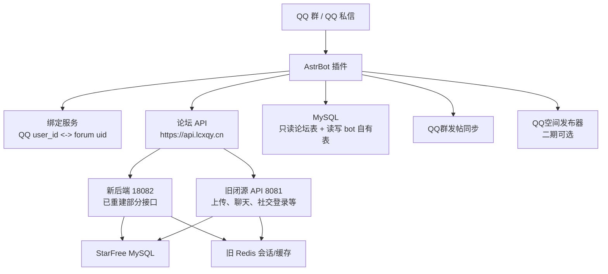
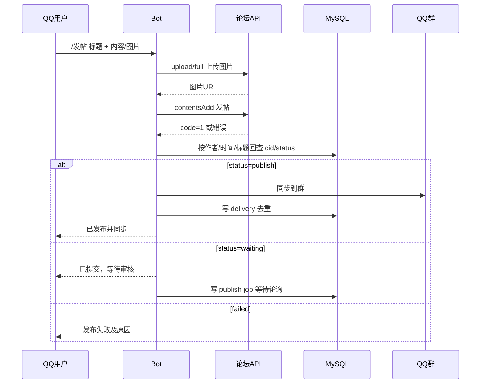

# QQBot / ArtBot 帖子同步插件设计手册

> 目标读者：接手开发的 AI 或开发者。
>
> 目标：为当前 StarFree / LCXQY 论坛项目设计一个 QQ 群机器人插件，实现账号绑定、论坛帖子同步到群、QQ群/私信触发发帖、审核后同步、可选 QQ 空间发布。
>
> 重要：本文是规划和交接文档，不是已完成实现。正式编码前必须先复核线上接口、数据库字段和 Bot 框架版本。

---

## 1. 一句话结论

建议做一个独立的 AstrBot/ArtBot 插件，插件只保存“QQ 用户/群组与论坛 uid 的绑定关系、同步游标、投递日志”，不直接改论坛核心表；发帖必须先调用论坛后端写入 `starfree_contents`，再读取论坛数据库/API 的最终状态，只有 `status='publish'` 的帖子才同步到群。这样才能保证机器人行为与论坛审核一致。

---

## 2. 服务器与项目连接信息

### 2.1 生产服务器

> Git 仓库不保存明文服务器凭据。实际值仅保存在被 `.gitignore` 排除的 `markdown_docs/private/SERVER_ACCESS.local.md`。

- 服务器 IP：`<SERVER_IP>`
- SSH 用户：优先尝试 `root`
- SSH 密码：`<SERVER_PASSWORD>`
- API 公网域名：`https://api.lcxqy.cn/`
- 后台站点：`https://admin.lcxqy.cn/`
- H5/分享域名：`https://prev.lcxqy.cn/`
- 新后端本机端口：`127.0.0.1:18082`
- 旧闭源 Java API 本机端口：`127.0.0.1:8081`
- Nginx 对外 API：`api.lcxqy.cn`，通过精确路由分流到 18082 或 8081
- 新后端服务名：`starfree-replacement.service`
- 新后端目录：`/opt/starfree-replacement/`
- 旧后端/数据库/Redis 配置源：`/opt/application.properties`
- Nginx include：`/www/server/panel/vhost/nginx/extension/api.lcxqy.cn/starfree-replacement-public.conf`

连接示例：

```bash
ssh root@<SERVER_IP>
```

上线前检查：

```bash
systemctl status starfree-replacement.service --no-pager
curl -fsS http://127.0.0.1:18082/health
curl -fsS http://127.0.0.1:8081/SFreeUsers/regConfig
nginx -t
```

### 2.2 本地项目路径

- 项目根目录：`D:\Users\陈家博\Documents\HBuilderProjects\lcwxq`
- 总技术手册：`AI_PROJECT_BRIEF.md`
- 前端 API 配置：`utils/api.js`
- 发帖页面参考：`pages/user/post.vue`
- 新后端源码：`backend/starfree-replacement/`
- 后端生产说明：`backend/deploy/production/README.md`
- 当前重建状态：`backend/docs/REBUILD_STATUS.md`
- 数据库快照：`backend/database/snapshots/lcxqy_2026-07-23_11-17-42.sql`

---

## 3. 框架名称确认：ArtBot vs AstrBot

用户口述为 `artbot`。当前中文 QQ bot 场景里更常见的是 `AstrBot`。本文主方案按 AstrBot 写：

- 插件目录使用 `astrbot_plugin_插件名`
- 插件入口通常是 `main.py`
- 插件类继承 `Star`
- 命令处理函数放在插件类中
- 插件持久化数据放在 AstrBot 的 `data` 目录或外部数据库
- Python 依赖写入插件目录的 `requirements.txt`

如果实际使用的确实是另一个 Node.js 或其他语言的 ArtBot，也不要推翻业务设计，只需要把本文的“服务层接口”和“数据库表”迁移到对应框架的插件入口即可。

### 3.1 AstrBot 官方制作流程

以下步骤按 AstrBot 官方插件开发文档整理，用于接手者从零创建插件：

1. 准备 AstrBot 本体和插件目录。

   ```bash
   git clone https://github.com/AstrBotDevs/AstrBot
   mkdir -p AstrBot/data/plugins
   cd AstrBot/data/plugins
   git clone <插件仓库地址>
   ```

2. 插件仓库命名建议：

   - 推荐以 `astrbot_plugin_` 开头。
   - 全小写。
   - 不含空格。
   - 尽量短，例如 `astrbot_plugin_lcxqy_post_sync`。

3. 插件目录里至少放这些文件：

   ```text
   astrbot_plugin_lcxqy_post_sync/
     main.py
     metadata.yaml
     requirements.txt
     _conf_schema.json
     services/
     storage/
   ```

4. `metadata.yaml` 用于插件元数据和插件市场展示；即使暂时不发布市场，也建议写完整。

   ```yaml
   name: astrbot_plugin_lcxqy_post_sync
   desc: LCXQY 论坛帖子同步、账号绑定与 QQ 发帖桥接
   version: 0.1.0
   author: lcxqy
   repo: ""
   ```

5. `requirements.txt` 写 Python 第三方依赖。AstrBot 安装插件时会按它安装依赖。

   ```text
   httpx>=0.27
   aiomysql>=0.2
   pydantic>=2
   python-dotenv>=1
   ```

6. 简单可编辑配置使用 `_conf_schema.json`；复杂配置页、日志页、导入导出页再考虑 `pages/<page_name>/index.html` 和 `context.register_web_api()`。

7. 启动 AstrBot 本体后调试插件。AstrBot 是运行时注入插件，修改代码后在 WebUI 的插件管理里点“管理”/“重载插件”，不需要每次重装。

8. 所有消息处理函数必须写在继承 `Star` 的插件类里；服务层可以拆到 `services/`，再由插件类方法调用。

9. 持久化数据不要写在插件源码目录，避免插件更新或重装时被覆盖。LCXQY 这个插件的业务数据建议放 MySQL 的 `starfree_qqbot_*` 表；临时文件、缓存和下载图片放 AstrBot data 目录或系统临时目录。

10. 网络请求使用异步库，例如 `httpx.AsyncClient` 或 `aiohttp`，不要在命令处理里用阻塞式 `requests`。

官方参考：

- AstrBot 插件开发：`https://docs-v3.astrbot.app/dev/star/plugin.html`
- AstrBot 最小插件示例：`https://docs.astrbot.app/en/dev/star/guides/simple.html`
- AstrBot 插件页面和 Web API：`https://docs.astrbot.app/en/dev/star/guides/plugin-pages.html`
- AstrBot 插件市场/metadata 规范：`https://docs.astrbot.app/en/dev/plugin-market/2026-06-27.html`

建议插件名：

```text
astrbot_plugin_lcxqy_post_sync
```

建议目录：

```text
astrbot_plugin_lcxqy_post_sync/
  main.py
  requirements.txt
  README.md
  metadata.yaml
  _conf_schema.json
  services/
    forum_client.py
    binding_service.py
    publish_service.py
    sync_service.py
    qzone_publisher.py
  storage/
    mysql.py
    migrations.sql
```

---

## 4. 总体架构



核心原则：

1. Bot 不直接插入 `starfree_contents`。
2. Bot 发帖先走论坛后端。
3. Bot 同步群消息时以数据库/API 中的最终状态为准。
4. 只有 `starfree_contents.status='publish'` 才能同步到群。
5. `waiting`、`draft`、`delete`、`reject` 等非公开状态只私信作者或管理员，不发群。
6. 插件自己的表独立命名，不污染 StarFree 原有表。
7. 上传、验证码、支付、聊天、插件相关闭源逻辑继续走旧后端，不在 QQBot 项目里重建。
8. QQ 空间是可选外部发布器，失败不能影响论坛发帖和群同步。

---

## 5. 当前论坛后端边界

### 5.1 新旧后端分工

当前系统是“旧闭源 API + 新 Spring Boot replacement”混合运行：

| 模块 | 当前状态 | QQBot 影响 |
|---|---|---|
| 普通帖子详情 `/SFreeContents/contentsInfo` | 新后端 | 可用于审核后读取最终帖子 |
| 普通帖子发布 `/SFreeContents/contentsAdd` | 新后端 + 内部委托 | 可用于 Bot 发帖；仅普通 post/video 新写 |
| 普通帖子编辑 `/SFreeContents/contentsUpdate` | 新后端 + 内部委托 | Bot MVP 可不做编辑 |
| 带 token 的 `contentsList` | 仍可能走旧后端 | 同步任务尽量直接查 DB 或匿名列表 |
| 上传 `/upload/full` | 旧后端 | 图片上传必须保留旧接口 |
| 社交登录/绑定 `/SFreeUsers/apiLogin/apiBind/userBindStatus` | 未重写 | 不要复用旧端“信任 openId”的社交绑定方式 |
| 用户登录 `/SFreeUsers/userLogin` | 生产仍可走旧端 | 仅作为应急绑定方案，不建议 Bot 保存密码 |
| 用户状态 `/SFreeUsers/userStatus` | 可用 | 可用于验证 token |
| 后台审核 `/SFreeContents/contentsAudit` | 旧端 | Bot 不重建审核，只等论坛结果 |
| 支付/充值 | 官方旧端 | 与 QQBot 无关，不碰 |

### 5.2 关键事实

- 公网 API 统一入口是 `https://api.lcxqy.cn/`。
- 新服务绑定 `127.0.0.1:18082`，不要公网暴露。
- 旧服务在 `127.0.0.1:8081`。
- Nginx 用 exact location 分流，不能只看“源码有实现”就认为公网已切流。
- Redis session 使用旧 Java 序列化，普通 redis-cli 字符串查看可能误判。
- `contentsInfo` 成功时返回裸文章对象，不是 `{code,msg,data}`。
- 业务错误很多时候仍是 HTTP 200，必须判断 JSON `code` 或文章对象字段。

---

## 6. 论坛数据模型摘要

### 6.1 用户表 `starfree_users`

关键字段：

| 字段 | 含义 |
|---|---|
| `uid` | 论坛用户 ID，绑定主键 |
| `name` | 登录名 |
| `screenName` | 昵称 |
| `mail` | 邮箱 |
| `phone` | 手机 |
| `group` | 权限组：administrator/editor/contributor/follower/visitor 等 |
| `authCode` | MySQL token，旧 Redis-only token 可能不在这里 |
| `avatar` | 头像 |
| `bantime` | 封禁时间 |
| `posttime` | 发帖限制相关 |
| `assets` | 钱包余额 |
| `points` | 积分 |
| `experience` | 经验 |

注意：

- Bot 绑定应绑定到 `uid`，不要绑定 `name`，因为用户名可能展示变化。
- 不要把 `group`、`assets`、`points`、`experience` 等客户端传参当可信输入。
- 如果 Bot 保存 token，必须加密保存，并考虑 token 失效和 Redis-only session。

### 6.2 内容表 `starfree_contents`

关键字段：

| 字段 | 含义 |
|---|---|
| `cid` | 内容 ID |
| `title` | 标题 |
| `created` | 创建时间，Unix 秒 |
| `modified` | 修改时间，Unix 秒 |
| `text` | 正文，可能含 Markdown、HTML 片段、`||rn||` 换行占位 |
| `authorId` | 作者 uid |
| `type` | `post`、`video` 等 |
| `status` | `publish`、`waiting`、`draft`、删除/拒绝等历史状态 |
| `commentsNum` | 评论数 |
| `views` | 阅读数 |
| `likes` | 点赞数 |
| `isrecommend` | 推荐 |
| `istop` | 置顶 |
| `isswiper` | 轮播 |
| `replyTime` | 最后回复/更新时间 |

同步规则：

- 群同步只允许 `type in ('post','video')` 且 `status='publish'`。
- 待审帖子通常状态不是 `publish`，不能发群。
- 已删除帖子可能被旧缓存短暂显示，Bot 同步必须直接查数据库或 `contentsInfo` 最终返回。

### 6.3 分类表 `starfree_metas`

关键字段：

| 字段 | 含义 |
|---|---|
| `mid` | 分类 ID |
| `name` | 分类名 |
| `slug` | slug |
| `type` | 分类类型 |
| `count` | 内容数量 |
| `parent` | 父分类 |
| `isrecommend` | 是否推荐 |

发帖参数里的 `category` 通常是分类 ID 字符串，可能是逗号分隔多分类。Bot MVP 可以配置一个默认分类，比如 `default_mid=1`，但上线前必须从生产库确认真实可用分类。

### 6.4 社交登录表 `starfree_userapi`

旧表字段：

| 字段 | 含义 |
|---|---|
| `openId` | 第三方 openId |
| `appLoginType` | 第三方类型 |
| `uid` | 绑定用户 |

注意：

- 现有 `/SFreeUsers/apiLogin/apiBind/userBindStatus` 未重写。
- 旧闭源社交绑定逻辑可能信任客户端 openId，不能照抄。
- QQBot 绑定不建议复用 `starfree_userapi`，除非重建安全校验。
- 推荐新建 Bot 专用绑定表，避免混淆 OAuth 登录和 QQ 群机器人身份。

---

## 7. Bot 自有表设计

建议用 InnoDB，因为 Bot 自有表不是旧 MyISAM 兼容表，事务对绑定和投递日志有帮助。若生产 MySQL 版本或权限不支持 InnoDB，再降级 MyISAM。

### 7.1 `starfree_qqbot_bindings`

```sql
CREATE TABLE IF NOT EXISTS starfree_qqbot_bindings (
  id BIGINT UNSIGNED NOT NULL AUTO_INCREMENT,
  platform VARCHAR(32) NOT NULL DEFAULT 'qq',
  qq_user_id VARCHAR(64) NOT NULL,
  qq_union_id VARCHAR(128) DEFAULT NULL,
  forum_uid INT UNSIGNED NOT NULL,
  forum_name VARCHAR(64) DEFAULT NULL,
  forum_screen_name VARCHAR(64) DEFAULT NULL,
  bind_status VARCHAR(16) NOT NULL DEFAULT 'active',
  bind_method VARCHAR(32) NOT NULL,
  created_at INT UNSIGNED NOT NULL,
  verified_at INT UNSIGNED DEFAULT 0,
  last_seen_at INT UNSIGNED DEFAULT 0,
  revoked_at INT UNSIGNED DEFAULT 0,
  note VARCHAR(255) DEFAULT NULL,
  PRIMARY KEY (id),
  UNIQUE KEY uk_platform_qq_user (platform, qq_user_id),
  KEY idx_forum_uid (forum_uid),
  KEY idx_status (bind_status)
) ENGINE=InnoDB DEFAULT CHARSET=utf8mb4 COMMENT='QQBot 用户绑定表';
```

### 7.2 `starfree_qqbot_bind_challenges`

```sql
CREATE TABLE IF NOT EXISTS starfree_qqbot_bind_challenges (
  id BIGINT UNSIGNED NOT NULL AUTO_INCREMENT,
  platform VARCHAR(32) NOT NULL DEFAULT 'qq',
  qq_user_id VARCHAR(64) NOT NULL,
  forum_uid INT UNSIGNED DEFAULT NULL,
  forum_name VARCHAR(64) DEFAULT NULL,
  challenge_code_hash CHAR(64) NOT NULL,
  expires_at INT UNSIGNED NOT NULL,
  consumed_at INT UNSIGNED DEFAULT 0,
  created_at INT UNSIGNED NOT NULL,
  attempts INT UNSIGNED NOT NULL DEFAULT 0,
  status VARCHAR(16) NOT NULL DEFAULT 'pending',
  PRIMARY KEY (id),
  KEY idx_qq_status (platform, qq_user_id, status),
  KEY idx_expires (expires_at),
  KEY idx_forum_uid (forum_uid)
) ENGINE=InnoDB DEFAULT CHARSET=utf8mb4 COMMENT='QQBot 绑定一次性挑战';
```

说明：

- 只保存验证码 hash，不保存明文验证码。
- 验证码 10 分钟过期。
- 验证失败超过 5 次作废。
- 绑定成功后写 `consumed_at`，挑战不可复用。

### 7.3 `starfree_qqbot_sync_state`

```sql
CREATE TABLE IF NOT EXISTS starfree_qqbot_sync_state (
  id BIGINT UNSIGNED NOT NULL AUTO_INCREMENT,
  group_id VARCHAR(64) NOT NULL,
  sync_scope VARCHAR(32) NOT NULL DEFAULT 'contents',
  last_cid INT UNSIGNED NOT NULL DEFAULT 0,
  last_created INT UNSIGNED NOT NULL DEFAULT 0,
  last_scan_at INT UNSIGNED NOT NULL DEFAULT 0,
  enabled TINYINT NOT NULL DEFAULT 1,
  config_json TEXT,
  PRIMARY KEY (id),
  UNIQUE KEY uk_group_scope (group_id, sync_scope)
) ENGINE=InnoDB DEFAULT CHARSET=utf8mb4 COMMENT='QQBot 群同步游标';
```

### 7.4 `starfree_qqbot_post_deliveries`

```sql
CREATE TABLE IF NOT EXISTS starfree_qqbot_post_deliveries (
  id BIGINT UNSIGNED NOT NULL AUTO_INCREMENT,
  group_id VARCHAR(64) NOT NULL,
  cid INT UNSIGNED NOT NULL,
  forum_uid INT UNSIGNED NOT NULL,
  qq_user_id VARCHAR(64) DEFAULT NULL,
  source VARCHAR(32) NOT NULL DEFAULT 'forum_poll',
  delivered_at INT UNSIGNED NOT NULL,
  qq_message_id VARCHAR(128) DEFAULT NULL,
  status VARCHAR(16) NOT NULL DEFAULT 'sent',
  error TEXT,
  PRIMARY KEY (id),
  UNIQUE KEY uk_group_cid (group_id, cid),
  KEY idx_cid (cid),
  KEY idx_uid (forum_uid),
  KEY idx_delivered_at (delivered_at)
) ENGINE=InnoDB DEFAULT CHARSET=utf8mb4 COMMENT='QQBot 群投递去重日志';
```

### 7.5 `starfree_qqbot_publish_jobs`

```sql
CREATE TABLE IF NOT EXISTS starfree_qqbot_publish_jobs (
  id BIGINT UNSIGNED NOT NULL AUTO_INCREMENT,
  request_id VARCHAR(64) NOT NULL,
  qq_user_id VARCHAR(64) NOT NULL,
  group_id VARCHAR(64) DEFAULT NULL,
  forum_uid INT UNSIGNED NOT NULL,
  cid INT UNSIGNED DEFAULT 0,
  title VARCHAR(255) NOT NULL,
  status VARCHAR(32) NOT NULL DEFAULT 'created',
  created_at INT UNSIGNED NOT NULL,
  submitted_at INT UNSIGNED DEFAULT 0,
  published_at INT UNSIGNED DEFAULT 0,
  last_checked_at INT UNSIGNED DEFAULT 0,
  error TEXT,
  payload_json MEDIUMTEXT,
  PRIMARY KEY (id),
  UNIQUE KEY uk_request_id (request_id),
  KEY idx_qq_status (qq_user_id, status),
  KEY idx_cid (cid)
) ENGINE=InnoDB DEFAULT CHARSET=utf8mb4 COMMENT='QQBot 发帖任务';
```

状态建议：

| 状态 | 含义 |
|---|---|
| `created` | QQ 命令已接收 |
| `uploading` | 正在上传 QQ 图片到论坛 |
| `submitted` | 已调用论坛发帖接口 |
| `waiting_review` | 论坛已收帖但待审核 |
| `published` | 论坛已公开，已准备同步 |
| `delivered` | 已发群 |
| `failed` | 失败 |
| `cancelled` | 用户取消 |

---

## 8. 账号绑定设计

### 8.1 推荐方案：论坛登录态确认绑定

这是安全主方案。需要新后端或前端增加一个很小的 Bot 绑定确认能力。

流程：

1. 用户在 QQ 私信发送：

   ```text
   /绑定 用户名或UID
   ```

2. Bot 查询 `starfree_users`，确认存在该用户。
3. Bot 生成一次性绑定码，例如 `LCX-824913`，写入 `starfree_qqbot_bind_challenges`。
4. Bot 回复用户：

   ```text
   请登录论坛后打开绑定页，并输入绑定码：LCX-824913
   绑定码 10 分钟内有效。
   ```

5. 论坛侧登录用户调用新接口：

   ```http
   POST /SFreeBot/bindConfirm
   Content-Type: application/x-www-form-urlencoded

   token=<论坛登录token>
   code=LCX-824913
   ```

6. 后端通过 `token` 解析论坛 `uid`，再校验挑战码中的目标 `forum_uid`。
7. 写入 `starfree_qqbot_bindings`。
8. Bot 私信通知绑定成功。

优点：

- Bot 不接触论坛密码。
- 论坛账号身份由论坛 token 确认。
- 能兼容 MySQL token 和 Redis-only token。
- 绑定行为可审计。

需要新增后端接口：

```text
POST /SFreeBot/bindConfirm
```

鉴权：

- 用户论坛 token 必填。
- code 必填。
- code 过期或已消费返回 `code=0`。
- 成功返回 `{code:1,msg:"绑定成功",data:{uid,name,screenName}}`。

注意：

- 该接口可以先只在 18082 实现，不急着切公网；如果绑定页走公网，则需加 Nginx exact route。
- 如果 Bot 和新后端同机，也可设计为 Bot 直连 18082，但最终用户确认页仍要走公网 API。
- 不要让客户端传 `uid` 决定身份，必须从 token 解析。

### 8.2 MVP 方案：Bot 私信账号密码登录

仅作为快速验证，不建议长期使用。

命令：

```text
/绑定账号 用户名 密码
```

流程：

1. Bot 调用：

   ```http
   POST https://api.lcxqy.cn/SFreeUsers/userLogin
   Content-Type: application/x-www-form-urlencoded

   name=<用户名/邮箱/手机号>
   password=<密码>
   ```

2. 登录成功后，调用：

   ```http
   GET https://api.lcxqy.cn/SFreeUsers/userStatus?token=<token>
   ```

3. 解析 uid，写入 `starfree_qqbot_bindings`。
4. token 如需用于发帖，必须加密保存；密码绝不能保存。
5. 私信中立即提示用户删除含密码的聊天记录。

风险：

- Bot 会接触用户密码。
- QQ 私信本身不适合传密码。
- 机器人日志、异常栈、调试输出都可能泄漏。
- 只适合内测，不适合正式上线。

### 8.3 管理员预绑定

适用于首批测试用户：

```sql
INSERT INTO starfree_qqbot_bindings
(platform, qq_user_id, forum_uid, forum_name, forum_screen_name, bind_method, created_at, verified_at)
VALUES
('qq', 'QQ号', 123, '论坛用户名', '昵称', 'admin_seed', UNIX_TIMESTAMP(), UNIX_TIMESTAMP());
```

上线前必须让用户可以自助解绑。

---

## 9. 发帖设计

### 9.1 命令格式

私信可用：

```text
/发帖 标题
正文内容
```

带图片：

```text
/发帖 标题
正文内容
[附带 QQ 图片]
```

群内可选启用：

```text
/发帖 标题
正文内容
```

建议 MVP 只允许私信发帖，群内发帖容易产生刷屏、误触和隐私问题。

建议扩展命令：

```text
/绑定 <用户名或UID>
/确认绑定 <验证码>
/解绑
/发帖 <标题>
/发视频 <标题>
/我的绑定
/我的帖子
/同步状态
/重试同步 <cid>
```

### 9.2 权限规则

- 用户必须先绑定论坛账号。
- 未绑定用户执行 `/发帖`，Bot 回复绑定指引。
- 如果论坛用户 `bantime` 未过，不允许发帖。
- 如果论坛限制仅管理员/编辑可公开发布，Bot 必须遵守。
- `administrator`、`editor` 等权限判断来自论坛用户表或 `userStatus`，不要由 QQ 群管理员身份替代。
- QQ 群管理员只能管理 Bot 群同步配置，不代表论坛审核权限。

### 9.3 正文格式

前端发帖页使用 Markdown：

- 图片格式：``
- 普通换行在提交前替换为 `||rn||`
- `isMd=1` 表示 Markdown
- 前端会对 `<script>`、`<form>`、`<iframe>`、`<frame>` 做安全提示，Bot 也应拦截

Bot 建议正文处理：

1. 去除危险 HTML：`script/form/iframe/frame/object/embed/onerror/onload/javascript:`
2. 将 QQ 图片上传到论坛，得到 URL。
3. 追加 Markdown 图片：

   ```markdown
   
   ```

4. 换行转换：

   ```python
   text_for_api = text.replace("\r\n", "||rn||").replace("\n", "||rn||")
   ```

### 9.4 图片上传

现有前端使用：

```javascript
uni.uploadFile({
  url: that.$API.upload(),
  filePath: tempFilePaths[i],
  name: 'file',
  formData: {
    token: that.token
  }
})
```

`that.$API.upload()` 对应 `upload/full`，该接口仍由旧后端负责。

Python Bot 上传示例：

```python
import httpx

async def upload_image(api_base: str, token: str, local_file: str) -> str:
    with open(local_file, "rb") as f:
        files = {"file": ("image.jpg", f, "image/jpeg")}
        data = {"token": token}
        r = await httpx.AsyncClient(timeout=60).post(
            f"{api_base}/upload/full",
            data=data,
            files=files,
        )
    payload = r.json()
    if payload.get("code") != 1:
        raise RuntimeError(payload.get("msg") or "upload failed")
    return payload["data"]["url"]
```

注意：

- 上传接口未重写，线上会走旧 8081。
- 图片需要先从 QQ 消息中下载到临时目录。
- 下载和上传后要删除临时文件。
- 单次发帖图片数量建议限制 9 张以内。
- 单张图片大小建议限制，例如 10MB。
- 只允许图片 MIME，避免上传任意可执行文件。

### 9.5 调用论坛发帖接口

现有接口：

```http
POST https://api.lcxqy.cn/SFreeContents/contentsAdd
Content-Type: application/x-www-form-urlencoded
```

表单字段：

| 字段 | 必填 | 说明 |
|---|---|---|
| `token` | 是 | 论坛用户 token；推荐长期改为内部 Bot 桥接接口 |
| `params` | 是 | JSON 字符串 |
| `text` | 是 | 正文，换行用 `||rn||` |
| `isMd` | 建议 | `1` 表示 Markdown |

`params` 示例：

```json
{
  "title": "来自 QQBot 的帖子标题",
  "category": "1",
  "tag": "",
  "type": "post"
}
```

完整 curl：

```bash
curl -sS -X POST 'https://api.lcxqy.cn/SFreeContents/contentsAdd' \
  -H 'Content-Type: application/x-www-form-urlencoded' \
  --data-urlencode 'token=<论坛token>' \
  --data-urlencode 'params={"title":"来自QQBot的帖子","category":"1","type":"post"}' \
  --data-urlencode 'text=正文第一行||rn||正文第二行||rn||' \
  --data-urlencode 'isMd=1'
```

接口行为：

- 仅普通 `post` / `video` 进入新后端写入。
- 付费、草稿、动态关联、商品关联、未知类型会委托旧 8081。
- 控制器当前成功返回旧兼容语义，可能只是插入结果，不一定直接返回 `cid`。
- 所以 Bot 不能只依赖接口响应拿 cid；需要二次读取或按唯一标题/时间/作者回查。

### 9.6 推荐新增内部发帖桥接接口

长期方案不要让 Bot 保存每个用户 token。建议在新后端增加内部接口：

```text
POST /SFreeBot/contentsAdd
```

请求：

```json
{
  "botSecret": "server-side-secret",
  "platform": "qq",
  "qqUserId": "123456",
  "groupId": "987654",
  "requestId": "qqbot-20260731-xxxx",
  "title": "标题",
  "text": "Markdown 正文",
  "category": "1",
  "type": "post",
  "imageUrls": ["https://..."]
}
```

后端行为：

1. 校验 `botSecret`。
2. 通过 `starfree_qqbot_bindings` 找到 `forum_uid`。
3. 检查用户存在、未封禁、有发帖权限。
4. 复用现有 `ContentService.add(...)` 或同等业务逻辑写入。
5. 按论坛审核配置得到 `status`。
6. 返回 `{code:1,msg:"发布成功",data:{cid,status}}`。

优点：

- Bot 不保存用户论坛密码。
- Bot 不需要长期保存用户 token。
- 后端能准确按 uid 发帖。
- 可以统一做幂等、审计、限流。

限制：

- 需要改后端。
- 需要给 Bot 一个服务端密钥。
- 密钥只能放服务器环境变量或配置文件，不能写入公开仓库。

---

## 10. 审核与同步流程

### 10.1 发帖后的状态处理

发帖后必须先进入论坛，再读取论坛状态：



### 10.2 只同步审核通过的帖子

同步任务每 30-60 秒扫描：

```sql
SELECT cid, title, text, authorId, created, modified, type, status
FROM starfree_contents
WHERE cid > ?
  AND status = 'publish'
  AND type IN ('post', 'video')
ORDER BY cid ASC
LIMIT 50;
```

对每个候选：

1. 查 `starfree_qqbot_post_deliveries` 是否已经发过该群。
2. 如果未发，读取完整 `contentsInfo` 或直接用数据库内容组装摘要。
3. 发送到配置的 QQ 群。
4. 写投递日志。
5. 更新 `starfree_qqbot_sync_state.last_cid`。

注意：

- 使用 `cid` 作为游标通常足够，辅以 `created` 防止特殊导入。
- 如果帖子审核后 `cid` 小于当前游标，可能漏同步。为避免漏审核通过的旧帖子，建议另有 `waiting_review` job 表轮询 `cid`。
- 对 Bot 自己发的待审帖子，应在 `publish_jobs` 中按 `cid` 单独轮询，不能只靠全局游标。

### 10.3 待审核 job 轮询

```sql
SELECT id, cid
FROM starfree_qqbot_publish_jobs
WHERE status='waiting_review'
  AND cid > 0
  AND last_checked_at < UNIX_TIMESTAMP() - 30
ORDER BY id ASC
LIMIT 20;
```

对每个 job：

```sql
SELECT cid, title, status, authorId
FROM starfree_contents
WHERE cid = ?;
```

状态处理：

| status | Bot 行为 |
|---|---|
| `publish` | 同步到群，job 改 `published/delivered` |
| `waiting` | 保持等待 |
| `draft` | 通知作者仍未公开 |
| 拒绝/删除/不存在 | 私信作者审核未通过或已删除，job 结束 |
| 其他 | 记录日志，不发群 |

### 10.4 群消息格式

建议格式：

```text
【新帖子】{title}
作者：{screenName or name}（UID {uid}）
链接：https://prev.lcxqy.cn/#/pages/contents/info?cid={cid}&title=starfree

{摘要前 120 字}
```

如果有图片：

- QQ 支持图片时，发送第一张图作为预览。
- 正文多图只发链接或前 3 张，避免刷屏。
- 必须保留论坛链接作为权威地址。

摘要处理：

- 去掉 Markdown 图片、HTML 标签、`[hide]`、`[vip]` 内部内容。
- `||rn||` 转换为空格或换行。
- 不要把隐藏/会员可见内容直接同步到群。

---

## 11. QQ 空间发布功能（二期可选）

### 11.1 放在二期的原因

QQ 空间发布与论坛发帖是两个不同系统：

- 论坛审核是权威流程。
- QQ 空间发布失败不能影响论坛发帖。
- QQ 空间需要单独账号授权、Cookie/扫码/开放平台能力或合规 SDK。
- 非官方登录态容易失效，也可能触发风控。
- 不能用 Bot 主账号明文 Cookie 写死在代码中。

### 11.2 推荐接口抽象

定义发布器接口：

```python
class ExternalPublisher:
    async def publish(self, post: ForumPost) -> ExternalPublishResult:
        ...
```

QQ 空间发布器：

```python
class QZonePublisher(ExternalPublisher):
    async def publish(self, post):
        # 只在 post.status == "publish" 后执行
        # 失败只记日志，不回滚论坛和QQ群同步
        pass
```

表：

```sql
CREATE TABLE IF NOT EXISTS starfree_qqbot_external_publish_jobs (
  id BIGINT UNSIGNED NOT NULL AUTO_INCREMENT,
  cid INT UNSIGNED NOT NULL,
  provider VARCHAR(32) NOT NULL,
  status VARCHAR(32) NOT NULL DEFAULT 'pending',
  attempts INT UNSIGNED NOT NULL DEFAULT 0,
  next_retry_at INT UNSIGNED DEFAULT 0,
  external_id VARCHAR(128) DEFAULT NULL,
  error TEXT,
  created_at INT UNSIGNED NOT NULL,
  updated_at INT UNSIGNED NOT NULL,
  PRIMARY KEY (id),
  UNIQUE KEY uk_provider_cid (provider, cid),
  KEY idx_status_retry (status, next_retry_at)
) ENGINE=InnoDB DEFAULT CHARSET=utf8mb4 COMMENT='QQBot 外部平台发布任务';
```

触发条件：

- 只对 `status='publish'` 的帖子创建外部发布任务。
- 管理员配置 `enable_qzone=true` 后才启用。
- 默认只发布标题、摘要、论坛链接和最多一张图。
- 不发布隐藏内容、会员内容、付费内容。

### 11.3 风险控制

- QQ 空间账号授权信息必须放环境变量或服务器密钥文件。
- 不要把 Cookie、token、扫码状态写进 Git。
- 加每日发布上限。
- 失败指数退避重试。
- 失败 3 次进入 `failed`，不再无限刷。
- 要能一键关闭 QQ 空间发布，不影响论坛和群同步。

---

## 12. 插件配置建议

`_conf_schema.json` 可包含。AstrBot 会按该 schema 生成插件配置，实际运行配置不要手写进仓库：

```json
{
  "api_base": "https://api.lcxqy.cn",
  "web_base": "https://prev.lcxqy.cn/#",
  "default_category": "1",
  "sync_interval_seconds": 45,
  "max_images_per_post": 9,
  "max_image_mb": 10,
  "allow_group_publish": false,
  "allowed_group_ids": [],
  "admin_qq_ids": [],
  "enable_qzone": false,
  "qzone_provider": "disabled",
  "bot_secret_env": "LCXQY_QQBOT_SECRET",
  "mysql": {
    "host": "127.0.0.1",
    "port": 3306,
    "database": "从 /opt/application.properties 读取",
    "user": "从 /opt/application.properties 读取",
    "password": "从 /opt/application.properties 读取"
  }
}
```

不要把 MySQL 密码、Redis 密码、Bot secret、QQ 空间 Cookie 写进配置模板。

---

## 13. 数据库连接方式

### 13.1 生产服务器

在服务器上读取旧配置：

```bash
grep -E 'spring.datasource|jdbc|redis|mysql|password|username' /opt/application.properties
```

常见 Spring Boot 配置名可能是：

```text
spring.datasource.url
spring.datasource.username
spring.datasource.password
spring.redis.host
spring.redis.port
spring.redis.password
```

Bot 插件建议运行在同一台服务器上，MySQL 连接 `127.0.0.1`，不要公网暴露数据库端口。

### 13.2 本地开发

本地数据库快照：

```text
backend/database/snapshots/lcxqy_2026-07-23_11-17-42.sql
```

导入本地 MySQL 后，Bot 可以用 `.env.local`：

```env
LCXQY_API_BASE=https://api.lcxqy.cn
LCXQY_WEB_BASE=https://prev.lcxqy.cn/#
LCXQY_MYSQL_HOST=127.0.0.1
LCXQY_MYSQL_PORT=3306
LCXQY_MYSQL_DATABASE=lcxqy
LCXQY_MYSQL_USER=root
LCXQY_MYSQL_PASSWORD=
LCXQY_QQBOT_SECRET=dev-only-secret
```

注意：

- 不知道本地 MySQL 密码时，可以用已保存密码的桌面端导出连接配置，或让用户输入。
- 不要把 `.env.local` 提交。
- 如果只是规划和单元测试，可用 SQLite 模拟 Bot 自有表，但最终必须用 MySQL 验证字段类型和编码。

---

## 14. 插件代码骨架

> 这是结构示例，不是完整可运行代码。具体 import 以当前 AstrBot 版本为准。

```python
from astrbot.api import logger
from astrbot.api.event import filter, AstrMessageEvent
from astrbot.api.star import Context, Star, register

@register("lcxqy_post_sync", "lcxqy", "LCXQY 论坛帖子同步与 QQ 发帖桥接", "0.1.0")
class LcxqyPostSyncPlugin(Star):
    def __init__(self, context: Context):
        super().__init__(context)
        self.config = None
        self.forum = None
        self.binding = None
        self.publisher = None
        self.syncer = None

    async def initialize(self):
        # 1. 读取配置
        # 2. 初始化 MySQL 连接池
        # 3. 运行 Bot 自有表 migration
        # 4. 启动后台同步任务
        pass

    @filter.command("绑定")
    async def bind(self, event: AstrMessageEvent):
        # /绑定 用户名或UID
        logger.info("收到 QQBot 绑定命令")
        pass

    @filter.command("解绑")
    async def unbind(self, event: AstrMessageEvent):
        pass

    @filter.command("发帖")
    async def publish_post(self, event: AstrMessageEvent):
        # 解析标题、正文、图片
        # 上传图片
        # 调论坛发帖
        # 写 publish job
        pass

    @filter.command("同步状态")
    async def sync_status(self, event: AstrMessageEvent):
        pass

    async def terminate(self):
        # 停止后台任务，关闭 DB 连接池
        pass
```

推荐依赖：

```text
httpx>=0.27
aiomysql>=0.2
pydantic>=2
python-dotenv>=1
```

---

## 15. ForumClient 设计

### 15.1 HTTP 客户端

```python
class ForumClient:
    def __init__(self, api_base: str):
        self.api_base = api_base.rstrip("/")
        self.client = httpx.AsyncClient(timeout=httpx.Timeout(30.0, connect=10.0))

    async def user_status(self, token: str) -> dict:
        r = await self.client.get(f"{self.api_base}/SFreeUsers/userStatus", params={"token": token})
        return self._json(r)

    async def upload_full(self, token: str, path: str) -> str:
        ...

    async def contents_add(self, token: str, params: dict, text: str, is_md: int = 1) -> dict:
        form = {
            "token": token,
            "params": json.dumps(params, ensure_ascii=False),
            "text": text.replace("\r\n", "||rn||").replace("\n", "||rn||"),
            "isMd": str(is_md),
        }
        r = await self.client.post(f"{self.api_base}/SFreeContents/contentsAdd", data=form)
        return self._json(r)

    async def contents_info(self, cid: int, token: str | None = None) -> dict:
        params = {"key": cid, "isMd": 1}
        if token:
            params["token"] = token
        r = await self.client.get(f"{self.api_base}/SFreeContents/contentsInfo", params=params)
        return self._json_or_raw_article(r)
```

### 15.2 响应解析规则

- 普通接口：`code=1` 成功，`code=0` 失败。
- `contentsInfo` 成功时是裸文章对象，判断是否含 `cid/title/authorId/status`。
- HTTP 200 不等于业务成功。
- 失败时把 `msg` 原样返回给用户，便于定位审核/权限/登录问题。
- 请求超时要告诉用户“论坛接口超时，请稍后重试”，不要重复提交。

---

## 16. 绑定与发帖的安全设计

### 16.1 不要保存用户密码

禁止：

- 明文保存论坛密码。
- 在日志打印用户密码。
- 把密码放到 `payload_json`。
- 把密码传给第三方模型。
- 把密码写入 README 或配置样例。

如果 MVP 必须用账号密码登录：

- 只在内测群启用。
- 登录成功后立刻丢弃密码。
- token 加密保存。
- 日志过滤 `password=...`。
- 文档里明确这是临时方案。

### 16.2 Token 存储

如果保存 token：

- 加密列：`forum_token_ciphertext`
- 密钥来源：环境变量 `LCXQY_QQBOT_TOKEN_KEY`
- token 失效后引导用户重新绑定。
- Bot 自有表不要直接扩展 `starfree_users`。

### 16.3 幂等

每次发帖命令生成 `request_id`：

```text
qqbot-{qq_user_id}-{timestamp}-{random}
```

用途：

- 写入 `starfree_qqbot_publish_jobs`。
- 防止用户重复发送同一命令造成多帖。
- 如果后端新增 Bot bridge，应把 `requestId` 传给后端并做唯一约束。

### 16.4 限流

建议：

| 维度 | 限制 |
|---|---|
| 单 QQ 用户 | 每 60 秒 1 次发帖 |
| 单 QQ 用户 | 每日最多 20 次发帖 |
| 单群同步 | 每 10 秒最多 3 条 |
| 图片 | 单帖最多 9 张 |
| 图片大小 | 单张最多 10MB |
| 标题 | 5-80 字 |
| 正文 | 20-5000 字 |

前端当前已有标题不少于 5 字、正文不少于 20 字的校验，Bot 应保持一致。

---

## 17. 同步群配置

建议支持管理员命令：

```text
/开启论坛同步
/关闭论坛同步
/同步分类 1,2,3
/同步状态
/重同步 12345
```

配置存储在 `starfree_qqbot_sync_state.config_json`：

```json
{
  "category_allowlist": ["1", "2"],
  "include_video": true,
  "include_bot_posts": true,
  "summary_length": 120,
  "send_first_image": true
}
```

同步筛选 SQL 可加分类关系。若分类关系存在独立 relation 表，需要从生产库确认表名和字段；不要猜测。若接口更方便，可以调用 `contentsList`，但带 token 的 `contentsList` 仍可能走旧后端，且分页/缓存更难保证审核补漏。

---

## 18. 审核一致性的注意点

必须遵守：

1. Bot 不能替管理员审核。
2. Bot 不能先发群再等论坛审核。
3. Bot 不应读用户提交内容后直接群发，因为论坛最终可能拒绝、删除或修改。
4. Bot 同步时以数据库/API 的 `status='publish'` 为准。
5. 如果论坛后台删除帖子，Bot 不应继续重复同步；delivery 只记录已发，不能作为帖子仍存在的证明。
6. 已发到群的帖子如果后续被后台删除，二期可做撤回/删除通知，但 MVP 可先不做。
7. 对隐藏内容 `[hide]...[/hide]`、会员内容 `[vip]...[/vip]`、付费内容，不要展开同步到群。

---

## 19. 服务器部署建议

### 19.1 运行位置

推荐 Bot 和论坛 API 同服务器：

```text
/opt/lcxqy-qqbot/
  astrbot_plugin_lcxqy_post_sync/
  .env
  logs/
```

优点：

- 可访问 `127.0.0.1:18082` 和本地 MySQL。
- 不需要暴露数据库。
- 与 Nginx/API 网络最短。

### 19.2 systemd

示例：

```ini
[Unit]
Description=LCXQY QQBot
After=network.target mysql.service redis.service

[Service]
WorkingDirectory=/opt/lcxqy-qqbot
EnvironmentFile=/opt/lcxqy-qqbot/.env
ExecStart=/usr/bin/python3 -m astrbot
Restart=always
RestartSec=5
User=root

[Install]
WantedBy=multi-user.target
```

上线检查：

```bash
systemctl daemon-reload
systemctl enable --now lcxqy-qqbot.service
journalctl -u lcxqy-qqbot.service -f
```

### 19.3 不建议的部署

- 不要把 Bot 部署在用户电脑长期跑。
- 不要把 MySQL 3306 公网开放给 Bot。
- 不要让 Bot 直接访问 18082 的公网端口；18082 应只绑定 loopback。
- 不要和旧闭源 API 争用 8081 端口。

---

## 20. 测试流程

### 20.1 本地开发测试

1. 导入数据库快照。
2. 创建 Bot 自有表。
3. 准备测试用户。
4. 用 API 验证登录/发帖：

```bash
curl -sS -X POST 'https://api.lcxqy.cn/SFreeUsers/userLogin' \
  -H 'Content-Type: application/x-www-form-urlencoded' \
  --data-urlencode 'name=<test-user>' \
  --data-urlencode 'password=<test-password>'
```

5. 发测试帖，确认 `starfree_contents` 出现新 cid。
6. 根据审核配置确认 status。
7. Bot 只同步 publish。

### 20.2 生产灰度测试

1. 只在一个测试群开启。
2. 管理员预绑定一个测试 QQ。
3. 私信 `/发帖`，带一张小图。
4. 确认论坛后台出现帖子。
5. 如果待审核，先确认群里没有消息。
6. 后台审核通过。
7. Bot 轮询到 `publish` 后发群。
8. 检查 `starfree_qqbot_post_deliveries` 去重记录。
9. 再跑一次同步任务，确认不会重复发。
10. 后台删除测试帖，确认 Bot 不再同步。

### 20.3 必测异常

| 场景 | 期望 |
|---|---|
| 未绑定发帖 | 提示先绑定 |
| 绑定不存在用户 | 提示用户不存在 |
| 验证码过期 | 提示重新绑定 |
| token 失效 | 提示重新绑定 |
| 上传失败 | 不调用发帖，提示图片失败 |
| 发帖接口返回 code=0 | 不写 delivered，提示论坛 msg |
| 发帖待审核 | 私信待审核，不发群 |
| 审核通过 | 发群一次 |
| 重复同步 | 不重复发 |
| 论坛删除 | 后续不再发 |
| QQ 空间失败 | 只记录错误，不影响群同步 |

---

## 21. 开发顺序建议

### Phase 0：确认框架和运行环境

- 确认实际框架是否 AstrBot。
- 在本地跑一个 hello command 插件。
- 确认能收到 QQ 私信和群消息。
- 确认能下载 QQ 图片。

### Phase 1：只读同步

- 建 Bot 自有表。
- 连接 MySQL。
- 扫描 `starfree_contents.status='publish'`。
- 手工配置一个群。
- 同步最新帖子到群。
- 去重可用。

### Phase 2：账号绑定

- 先做管理员预绑定。
- 再做 `/绑定` challenge。
- 最后补论坛 token 确认接口或绑定页。
- 不先做密码登录，除非必须内测。

### Phase 3：私信发帖

- 支持纯文本发帖。
- 支持图片上传。
- 发帖后只私信状态，不立即群发。
- 等审核轮询后同步群。

### Phase 4：群内发帖和管理命令

- 只允许白名单群。
- 群发帖默认关闭。
- 加用户/群限流。
- 加同步分类配置。

### Phase 5：QQ 空间

- 选定合法发布方式。
- 实现外部发布器。
- 只在论坛 publish 后触发。
- 失败不影响主链路。

---

## 22. 给接手 AI 的具体操作清单

1. 先读：
   - `AI_PROJECT_BRIEF.md`
   - `backend/docs/REBUILD_STATUS.md`
   - `backend/deploy/production/README.md`
   - `utils/api.js`
   - `pages/user/post.vue`
2. 连接服务器：
   - `ssh root@<SERVER_IP>`
   - 密码从本地私密凭据文件或安全的密码管理器读取。
3. 在服务器读取：
   - `/opt/application.properties`
   - `/opt/starfree-replacement/start.sh`
   - 当前 Nginx include
4. 不要先改 Nginx。
5. 不要先改旧 API。
6. 不要直接 INSERT `starfree_contents`。
7. 先建 Bot 自有表。
8. 先做只读同步。
9. 再做绑定。
10. 再做发帖。
11. 最后再考虑 QQ 空间。
12. 每次生产写入测试都用随机前缀，并清理 SQL/Redis 残留。
13. 如果要新增后端 `SFreeBot` 内部桥接路由，先本地测试，再直连 18082 测试，再决定是否切公网 exact route。
14. 文档和代码注释必须写清楚每个接口的鉴权、参数、副作用、失败行为和审核状态。

---

## 23. 核心风险清单

- 明文密码泄漏：不要用用户论坛密码做长期方案。
- 绕过审核：Bot 不能直接群发用户投稿内容。
- 重复发帖：命令重试要有 request_id。
- 重复同步：delivery 表必须有 `(group_id,cid)` 唯一键。
- 上传接口旧端：`upload/full` 不要当作已重建。
- contentsInfo 非标准响应：成功是裸对象。
- HTTP 200 不代表成功。
- token 可能是 Redis-only，不能只查 `authCode`。
- MyISAM 非事务：不要多表直写论坛核心逻辑。
- QQ 空间授权不稳定：二期隔离。
- 分类 ID 不能猜：上线前查生产 `starfree_metas`。
- 群内发帖默认关闭：避免误触和刷屏。
- 隐藏/会员/付费内容不能展开到 QQ 群。

---

## 24. 最小 MVP 范围

如果只做第一版，建议只做这些：

1. 管理员预绑定 QQ 用户和论坛 uid。
2. 私信 `/发帖 标题 + 正文 + 图片`。
3. 调 `upload/full` 上传图片。
4. 调 `contentsAdd` 提交论坛。
5. 记录 publish job。
6. 轮询 `starfree_contents`，仅 publish 后同步指定测试群。
7. delivery 去重。
8. `/同步状态` 管理命令。
9. 不做 QQ 空间。
10. 不做群内发帖。

MVP 成功标准：

- 未审核帖子不会出现在群里。
- 审核通过后自动同步一次。
- 重启 Bot 后不会重复发。
- 图片能在论坛和群里打开。
- 用户和帖子都能追溯到 uid/cid。

---

## 25. 后续可扩展

- 后台删除后自动发“帖子已删除”通知或撤回 QQ 群消息。
- 支持评论同步。
- 支持群消息回复映射到论坛评论。
- 支持多个群按分类同步。
- 支持论坛用户绑定多个 QQ。
- 支持 QQ 群成员自动识别论坛身份。
- 支持管理员在 QQ 审核帖子，但仍必须调用论坛审核接口。
- 支持 QQ 空间发布。
- 支持失败消息重试队列和 Web 管理面板。

---

## 26. 外部参考

- AstrBot 插件开发官方文档：`https://docs-v3.astrbot.app/dev/star/plugin.html`
- AstrBot 插件页面能力官方文档：`https://docs.astrbot.app/en/dev/star/guides/plugin-pages.html`
- 腾讯 QQ 空间产品说明：`https://www.tencent.com/zh-cn/products/qzone/`

接手者应以当前安装的 AstrBot/ArtBot 版本文档为准。本文只固定 LCXQY 论坛侧的业务边界、数据库设计和接口流程。
